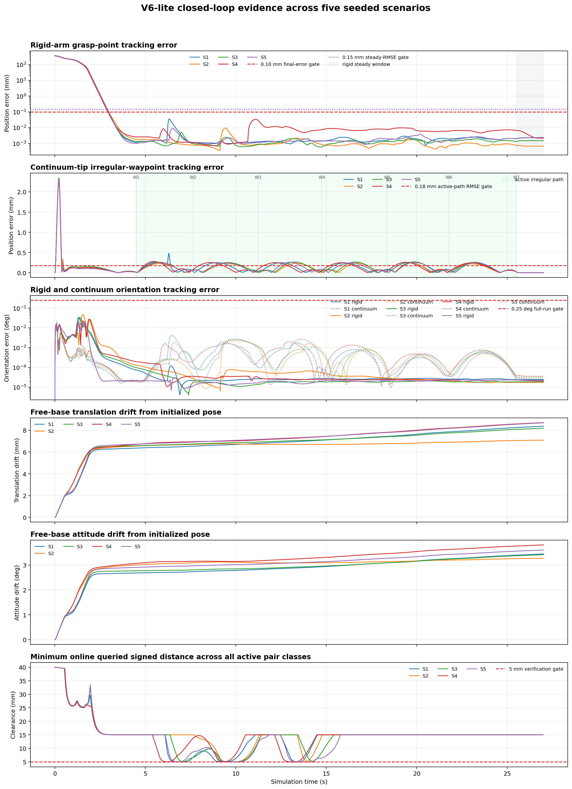
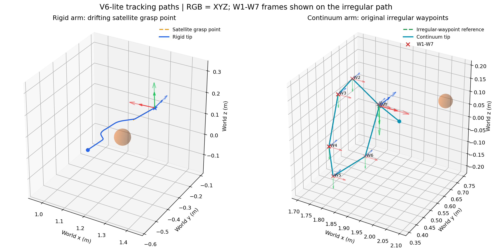
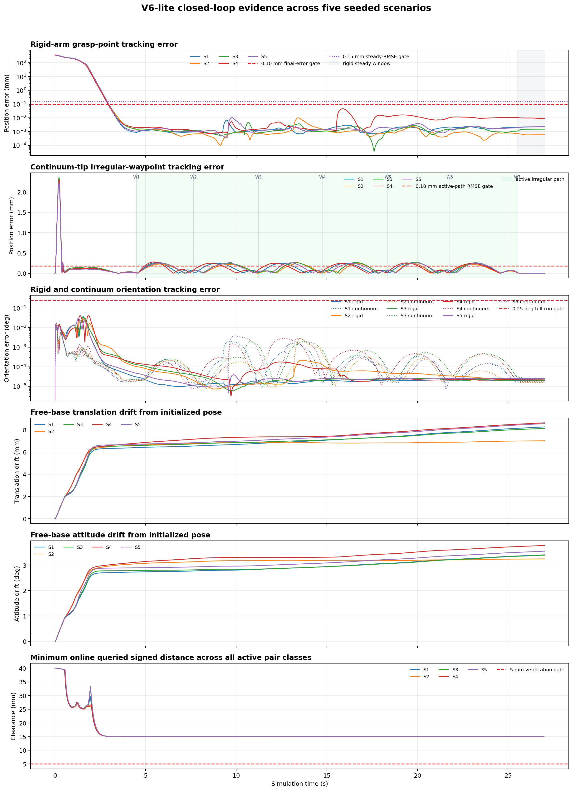
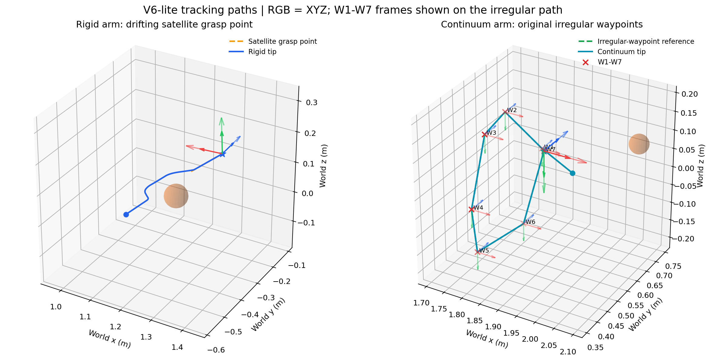

# Hybrid Dual-Arm Space Manipulator — V6-lite

这是 V6-lite 的独立、可复现实验仓库。它包含当前闭环所需的完整算法链、机器人模型、整机碰撞验证器、正式五场景 trace、验收结果以及最新可视化产物；同时包含 V6.1-A 的连续体臂形审计和 V6.1-B 的 PCC/胶囊 CBF 控制集成。

V6-lite 是**无学习在线控制器**：运行时不加载训练集、神经网络权重、归一化器或 Diffusion 模块。核心链路为：

```text
目标卫星抓捕位姿 + 连续体不规则航点 + 整机/目标有符号距离
                         ↓
             17 维约束速度 QP（50 Hz）
                         ↓
        67 维模型补偿饱和力矩伺服（500 Hz）
                         ↓
                    MuJoCo 动力学
```

## 当前合同与结果

- 合同版本：`v6_lite_6`
- 规划变量：10 维连续体形状坐标 + 7 维刚性臂关节
- 执行变量：67 个直接力矩执行器
- 在线安全：关节/速度/加速度约束、整机 signed-distance CBF、运动目标 6D 外生漂移补偿
- 目标碰撞策略：连续体、基座及非接触刚性几何均纳入硬约束；仅两个明确命名的刚性末端抓捕几何豁免
- 正式验证：5 个独立种子场景，`26/26` 检查通过，QP 失败 `0`
- 连续体—目标卫星原生 500 Hz 最小间隙：`24.994694 mm`，低于 5 mm 状态 `0`，穿透状态 `0`
- 整机 4×细分最小间隙：`14.995557 mm`
- V6.1-A 影子审计：10,000 个臂形构型 + 10,000 个卫星相对几何案例，离散 FK、PCC 导数、包络覆盖与距离梯度全部通过，胶囊/PCC 假安全均为 `0`
- V6.1-B：PCC/胶囊约束默认关闭；启用版真实五场景同样 `26/26`，QP 失败 `0`，PCC 激活 `3,718` 次、绑定 `202` 次，最差任务 p95 `18.089305 ms`
- V6.1-B 启用版连续体—目标卫星原生 500 Hz 最小间隙：`78.529716 mm`，低于 5 mm/穿透状态均为 `0/0`

当前证据是固定 MuJoCo 模型和离散检查时刻上的仿真证据，不等同于连续时间 CCD 证书、抓捕接触后组合体动力学证明或硬件安全认证。

## 仓库内容

| 路径 | 内容 |
| --- | --- |
| `v6_lite/hierarchical_qp.py` | 17 维反作用感知速度 QP、任务层级、时变 CBF 与硬约束 |
| `v6_lite/run_v6_lite.py` | 50 Hz 规划 / 500 Hz 力矩闭环、五场景运行和指标输出 |
| `v6_lite/irregular_waypoints.py` | 7 个不规则航点与分段 minimum-jerk 参考 |
| `v6_lite/validate_v6_lite.py` | trace 独立重放、整机细分距离审计及 500 Hz 连续体—卫星专项检查 |
| `v6_lite/continuum_model_spec.py` | 版本化的 5 段 PCC、30 模块离散链、10→60 映射与工作域合同 |
| `v6_lite/continuum_shape_model.py` | URDF 一致独立 FK，以及任意弧长的解析 PCC `p,R,Jp,JR` |
| `v6_lite/continuum_jacobian.py` | 任意弧长 PCC 点位置对 10 维形状变量的 `(3,10)` Jacobian 接口 |
| `v6_lite/pcc_clearance.py` | PCC 有限半径管体对移动卫星 OBB 的粗搜索、局部细化、净空与梯度 |
| `v6_lite/pcc_monitor.py` | 50 Hz PCC/胶囊/MuJoCo 对照记录及三类审计图 |
| `v6_lite/shape_clearance.py` | 61 胶囊 + 原几何兜底、移动卫星 OBB 净空及只读三方影子对照 |
| `v6_lite/audit_v6_1a.py` | 10,000 构型/10,000 目标案例的冻结审计与报告生成器 |
| `v6_lite/audit_v6_1_b.py` | 1,000 Jacobian + 10,000 false-safe + 在线单-QP 审计 |
| `v6_lite/finalize_v6_1_b.py` | 汇总默认关闭/启用五场景 A/B、监控与回归报告 |
| `model_test/` | 17→67 维模型合同、角度约定与共享整机碰撞验证器 |
| `dual_arm_space_robot_2026/` | 当前主 URDF 及其实际引用的 75 个 STL 网格 |
| `v6_lite/output/` | 正式指标、5 个完整 trace、验证报告和哈希清单 |
| `v6_lite/visualization/output/` | 六面板误差图、三维路径图、基座漂移 GIF、五个单视角视频、组合视频及预览图 |
| `v6_lite/visualization/continuum_focus_output/` | 连续体一侧专用视频、预览图及 manifest |
| `v6_lite/visualization/output_v6_1_b/` | V6.1-B 启用版新生成的全套图、GIF、五视角视频、预览图和 22/22 校验 |
| `v6_lite/visualization/continuum_focus_output_v6_1_b/` | V6.1-B 连续体单侧视频及预览图 |
| `docs/DERIVATION_PACKAGE.md` | PCC 臂形曲线、臂体—卫星距离、时变 CBF 推导和相关文献 |
| `docs/V6_1A_SHAPE_GEOMETRY_AUDIT.md` | V6.1-A 实现、正式数值、产物和证据边界 |
| `docs/V6_1B_PCC_CBF_INTEGRATION.md` | V6.1-B 几何、广义距离 Jacobian、CBF、A/B 与正式结果 |
| `v6_lite/V6_LITE_LOGIC_ARCHITECTURE.md` | 完整逻辑架构、输入输出、控制与验收定义 |

## 环境

已验证环境为 Python 3.9/3.10、MuJoCo 3.3.2、NumPy 1.26.4、SciPy 1.11.2、Matplotlib 3.8.0、Pillow 10.2.0。核心运行与验证不依赖 PyTorch。NumPy 1.26.4 同时满足 SciPy 1.11.2 的 Windows 二进制 C-API；旧的 1.21.6 组合在导入 `scipy.linalg` 时会发生 ABI 错误。

`requirements.txt` 固定为生成当前证据时的精确版本；其中 MuJoCo 版本会参与运行合同身份哈希，不应在复验现有 trace 时自动升级。

```bash
python -m venv .venv
# Windows: .venv\Scripts\activate
# Linux/macOS: source .venv/bin/activate
python -m pip install --upgrade pip
python -m pip install -r requirements.txt
```

生成或审计 MP4 还要求系统 `PATH` 中可找到 `ffmpeg` 和 `ffprobe`。

## 运行、验证和测试

以下命令都从仓库根目录执行：

```bash
python -m v6_lite.run_v6_lite
python -m v6_lite.validate_v6_lite
python -m unittest v6_lite.test_v6_lite v6_lite.test_target_collision_policy -v
python -m unittest v6_lite.visualization.test_visualizations -v
python -m v6_lite.audit_v6_1a
python -m unittest v6_lite.test_continuum_shape_model v6_lite.test_shape_clearance v6_lite.test_v6_1a_artifacts -v

# V6.1-B 正式几何审计、默认关闭/启用 A/B 与聚合报告
python -m v6_lite.audit_v6_1_b
python -m v6_lite.run_v6_lite --output-dir v6_lite/output/v6_1_b/baseline_root/output
python -m v6_lite.run_v6_lite --output-dir v6_lite/output/v6_1_b/enabled_root/output --enable-pcc-cbf --enable-capsule-cbf
python -m v6_lite.finalize_v6_1_b
python -m unittest v6_lite.test_v6_1_b -v
```

完整五场景运行会重新生成约 140 MB 的 trace，并进行密集距离计算，因此耗时明显高于单元测试。仓库已经包含当前正式 trace，可直接运行独立验证。

## 可视化

V6.1-B 启用版最新可视化使用 `v6_lite/output/v6_1_b/enabled_root/output/` 中的正式五场景 trace；目录 `visualization/output/` 保留 V6-lite 稳定版的旧图和视频。完整的 V6.1-B 图与视频清单见 [visualization_manifest.json](v6_lite/visualization/output_v6_1_b/visualization_manifest.json)，独立校验为 [22/22](v6_lite/visualization/output_v6_1_b/visualization_validation.json)。





- [V6.1-B 五视角组合视频](v6_lite/visualization/output_v6_1_b/videos/v6_lite_scenario_00_five_view_grid.mp4)
- [V6.1-B 连续体单侧视频](v6_lite/visualization/continuum_focus_output_v6_1_b/videos/v6_lite_scenario_00_continuum_focus.mp4)

以下命令重建 V6-lite 稳定版可视化：

```bash
python -m v6_lite.visualization.generate_visualizations
python -m v6_lite.visualization.validate_visualizations

# 只生成连续体一侧专用视频
python -m v6_lite.visualization.generate_visualizations \
  --continuum-focus-only \
  --output-dir v6_lite/visualization/continuum_focus_output
```





视频入口：

- [五视角组合视频](v6_lite/visualization/output/videos/v6_lite_scenario_00_five_view_grid.mp4)
- [连续体一侧专用视频](v6_lite/visualization/continuum_focus_output/videos/v6_lite_scenario_00_continuum_focus.mp4)

## 进一步阅读

- [V6-lite 完整逻辑架构](v6_lite/V6_LITE_LOGIC_ARCHITECTURE.md)
- [PCC 几何距离与安全约束推导](docs/DERIVATION_PACKAGE.md)
- [V6.1-A 臂形与有限体积几何审计](docs/V6_1A_SHAPE_GEOMETRY_AUDIT.md)
- [V6.1-B PCC/胶囊 CBF 控制集成](docs/V6_1B_PCC_CBF_INTEGRATION.md)
- [V6-lite 模块说明](v6_lite/README.md)
- [机器人模型资产来源与发布状态](ASSET_PROVENANCE.md)
