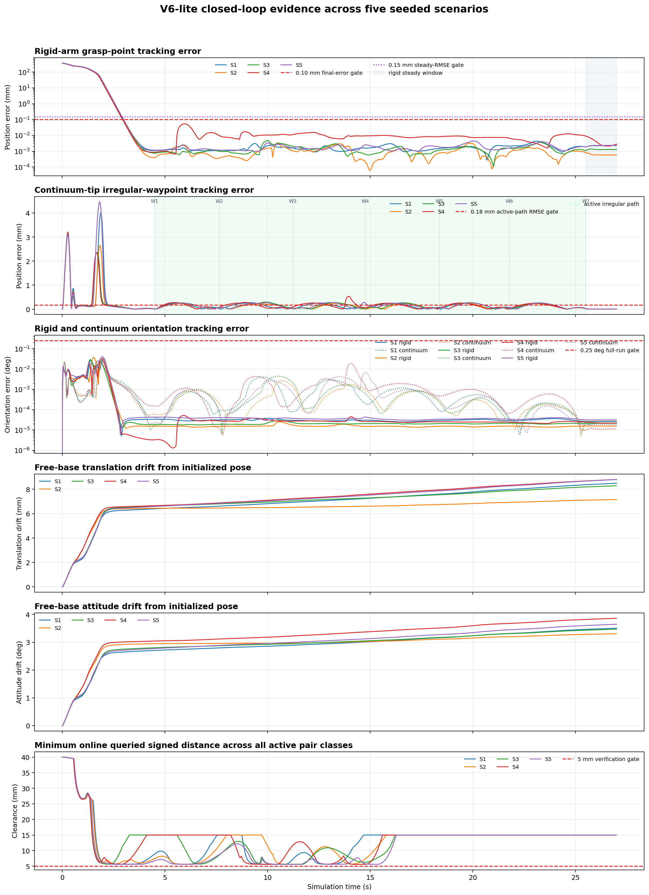
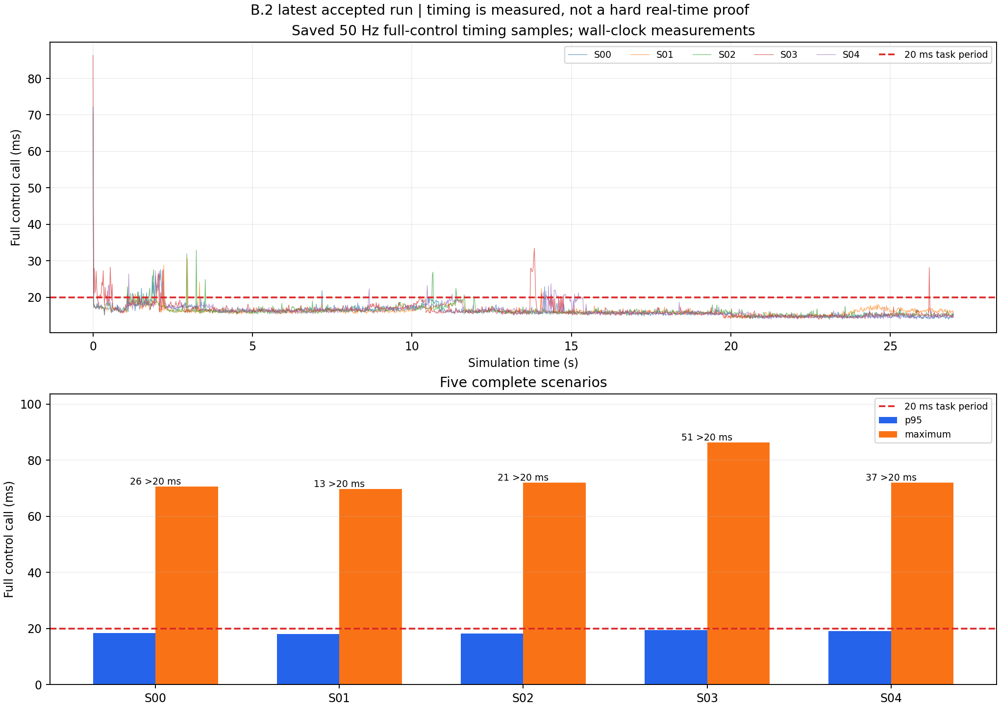

# Hybrid Dual-Arm Space Manipulator — V6-lite

这是 V6-lite 的独立实验仓库。当前实现为 V6.2-C.1 `bounded_interval_pcc`：保留 B.2 功能，加入端到端发布时序、等价工作区优化与延迟拒绝。C.1 的离线功能与重复计时验收通过，持续墙钟执行验收未通过；历史 B.2 的重复计时失败继续保留。在线使用一个 17 维加权速度 QP、十步执行斜坡与 67 路力矩伺服。A.1 / `legacy_pcc` 保留为历史对照。[机器可读状态](v6_lite/controller_status.json)区分历史结果与当前验收状态。

**C.1 最新结果：** 三轮完整五场景的非计时 trace 严格相同，原重放 `26/26`、合同 `11/11`、区间独立重算通过；20,250 周期的发布 p95 最差 `17.775 ms`，15/15 场景运行通过原 20 ms p95 门槛。功能和计时采样显式使用 `offline_replay`。默认墙钟门禁的五场景持续执行探测全部因过期停止，故持续执行验收仍为 `NOT_MET`，不宣称稳定 50 Hz 或硬实时。完整长尾、27 项延迟拒绝及全量回归 16 项历史源码哈希失败见 [C.1 报告](docs/V6_2_C1_RUNTIME_EVIDENCE.md)。

**C.1.1 当前状态：部分通过，持续执行验收 NOT_MET。** 默认区间墙钟路径为原生 500 Hz 执行循环，独立规划进程直接发布双缓冲命令。最新默认 native/HIGH/wall_deadline 流程绑定同一源码，该冻结候选的当前测试 186/186、历史冻结 16/16；27 s 单场景完整通过，发布 p95 为 14.954 ms、采集到实际应用 p95 为 19.861 ms。五场景全部尝试，仅 01 完成，四场因原生晚唤醒 3.735–4.608 ms 拒绝。强化审计确认完整场景 13,500 步一致，四次拒绝后未执行下一步。旧试验和失败全部保留；原生完整五场景、正式三轮及新完整 26/11/区间验收仍未达成。管理员优先级试验支线现已暂缓；权限条件未满足，不阻塞下面的补充研究路线。详见 [C.1.1 报告](docs/V6_2_C11_WALL_HANDOFF.md)。

**研究/仿真补充验收：PASSED。** 新源码 `9cd1831e7c77a340464a669eac3b5aa7cd9c3c3c` 完成五场景各 27 s、67,500 个物理步和 6,750 个规划周期；当前测试 200/200、历史冻结 16/16。研究交付功能/证据检查 25/25、执行合同 11/11；6,755 个规划边界、12,350 条区间行独立重算零失配，每场 90 个非计时数组与 C.1 第一轮严格相同。原 26 项仍全部重算，显式研究 profile 将 `measured_rate_deadlines` 单列性能观察；默认 legacy 的 26 项判定不变。模式 `research_simulation` 复用已有 C.1 同步优化路径，保留模拟 50 Hz/500 Hz 及原安全合同，无需管理员权限。

本轮规划/发布 20 ms、力矩 2 ms 的 p95 采样目标通过；最差单场景发布 p95/p99 为 18.929/22.350 ms，最大 37.411 ms，107/6,750 周期超过 20 ms、最长连续 11 个，启动周期完整保留。[额外独立审计 02](v6_lite/output/runs/research_independent_audit_02/report.json) 190/190，通过对全部证书、守卫、原始时钟、数组及 manifest 的核对；审计 01 的路径表示比较工具失败仍保留。研究通过补充原 C.1.1 目标；原生墙钟部署仍为 `NOT_MET`，硬件安全为 `NOT_ESTABLISHED`，旧目标未完成。具体源码、轨迹、独立验证、审计限制和性能范围见 [研究验收说明](docs/V6_2_RESEARCH_ACCEPTANCE.md) 与 [新运行报告](v6_lite/output/runs/research_acceptance_01/report.json)。

**后续保守性归因与形状诊断已完成：** 原 1,024 例计数精确复现；190 个误拒绝中，172 个来自固定代理本身低于门槛，18 个是原查询未判定。默认在线决策查询解决了全部 18 个未知案例，提高预算没有新增收益。固定 172 例中，同半径离散链只恢复 25 个判定，147 个仍低于门槛；原协议充分包络余量均为正。首协议独审 29/29，形状诊断 1,720 项数值与最终证据链 13/13 核对通过。保持安全半径，停止静态诊断扩张。预声明目标平移速度 2 倍闭环实验现已执行：五场全部尝试，2 场完成、3 场拒绝，完整验收失败且不完整；独立诊断确认三次冻结状态在原容差下约束冲突，增加求解迭代不能解决。保存全部失败，转向模型和执行误差研究，见 [压力实验报告](docs/V6_2_RESEARCH_VELOCITY_STRESS.md)。这些是有限离线证据，见 [保守性研究报告](docs/V6_2_RESEARCH_CONSERVATISM.md) 与 [形状与包络报告](docs/V6_2_RESEARCH_SHAPE_DECOMPOSITION.md)。

V6-lite 是**无学习在线控制器**：运行时不加载训练集、神经网络权重、归一化器或 Diffusion 模块。核心链路为：

```text
目标卫星抓捕位姿 + 连续体不规则航点 + 整机/目标有符号距离
                         ↓
             17 维约束速度 QP（50 Hz）
                         ↓
        67 维模型补偿饱和力矩伺服（500 Hz）
                         ↓
                    MuJoCo 动力学
```

## 当前合同与结果

- 历史 trace schema / `contract_version`：`v6_2_a1_ramp_aware_qp`；C.1 冻结基点 `0e76aba`。实际控制器、PCC 模式、伺服公式、积分器和模型哈希分别记录在 `runtime_identity` 中。
- 区间模式伺服：`b2_implicitfast_compensated_torque_v1`；旧模式伺服：`a1_model_based_servo_torque_v1`，二者保留各自公式。
- 规划变量：10 维连续体形状坐标 + 7 维刚性臂关节
- 执行变量：67 个直接力矩执行器
- 在线安全：关节/速度/加速度约束、整机 signed-distance CBF、运动目标 6D 外生漂移补偿
- 目标碰撞策略：连续体、基座及非接触刚性几何均纳入硬约束；仅两个明确命名的刚性末端抓捕几何豁免
- V6.2-A.1：关闭组和 PCC＋胶囊开启组各 5 场景；每组原 26 项真实 MuJoCo 力矩重放 `26/26`，新增执行合同 `11/11`，QP 失败 `0`
- V6.2-A.1：两组最差全链规划 p95 分别为 `14.402 ms` 和 `18.162 ms`；完整运行 trace 保存在本地，哈希见 [A.1 manifest](v6_lite/output/v6_2_a1/evidence_manifest.json)
- V6.2-B.1：另行从力矩重放状态重建几何行、目标漂移和自由基座反作用映射；原 `11/11` 报告保持原定义，新增报告单独给出
- V6.2-B.1 离线 PCC 有界距离查询：五段全覆盖区间下界；历史协议重生成 10,000 案例与独立冻结 1,024 案例的审计、精度、未判定和耗时见 [B.1 自动报告](v6_lite/output/v6_2_b1/formal_audit_r02/BOUNDED_CLEARANCE_AUDIT.md)
- V6.2-B.2 功能交付：五场景完整运行，真实力矩重放 `26/26`、执行合同 `11/11`；6,755 个规划边界、12,350 条区间行独立重算无不一致。[在线证据](docs/V6_2_B2_ONLINE_EVIDENCE.md)保留完整运行 p95 最大值 `19.529 ms` 和三轮重复计时失败 `20.457 / 20.571 / 24.729 ms`。
- 旧 A.1 影子轨迹的在线门禁仍为 `NOT_MET`，见[历史第二阶段证据](v6_lite/output/v6_2_b2/stage2_summary/STAGE2_EVIDENCE.md)。新区间闭环验收不改写历史门禁结果。
- C.1 在 `timing/<scenario>.jsonl` 保存状态采集至首路力矩发布的墙钟与线程 CPU 时间线，保留原算法计时。各阶段不重叠，嵌套求解器统计单独注明；p95、p99、最大值、超期次数、连续超期与首周期均保留。
- 历史 C.1 区间模式执行 `wall_deadline`：有效期固定从采集时刻起算 20 ms，十个力矩步均检查墙钟、模型、命令、区间、次序及预演起点；到期拒绝，不自动续期。同步仿真计算期间物理被冻结，因此即使墙钟门禁通过，也不能解释为真实异步硬件的安全证明。
- `offline_replay` 仅用于功能复验与完整性能采样，明确标记墙钟有效性未强制保证；它仍检查状态及预演一致性。停止仿真与迟到拒绝不构成安全备份。
- 历史 V6-lite 正式验证：5 场景 `26/26`，原生 500 Hz 连续体—目标最小间隙 `24.994694 mm`，整机 4×细分最小间隙 `14.995557 mm`
- V6.1-A 影子审计：10,000 个臂形构型 + 10,000 个卫星相对几何案例，离散 FK、PCC 导数、包络覆盖与距离梯度全部通过，胶囊/PCC 假安全均为 `0`
- V6.1-B：PCC/胶囊约束默认关闭；启用版真实五场景同样 `26/26`，QP 失败 `0`，PCC 激活 `3,718` 次、绑定 `202` 次，最差任务 p95 `18.089305 ms`
- V6.1-B 启用版连续体—目标卫星原生 500 Hz 最小间隙：`78.529716 mm`，低于 5 mm/穿透状态均为 `0/0`

当前证据是固定 MuJoCo 模型和离散检查时刻上的仿真证据，不等同于连续时间 CCD 证书、抓捕接触后组合体动力学证明或硬件安全认证。

## 仓库内容

| 路径 | 内容 |
| --- | --- |
| `v6_lite/hierarchical_qp.py` | 17 维反作用感知速度 QP、任务层级、时变 CBF 与硬约束 |
| `v6_lite/run_v6_lite.py` | 50 Hz 规划 / 500 Hz 力矩闭环、五场景运行和指标输出 |
| `v6_lite/run_evidence.py`、`v6_lite/run_matrix.py` | 唯一运行目录、起始元数据、失败保留及预声明的重复时延试验 |
| `v6_lite/recompute_execution_constraints.py` | 从原生力矩重放状态独立重建瞬时、斜坡和前瞻约束残差 |
| `v6_lite/bundle_evidence.py` | 原始 trace 打包、SHA-256 清单校验与不可覆盖导入 |
| `v6_lite/pcc_bounded_clearance.py`、`v6_lite/audit_b1_bounded_clearance.py` | 五段 PCC—OBB 距离上下界与只读离线审计；不进入在线控制 |
| `v6_lite/pcc_interval_cbf.py`、`v6_lite/pcc_persistent_interval_query.py` | B.2 在线固定材料区间安全函数、同一函数的 Jacobian 与持久区间决策查询 |
| `v6_lite/shadow_b2_interval_cbf.py`、`v6_lite/audit_b2_budget_frontier.py`、`v6_lite/audit_b2_refined_start.py` | B.2 原生重放影子、离线预算阶梯及高预算斜坡起点诊断；逐状态结果和失败快照保留 |
| `v6_lite/irregular_waypoints.py` | 7 个不规则航点与分段 minimum-jerk 参考 |
| `v6_lite/validate_v6_lite.py` | trace 独立重放、整机细分距离审计及 500 Hz 连续体—卫星专项检查 |
| `v6_lite/continuum_model_spec.py` | 版本化的 5 段 PCC、30 模块离散链、10→60 映射与工作域合同 |
| `v6_lite/continuum_shape_model.py` | URDF 一致独立 FK，以及任意弧长的解析 PCC `p,R,Jp,JR` |
| `v6_lite/continuum_jacobian.py` | 任意弧长 PCC 点位置对 10 维形状变量的 `(3,10)` Jacobian 接口 |
| `v6_lite/pcc_clearance.py` | PCC 有限半径管体对移动卫星 OBB 的粗搜索、局部细化、净空与梯度 |
| `v6_lite/pcc_monitor.py` | 50 Hz PCC/胶囊/MuJoCo 对照记录及三类审计图 |
| `v6_lite/shape_clearance.py` | 61 胶囊 + 原几何兜底、移动卫星 OBB 净空及只读三方影子对照 |
| `v6_lite/audit_v6_1a.py` | 10,000 构型/10,000 目标案例的冻结审计与报告生成器 |
| `v6_lite/audit_v6_1_b.py` | 1,000 Jacobian + 10,000 false-safe + 在线单-QP 审计 |
| `v6_lite/finalize_v6_1_b.py` | 汇总默认关闭/启用五场景 A/B、监控与回归报告 |
| `model_test/` | 17→67 维模型合同、角度约定与共享整机碰撞验证器 |
| `dual_arm_space_robot_2026/` | 当前主 URDF 及其实际引用的 75 个 STL 网格 |
| `v6_lite/output/v6_2_a1/` | A.1 两组报告、反例和本地原始 trace；完整 trace 不进入 Git 历史 |
| `v6_lite/output/runs/` | B.1 起每次运行的新编号目录；失败与中止目录也保留 |
| `v6_lite/visualization/output/` | 历史 V6-lite 六面板误差图、三维路径图、GIF 和五视角视频 |
| `v6_lite/visualization/continuum_focus_output/` | 历史连续体单侧视频、预览图及 manifest |
| `v6_lite/visualization/output_v6_2_b2_latest_20260930/` | 最新 B.2 五场景总图、逐场景路径图、30 个五视角/组合视频、预览图和哈希校验 |
| `v6_lite/visualization/output_v6_1_b/` | V6.1-B 历史图、GIF、五视角视频和 22/22 校验 |
| `v6_lite/visualization/continuum_focus_output_v6_1_b/` | V6.1-B 连续体单侧视频及预览图 |
| `docs/DERIVATION_PACKAGE.md` | PCC 臂形曲线、臂体—卫星距离、时变 CBF 推导和相关文献 |
| `docs/V6_1A_SHAPE_GEOMETRY_AUDIT.md` | V6.1-A 实现、正式数值、产物和证据边界 |
| `docs/V6_1B_PCC_CBF_INTEGRATION.md` | V6.1-B 几何、广义距离 Jacobian、CBF、A/B 与正式结果 |
| `v6_lite/V6_LITE_LOGIC_ARCHITECTURE.md` | 完整逻辑架构、输入输出、控制与验收定义 |

## 环境

已验证环境为 Python 3.9/3.10、MuJoCo 3.3.2、NumPy 1.26.4、SciPy 1.11.2、Matplotlib 3.8.0、Pillow 10.2.0。核心运行与验证不依赖 PyTorch。NumPy 1.26.4 同时满足 SciPy 1.11.2 的 Windows 二进制 C-API；旧的 1.21.6 组合在导入 `scipy.linalg` 时会发生 ABI 错误。

`requirements.txt` 固定为生成当前证据时的精确版本；其中 MuJoCo 版本会参与运行合同身份哈希，不应在复验现有 trace 时自动升级。

```bash
python -m venv .venv
# Windows: .venv\Scripts\activate
# Linux/macOS: source .venv/bin/activate
python -m pip install --upgrade pip
python -m pip install -r requirements.txt
```

生成或审计 MP4 还要求系统 `PATH` 中可找到 `ffmpeg` 和 `ffprobe`。

## 运行、验证和测试

以下命令都从仓库根目录执行：

```bash
# 补充研究入口：新目录、完整五场景及独立验证；无需管理员权限
python -m v6_lite.run_research_acceptance --output-dir v6_lite/output/runs/research-new-acceptance

# 每次自动生成 output/runs/<run_id>/；已存在的目录不会被覆盖
python -m v6_lite.run_v6_lite
python -m v6_lite.run_v6_lite --enable-pcc-cbf --enable-capsule-cbf

# C.1 默认墙钟门禁；超时保留失败目录并停止物理消费命令
python -m v6_lite.run_v6_lite --pcc-mode bounded_interval_pcc --enable-capsule-cbf

# 预声明三轮、每轮完整五场景 27 s；显式离线复验，保留全部时延与失败
python -m v6_lite.run_c1_acceptance --output-dir v6_lite/output/runs/c1-new-matrix --reference-dir <frozen-reference-run>
python -m v6_lite.audit_c1_delay_injection --run-dir <complete-c1-run> --output-dir v6_lite/output/runs/c1-new-delay

# 预声明每组 3 轮；所有轮次和失败均保留，不筛选通过轮次
python -m v6_lite.run_matrix --repeats 3

# 用实际新运行目录代替 <run_dir>；旧 26 项、A.1 的 11 项与 B.1 重算分别报告
python -m v6_lite.validate_v6_lite --output-dir <run_dir>
python -m v6_lite.recompute_execution_constraints --output-dir <run_dir>

# 不覆盖既有包或导入目录；可重复 --include 引入反例和其他运行
python -m v6_lite.bundle_evidence pack --bundle v6_lite/output/releases/v6-evidence.zip --include run=<run_dir>
python -m v6_lite.bundle_evidence verify --bundle v6_lite/output/releases/v6-evidence.zip --import-dir v6_lite/output/releases/imported-v6-evidence

# 离线有界几何审计；默认重生成历史 10,000 案例并冻结新留出集
python -m v6_lite.audit_b1_bounded_clearance --output-dir v6_lite/output/v6_2_b1/new_audit_run

python -m unittest discover -s v6_lite -p 'test*.py'
```

运行开始时的 `run_metadata.json` 绑定 Git 提交、源码哈希、模型、配置、场景和机器环境；`traces/` 保存力矩与状态，`failures/` 保存执行拒绝的部分 trace，`run_failure.json` 保存验收失败或异常。墙钟计时日志不能由物理重放重新产生。V6.1-B 的原路径是历史产物，当前运行入口会拒绝覆盖；原审计说明见 [V6.1-B 文档](docs/V6_1B_PCC_CBF_INTEGRATION.md)。

B.1 有界查询只界定当前 PCC 管体代理的连续弧长最小净空；返回代理安全、代理低于门槛或未知，并单独标明工作域和真实几何包络的证据范围。`bounds_valid` 依赖精确数学模型的弧长导数界，双精度外扩尚非形式化数值认证；有限样本包络回归不构成全域或连续时间保证。原在线 `PCCClearanceEvaluator` 及安全参数保持不变。

## 可视化

当前可视化使用 B.2 新区间 PCC 的[最新完整五场景运行](v6_lite/output/v6_2_b2/online_dense_slices_five_20260930/artifact_manifest.json)。图、GIF、逐场景路径、每场景五个视角和组合视频见[可视化总览](docs/V6_2_B2_LATEST_VISUALIZATION.md)，逐文件 SHA-256 和源 trace 绑定见[清单](v6_lite/visualization/output_v6_2_b2_latest_20260930/visualization_manifest.json)，独立文件与视频核验见[校验结果](v6_lite/visualization/output_v6_2_b2_latest_20260930/visualization_validation.json)。完整控制调用计时及求解候选与实际执行也在该总览中。旧图和视频仍在各自历史目录。





- [最新五场景组合视频入口](docs/V6_2_B2_LATEST_VISUALIZATION.md#每个场景的路径与五视角回放)
- [历史 V6.1-B 清单](v6_lite/visualization/output_v6_1_b/visualization_manifest.json)

以下命令重建 V6-lite 稳定版可视化：

```bash
python -m v6_lite.visualization.generate_visualizations
python -m v6_lite.visualization.validate_visualizations

# 只生成连续体一侧专用视频
python -m v6_lite.visualization.generate_visualizations \
  --continuum-focus-only \
  --output-dir v6_lite/visualization/continuum_focus_output
```

历史 V6-lite 稳定版的图和视频仍可从[旧清单](v6_lite/visualization/output/visualization_manifest.json)查询；它们不属于当前 B.2 可视化。

## 进一步阅读

- [研究/仿真、性能、墙钟部署与硬件安全的独立验收](docs/V6_2_RESEARCH_ACCEPTANCE.md)
- [V6-lite 完整逻辑架构](v6_lite/V6_LITE_LOGIC_ARCHITECTURE.md)
- [PCC 几何距离与安全约束推导](docs/DERIVATION_PACKAGE.md)
- [V6.1-A 臂形与有限体积几何审计](docs/V6_1A_SHAPE_GEOMETRY_AUDIT.md)
- [V6.1-B PCC/胶囊 CBF 控制集成](docs/V6_1B_PCC_CBF_INTEGRATION.md)
- [V6-lite 模块说明](v6_lite/README.md)
- [机器人模型资产来源与发布状态](ASSET_PROVENANCE.md)
