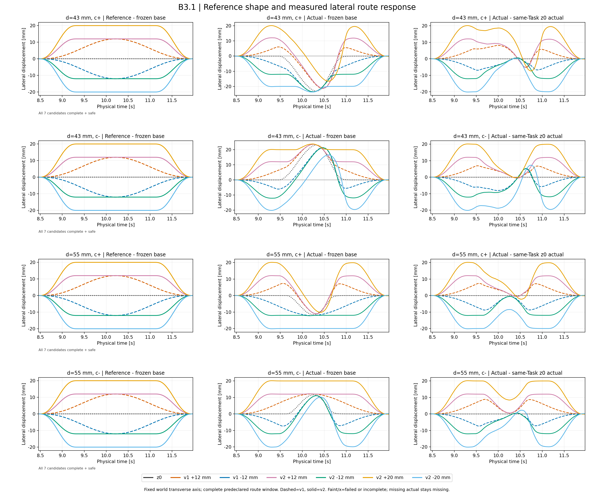
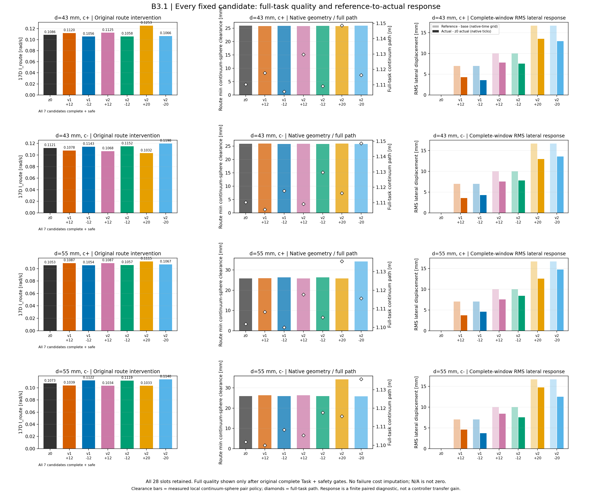
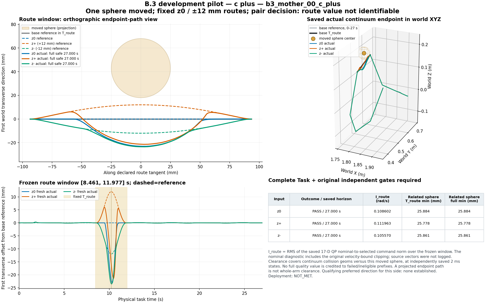
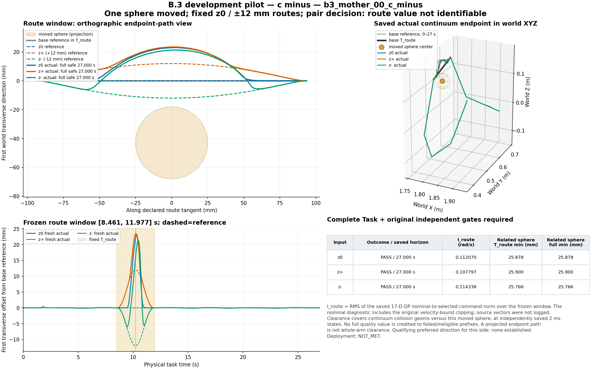
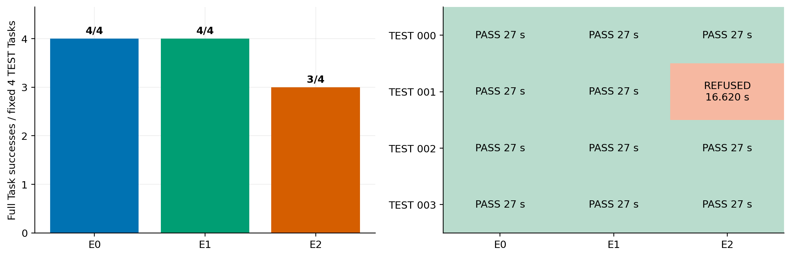
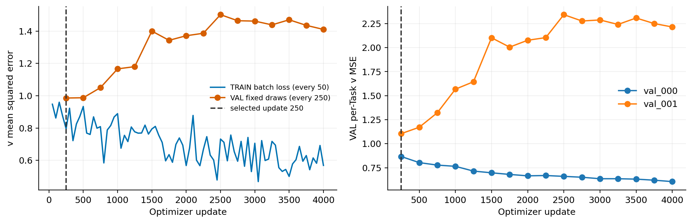
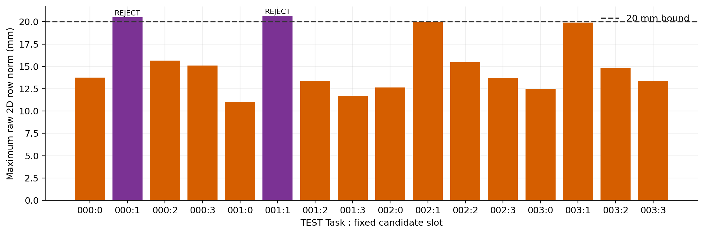
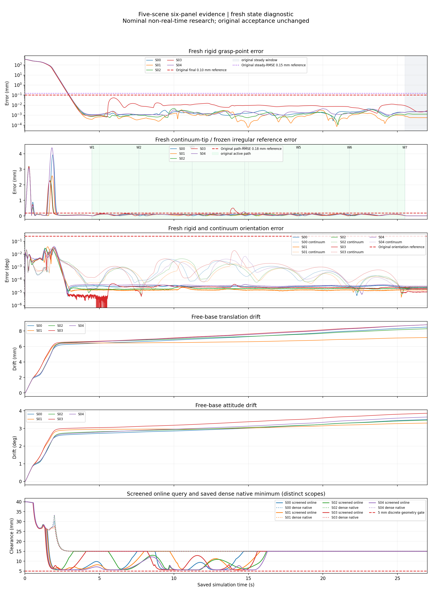
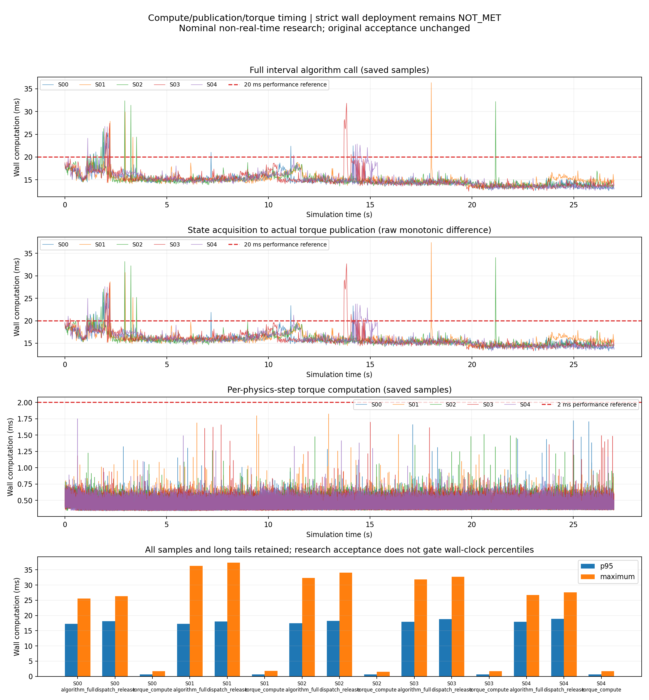

<!-- 2026-10-07 B.3.1 保存状态媒体补充 -->

**当前媒体已同步更新：全部 28 槽、196 个视频。** 五视角、连续体侧视、双臂末端轨迹、位置/姿态误差、基座漂移与保存的净空诊断均对应当前固定结果。仅读取保存状态，不新增闭环实验。

[完整媒体目录：五视角、连续体侧视、末端轨迹与误差](v6_4/visualization/execution_aware_media_20261007_01/README.md) · [交互目录](v6_4/visualization/execution_aware_media_20261007_01/index.html) · [来源与验证说明](docs/V6_4_B31_MEDIA_SUPPLEMENT.md)

原研究两图、报告、审查与冻结清单继续保留如下。新增媒体和当前入口的来源、校验另行记账。

---

# Hybrid Dual-Arm Space Manipulator — V6.4-B.3.1

当前分支 `v6.4-b3-1-execution-aware-route-teacher` 交付控制器感知参考与有限质量教师补充：一个母场景、四个开发任务、七种固定参考，共 28 个固定槽位，其中六条复用旧 B.3 原件、22 条为新增槽位。

**有限teacher较最佳常量低3.27%、较冻结几何规则低1.03%；同幅值v2没有一致优势，Diffusion收益未建立。**

完整 Task 与原安全门禁通过 **28/28**，质量指标可比较 **28/28**；两者分开记账。没有训练、模型采样或独立泛化 TEST，deployment 为 `NOT_MET`。下一步：结束本轮，保留有限质量向量和非学习基线，暂不训练新网络。

[当前两图与全部候选](v6_4/visualization/execution_aware_route_teacher_20261007_01/index.html) · [可视化说明](docs/V6_4_B31_VISUALIZATION.md) · [全部 28 行 CSV](v6_4/visualization/execution_aware_route_teacher_20261007_01/all_candidates.csv) · [有限教师与对照](v6_4/visualization/execution_aware_route_teacher_20261007_01/teacher_records.json) · [portable 研究报告](v6_4/releases/execution_aware_route_teacher_20261007_01/report.md) · [run03 独立审查](paper/review-traces/experiment-result-to-claim/2026-10-07_run03/response.md) · [审查 verdict](paper/review-traces/experiment-result-to-claim/2026-10-07_run03/verdict.json)





两图分别展示参考与实际横向响应、实际路线质量及几何指标；失败和缺测保持标注，旧六条缺失的 QP 向量不反算。actual、private preview、独立 replay、原生几何与附加路线查询成本见报告分账。actual producer 为 `d4464c8ae2aa7913a730ebbd775917e7a3b1af71`；后处理、绘图和发布的 source/hash 另行绑定。

独立审查：run03为partial / high，blocking_issues=[]；支持有限开发集结论，下游论文写作因缺少paper claim audit保持provisional。 发布状态：研究结论已独立审阅；本地封存、便携导出和远端提交验证由publication_receipts中的收据记录。

旧 B.3 的六条 pilot 均完整安全通过，但相对零参考仅 2.79%/3.81%，未达到原 10% 门槛；旧 P2/P3 与五组 TEST 仍为 `NOT_RUN_PILOT_STOP`。本补充不改写旧停止结论。[B.3 原报告](v6_4/releases/conditional_route_value_20261007_01/report.md) · [B.3 图表](v6_4/visualization/conditional_route_value_20261007_01/index.html) · [B.2 图表](v6_4/visualization/task_anchored_residual_20261007_01/index.html) · [V6.2 历史](v6_lite/visualization/latest/index.html)

<details>
<summary>历史归档：B.3 负结果、B.2 与 V6.2 原发布说明</summary>

# Hybrid Dual-Arm Space Manipulator — V6.4-B.3

本分支 `v6.4-b3-conditional-route-value` 收录场景依赖路线价值的固定预算补充研究。它从已发布 B.2 派生，使用原 12 维、20 mm 任务锚定残差和原执行/安全层；每对任务仅将一个既有球障碍换边。

**六个 pilot 槽位全部完整安全通过，但路线价值未达到预声明门槛。** c+ 侧较好的非零方向为 z−，相对零残差的路线窗口干预 RMS 降低 **2.79%**；c− 侧为 z+，降低 **3.81%**。数值偏好随障碍换边反转，改善均未达到要求的 10%；全部成功也未满足“一条成功、另一条失败”的判据。因此按冻结停止规则结束，不追加位置搜索、候选、幅值、种子或网络。

| 阶段 | 实际状态 |
|---|---|
| P0：旧 B.2 update250 固定噪声诊断 | 32 次 DDIM；16/16 对观察到条件响应，27/32 原始输出幅值合法；响应不证明正确适应 |
| P1：两侧 z0 / z+ / z− | **6/6 完整 Task + 原独立安全门禁通过**，一个开发母场景、两个任务 |
| P2 / P3：teacher 与新训练 | 按 pilot 停止规则未运行；optimizer 更新 0 |
| P4：Z0 / R0 / U0 / D_true / D_swap | 全部 **`NOT_RUN_PILOT_STOP`**，不能写成 0/4 失败或某方法胜出 |
| 路线价值 / 部署 | `ROUTE_VALUE_NOT_IDENTIFIABLE_WITHIN_CURRENT_REPRESENTATION` / **`NOT_MET`** |

当前已建立非学习可执行性见证；瓶颈是固定任务中的路线质量差额不足。本轮有限负结果不否定 Diffusion，也没有建立增加 Diffusion 优于简单检索的收益证据。

## 当前 B.3 可视化与报告

[两图与方法表说明](docs/V6_4_B3_VISUALIZATION.md) · [静态可视化总览](v6_4/visualization/conditional_route_value_20261007_01/index.html) · [可移植研究报告](v6_4/releases/conditional_route_value_20261007_01/report.md) · [方法表 CSV](v6_4/visualization/conditional_route_value_20261007_01/method_table.csv) · [方法表 Markdown](v6_4/visualization/conditional_route_value_20261007_01/method_table.md)





两张图对应开发 pilot 的两个障碍侧，分别提供 PNG / PDF；图中的端点路径投影不替代全连续体碰撞检查。刷新仅读取保存证据，没有新增物理执行、训练、采样或视频任务。静态 HTML 无外部依赖；GitHub 可直接查看本页两图及方法表。

完整质量比较要求 27 s Task、执行合同、区间独立重算、原生几何与参考消费绑定全部通过。`I_route` 复用原 QP 日志中的 17 维名义速度与实际选中速度差的范数，在冻结关键区间内取 RMS；名义值包含原速度边界裁剪，两个源向量未保存。净空单独报告连续体与移动球的相关几何对。

## 成本、身份与范围

本轮消耗 6 个 actual 槽位，actual、私有预演、独立保存力矩重放各 81,000 物理步，分别计费。执行及证据流程的原生几何查询为 201,187,130 次，额外路线质量查询 5,022,372 次，输入几何预检 41,846 次，旧保存状态的接线检查另列 186 次；这些不算新的独立闭环。

20 ms 规划、2 ms 物理、27 s 任务与原安全标准保持。墙钟 20 ms 不作研究门禁；robot-target 仍为原生 500 Hz，whole-body 为 50 Hz 边界加配置空间 subdivisions4。部署 `NOT_MET`，没有连续时间、硬实时或模型失配保证。

B.3 实际执行 producer：`f5f1687f5ba0b119c91bbc385dfdc841b56d091e`；已发布 B.2 基点：`28ef7889be16b4a504d9449f52c50e3a99e82a31`；B.2 原算法 producer：`7d0a3fd4bd17f41b99b388c30c5ac4897ac4d31d`。发布、可视化及说明的后续提交不改写执行身份。完整五问回答、固定计划、独立门禁及成本见[报告](v6_4/releases/conditional_route_value_20261007_01/report.md)，原始与省略证据见[发布清单](v6_4/releases/conditional_route_value_20261007_01/release_manifest.json)。

<details>
<summary>展开已发布 B.2 的历史结果、可视化与复验说明</summary>

# Hybrid Dual-Arm Space Manipulator — V6.4-B.2（历史归档）

本分支 `v6.4-b2-task-anchored-residual` 发布任务锚定的低维 Cartesian 路线残差先导试验及全套当前可视化。它是 V6.4-B.1 之后的独立补充；原执行和安全控制层保持冻结，旧试验及失败不改写。

**表示有效，学习收益未建立。** 非零残差确实改变控制器参考和实际运动，并在预声明允许中间绕行的补充 TaskSpec 下完成任务。固定 TEST 的结果如下；完整成功必须同时通过 Task、执行合同、区间独立重算、声明原生几何和参考消费绑定。

| 方法 | 完整 Task / 固定4任务 | 结论 |
|---|---:|---|
| E0：零残差 Cartesian | 4/4 | 非学习基础参考 |
| E1：TRAIN-only 最近邻检索 | 4/4 | 保留的非学习路线库 |
| E2：残差 Diffusion，固定 K1 | 3/4 | 学习收益未建立，不升为默认规划器 |

全部37次actual保留，共488260个实际物理步。Teacher23/24成功，TRAIN17参考/6任务、VAL6参考/2任务。一次真实训练4000更新/128000曝光；VAL选中update250，对应8000曝光。E2 raw16个有限非零、14个合法，2个超幅值原样拒绝；K4闭环未运行。两个原工作域拒绝（teacher_17、TEST_01_E2）均保留。

**验收边界：** 全部30条成功非零运行仍未通过历史严格全曲线 `continuum_irregular_waypoint_path_rmse`；本轮Task协议允许合法锚点间绕行，不能把它改写成旧全曲线协议通过。墙钟20ms不作本研究门禁，20ms规划/2ms物理/27s时长及安全标准不变。部署 `NOT_MET`，未建立连续时间安全、硬实时或计算延迟下的真实异步执行有效性。

## 当前全套可视化

[图表与回放目录](docs/V6_4_B2_VISUALIZATION.md) · [交互式总览](v6_4/visualization/task_anchored_residual_20261007_01/index.html) · [可移植完整报告](v6_4/releases/task_anchored_residual_20261007_01/report.md)







当前展示覆盖全部4 TEST×3方法、全部24教师、训练/验证、16 raw、解析表示、路径与参考、Task误差、几何、基座漂移、实际命令/力矩、PCC/区间诊断和发布计时。14条固定保存状态回放提供五视角、连续体特写和组合视频；失败只回放到实际停止时刻，不补齐尾部。渲染只调用 `mj_forward`，不重新运行控制器、训练或采样。

GitHub能显示PNG/GIF和Markdown；交互HTML请在本地HTTP服务打开，视频也可通过目录链接查看/下载：

```powershell
python -m http.server 8765 --bind 127.0.0.1
# http://127.0.0.1:8765/v6_4/visualization/task_anchored_residual_20261007_01/index.html
```

## 发布数据与复验

[v6_4/releases/task_anchored_residual_20261007_01](v6_4/releases/task_anchored_residual_20261007_01)包含冻结计划、Task、数据集、全部候选、两份真实权重、训练曲线、37槽结果与独立验收摘要及原封存manifest/verification。原文件字节不改，新增可移植映射与省略账本单独记录。

约2.4GB完整物理/重放NPZ及逐周期大流保留本地，未加入普通Git；**克隆此分支不等于取得全部可重放原始证据**。轻量发布包逐项匹配原封存哈希，省略项也保留原SHA与大小。详见[发布清单](v6_4/releases/task_anchored_residual_20261007_01/release_manifest.json)和[发布校验](v6_4/releases/task_anchored_residual_20261007_01/release_verification.json)。

```powershell
python -B -X utf8 -m v6_4.export_residual_release --verify --output v6_4/releases/task_anchored_residual_20261007_01
```

原实验源码producer：`7d0a3fd4bd17f41b99b388c30c5ac4897ac4d31d`。当前分支后续提交仅增加发布、可视化和说明，不重写原实验身份。[原实现说明](v6_4/TASK_ANCHORED_RESIDUAL.md)与[独立结论审阅](paper/review-traces/experiment-result-to-claim/2026-10-07_run01/response.md)保留。

</details>

## 历史归档

[B.2 图表与 98 个保存状态回放](docs/V6_4_B2_VISUALIZATION.md) · [B.2 历史总览](v6_4/visualization/task_anchored_residual_20261007_01/index.html)。B.2 原结果、失败、媒体和 manifest 保持其原范围。

[V6.2 历史可视化](docs/V6_2_LATEST_VISUALIZATION.md)保留原35视频与所有历史研究图，均为其原协议结果，不重标为V6.4新实验。

<details>
<summary>展开继承的 V6.2 控制器、安装与历史证据说明</summary>

# V6.2 继承控制器与历史研究

这是 V6-lite 的独立实验仓库。当前实现为 V6.2-C.1 `bounded_interval_pcc`：保留 B.2 功能，加入端到端发布时序、等价工作区优化与延迟拒绝。C.1 的离线功能与重复计时验收通过，持续墙钟执行验收未通过；历史 B.2 的重复计时失败继续保留。在线使用一个 17 维加权速度 QP、十步执行斜坡与 67 路力矩伺服。A.1 / `legacy_pcc` 保留为历史对照。[机器可读状态](v6_lite/controller_status.json)区分历史结果与当前验收状态。

**C.1 最新结果：** 三轮完整五场景的非计时 trace 严格相同，原重放 `26/26`、合同 `11/11`、区间独立重算通过；20,250 周期的发布 p95 最差 `17.775 ms`，15/15 场景运行通过原 20 ms p95 门槛。功能和计时采样显式使用 `offline_replay`。默认墙钟门禁的五场景持续执行探测全部因过期停止，故持续执行验收仍为 `NOT_MET`，不宣称稳定 50 Hz 或硬实时。完整长尾、27 项延迟拒绝及全量回归 16 项历史源码哈希失败见 [C.1 报告](docs/V6_2_C1_RUNTIME_EVIDENCE.md)。

**C.1.1 当前状态：部分通过，持续执行验收 NOT_MET。** 默认区间墙钟路径为原生 500 Hz 执行循环，独立规划进程直接发布双缓冲命令。最新默认 native/HIGH/wall_deadline 流程绑定同一源码，该冻结候选的当前测试 186/186、历史冻结 16/16；27 s 单场景完整通过，发布 p95 为 14.954 ms、采集到实际应用 p95 为 19.861 ms。五场景全部尝试，仅 01 完成，四场因原生晚唤醒 3.735–4.608 ms 拒绝。强化审计确认完整场景 13,500 步一致，四次拒绝后未执行下一步。旧试验和失败全部保留；原生完整五场景、正式三轮及新完整 26/11/区间验收仍未达成。管理员优先级试验支线现已暂缓；权限条件未满足，不阻塞下面的补充研究路线。详见 [C.1.1 报告](docs/V6_2_C11_WALL_HANDOFF.md)。

**研究/仿真补充验收：PASSED。** 新源码 `9cd1831e7c77a340464a669eac3b5aa7cd9c3c3c` 完成五场景各 27 s、67,500 个物理步和 6,750 个规划周期；当前测试 200/200、历史冻结 16/16。研究交付功能/证据检查 25/25、执行合同 11/11；6,755 个规划边界、12,350 条区间行独立重算零失配，每场 90 个非计时数组与 C.1 第一轮严格相同。原 26 项仍全部重算，显式研究 profile 将 `measured_rate_deadlines` 单列性能观察；默认 legacy 的 26 项判定不变。模式 `research_simulation` 复用已有 C.1 同步优化路径，保留模拟 50 Hz/500 Hz 及原安全合同，无需管理员权限。

本轮规划/发布 20 ms、力矩 2 ms 的 p95 采样目标通过；最差单场景发布 p95/p99 为 18.929/22.350 ms，最大 37.411 ms，107/6,750 周期超过 20 ms、最长连续 11 个，启动周期完整保留。额外独立审计 02（记录见[研究验收说明](docs/V6_2_RESEARCH_ACCEPTANCE.md)） 190/190，通过对全部证书、守卫、原始时钟、数组及 manifest 的核对；审计 01 的路径表示比较工具失败仍保留。研究通过补充原 C.1.1 目标；原生墙钟部署仍为 `NOT_MET`，硬件安全为 `NOT_ESTABLISHED`，旧目标未完成。具体源码、轨迹、独立验证、审计限制和性能范围见 [研究验收说明](docs/V6_2_RESEARCH_ACCEPTANCE.md) 与 [新运行报告](v6_lite/output/runs/research_acceptance_01/report.json)。

**有限补充研究已完成：** 原 1,024 例保守性归因与固定 172 例形状诊断完成；默认在线查询解决全部 18 个未知案例，更大预算没有新增收益。同半径离散链只恢复 25/172 个判定，原协议充分包络余量均为正，保持安全半径并停止静态诊断扩张。预声明目标平移速度 2 倍闭环实验五场全尝试，2 场完成、3 场拒绝，整体验收失败且不完整；三次冻结状态在原容差下约束冲突，停止扩展求解迭代。失败证据及独立核对完整保留，见 [保守性](docs/V6_2_RESEARCH_CONSERVATISM.md)、[形状与包络](docs/V6_2_RESEARCH_SHAPE_DECOMPOSITION.md) 和 [压力实验](docs/V6_2_RESEARCH_VELOCITY_STRESS.md) 报告。

主惯量 0.95/1.00/1.05 的五场景同力矩开环敏感性研究也已完成：15×27 s、202,500 物理步，五组名义九类量零残差；当前 220/220 加历史 16/16。全部声明离散观察仍不低于 5 mm，但降低 5% 惯量使最小间隙从约 15.00 mm 降至 9.03 mm，刚性末端最终误差增至 6.82 mm。独审核对全部保存证据并抽查几何；暂停前原件及工具失败保留，续作只补一组观察、0 物理重算。详见 [模型敏感性报告](docs/V6_2_RESEARCH_MODEL_SENSITIVITY.md)。本补充完成有限研究范围，不建立扰动闭环鲁棒性，也不完成原 C.1.1 墙钟部署目标。

V6-lite 是**无学习在线控制器**：运行时不加载训练集、神经网络权重、归一化器或 Diffusion 模块。核心链路为：

```text
目标卫星抓捕位姿 + 连续体不规则航点 + 整机/目标有符号距离
                         ↓
             17 维约束速度 QP（50 Hz）
                         ↓
        67 维模型补偿饱和力矩伺服（500 Hz）
                         ↓
                    MuJoCo 动力学
```

## 当前合同与结果

- 历史 trace schema / `contract_version`：`v6_2_a1_ramp_aware_qp`；C.1 冻结基点 `0e76aba`。实际控制器、PCC 模式、伺服公式、积分器和模型哈希分别记录在 `runtime_identity` 中。
- 区间模式伺服：`b2_implicitfast_compensated_torque_v1`；旧模式伺服：`a1_model_based_servo_torque_v1`，二者保留各自公式。
- 规划变量：10 维连续体形状坐标 + 7 维刚性臂关节
- 执行变量：67 个直接力矩执行器
- 在线安全：关节/速度/加速度约束、整机 signed-distance CBF、运动目标 6D 外生漂移补偿
- 目标碰撞策略：连续体、基座及非接触刚性几何均纳入硬约束；仅两个明确命名的刚性末端抓捕几何豁免
- V6.2-A.1：关闭组和 PCC＋胶囊开启组各 5 场景；每组原 26 项真实 MuJoCo 力矩重放 `26/26`，新增执行合同 `11/11`，QP 失败 `0`
- V6.2-A.1：两组最差全链规划 p95 分别为 `14.402 ms` 和 `18.162 ms`；完整运行 trace 保存在本地，哈希见 [A.1 manifest](v6_lite/output/v6_2_a1/evidence_manifest.json)
- V6.2-B.1：另行从力矩重放状态重建几何行、目标漂移和自由基座反作用映射；原 `11/11` 报告保持原定义，新增报告单独给出
- V6.2-B.1 离线 PCC 有界距离查询：五段全覆盖区间下界；历史协议重生成 10,000 案例与独立冻结 1,024 案例的审计、精度、未判定和耗时见 [B.1 自动报告](v6_lite/output/v6_2_b1/formal_audit_r02/BOUNDED_CLEARANCE_AUDIT.md)
- V6.2-B.2 功能交付：五场景完整运行，真实力矩重放 `26/26`、执行合同 `11/11`；6,755 个规划边界、12,350 条区间行独立重算无不一致。[在线证据](docs/V6_2_B2_ONLINE_EVIDENCE.md)保留完整运行 p95 最大值 `19.529 ms` 和三轮重复计时失败 `20.457 / 20.571 / 24.729 ms`。
- 旧 A.1 影子轨迹的在线门禁仍为 `NOT_MET`，见[历史第二阶段证据](v6_lite/output/v6_2_b2/stage2_summary/STAGE2_EVIDENCE.md)。新区间闭环验收不改写历史门禁结果。
- C.1 在 `timing/<scenario>.jsonl` 保存状态采集至首路力矩发布的墙钟与线程 CPU 时间线，保留原算法计时。各阶段不重叠，嵌套求解器统计单独注明；p95、p99、最大值、超期次数、连续超期与首周期均保留。
- 历史 C.1 区间模式执行 `wall_deadline`：有效期固定从采集时刻起算 20 ms，十个力矩步均检查墙钟、模型、命令、区间、次序及预演起点；到期拒绝，不自动续期。同步仿真计算期间物理被冻结，因此即使墙钟门禁通过，也不能解释为真实异步硬件的安全证明。
- `offline_replay` 仅用于功能复验与完整性能采样，明确标记墙钟有效性未强制保证；它仍检查状态及预演一致性。停止仿真与迟到拒绝不构成安全备份。
- 历史 V6-lite 正式验证：5 场景 `26/26`，原生 500 Hz 连续体—目标最小间隙 `24.994694 mm`，整机 4×细分最小间隙 `14.995557 mm`
- V6.1-A 影子审计：10,000 个臂形构型 + 10,000 个卫星相对几何案例，离散 FK、PCC 导数、包络覆盖与距离梯度全部通过，胶囊/PCC 假安全均为 `0`
- V6.1-B：PCC/胶囊约束默认关闭；启用版真实五场景同样 `26/26`，QP 失败 `0`，PCC 激活 `3,718` 次、绑定 `202` 次，最差任务 p95 `18.089305 ms`
- V6.1-B 启用版连续体—目标卫星原生 500 Hz 最小间隙：`78.529716 mm`，低于 5 mm/穿透状态均为 `0/0`

当前证据是固定 MuJoCo 模型和离散检查时刻上的仿真证据，不等同于连续时间 CCD 证书、抓捕接触后组合体动力学证明或硬件安全认证。

## 仓库内容

| 路径 | 内容 |
| --- | --- |
| `v6_lite/hierarchical_qp.py` | 17 维反作用感知速度 QP、任务层级、时变 CBF 与硬约束 |
| `v6_lite/run_v6_lite.py` | 50 Hz 规划 / 500 Hz 力矩闭环、五场景运行和指标输出 |
| `v6_lite/run_evidence.py`、`v6_lite/run_matrix.py` | 唯一运行目录、起始元数据、失败保留及预声明的重复时延试验 |
| `v6_lite/recompute_execution_constraints.py` | 从原生力矩重放状态独立重建瞬时、斜坡和前瞻约束残差 |
| `v6_lite/bundle_evidence.py` | 原始 trace 打包、SHA-256 清单校验与不可覆盖导入 |
| `v6_lite/pcc_bounded_clearance.py`、`v6_lite/audit_b1_bounded_clearance.py` | 五段 PCC—OBB 距离上下界与只读离线审计；不进入在线控制 |
| `v6_lite/pcc_interval_cbf.py`、`v6_lite/pcc_persistent_interval_query.py` | B.2 在线固定材料区间安全函数、同一函数的 Jacobian 与持久区间决策查询 |
| `v6_lite/shadow_b2_interval_cbf.py`、`v6_lite/audit_b2_budget_frontier.py`、`v6_lite/audit_b2_refined_start.py` | B.2 原生重放影子、离线预算阶梯及高预算斜坡起点诊断；逐状态结果和失败快照保留 |
| `v6_lite/irregular_waypoints.py` | 7 个不规则航点与分段 minimum-jerk 参考 |
| `v6_lite/validate_v6_lite.py` | trace 独立重放、整机细分距离审计及 500 Hz 连续体—卫星专项检查 |
| `v6_lite/continuum_model_spec.py` | 版本化的 5 段 PCC、30 模块离散链、10→60 映射与工作域合同 |
| `v6_lite/continuum_shape_model.py` | URDF 一致独立 FK，以及任意弧长的解析 PCC `p,R,Jp,JR` |
| `v6_lite/continuum_jacobian.py` | 任意弧长 PCC 点位置对 10 维形状变量的 `(3,10)` Jacobian 接口 |
| `v6_lite/pcc_clearance.py` | PCC 有限半径管体对移动卫星 OBB 的粗搜索、局部细化、净空与梯度 |
| `v6_lite/pcc_monitor.py` | 50 Hz PCC/胶囊/MuJoCo 对照记录及三类审计图 |
| `v6_lite/shape_clearance.py` | 61 胶囊 + 原几何兜底、移动卫星 OBB 净空及只读三方影子对照 |
| `v6_lite/audit_v6_1a.py` | 10,000 构型/10,000 目标案例的冻结审计与报告生成器 |
| `v6_lite/audit_v6_1_b.py` | 1,000 Jacobian + 10,000 false-safe + 在线单-QP 审计 |
| `v6_lite/finalize_v6_1_b.py` | 汇总默认关闭/启用五场景 A/B、监控与回归报告 |
| `model_test/` | 17→67 维模型合同、角度约定与共享整机碰撞验证器 |
| `dual_arm_space_robot_2026/` | 当前主 URDF 及其实际引用的 75 个 STL 网格 |
| `v6_lite/output/v6_2_a1/` | A.1 两组报告、反例和本地原始 trace；完整 trace 不进入 Git 历史 |
| `v6_lite/output/runs/` | B.1 起每次运行的新编号目录；失败与中止目录也保留 |
| `v6_lite/visualization/output/` | 历史 V6-lite 六面板误差图、三维路径图、GIF 和五视角视频 |
| `v6_lite/visualization/continuum_focus_output/` | 历史连续体单侧视频、预览图及 manifest |
| `v6_lite/visualization/latest/` | 当前研究全部六类结果、五场景 35 个完整视频、交互总览和独立哈希/媒体校验 |
| `v6_lite/visualization/output_v6_2_b2_latest_20260930/` | 历史 B.2 五场景图、30 个五视角/组合视频、预览图和哈希校验 |
| `v6_lite/visualization/output_v6_1_b/` | V6.1-B 历史图、GIF、五视角视频和 22/22 校验 |
| `v6_lite/visualization/continuum_focus_output_v6_1_b/` | V6.1-B 连续体单侧视频及预览图 |
| `docs/DERIVATION_PACKAGE.md` | PCC 臂形曲线、臂体—卫星距离、时变 CBF 推导和相关文献 |
| `docs/V6_1A_SHAPE_GEOMETRY_AUDIT.md` | V6.1-A 实现、正式数值、产物和证据边界 |
| `docs/V6_1B_PCC_CBF_INTEGRATION.md` | V6.1-B 几何、广义距离 Jacobian、CBF、A/B 与正式结果 |
| `v6_lite/V6_LITE_LOGIC_ARCHITECTURE.md` | 完整逻辑架构、输入输出、控制与验收定义 |

## 环境

已验证环境为 Python 3.9/3.10、MuJoCo 3.3.2、NumPy 1.26.4、SciPy 1.11.2、Matplotlib 3.8.0、Pillow 10.2.0。核心运行与验证不依赖 PyTorch。NumPy 1.26.4 同时满足 SciPy 1.11.2 的 Windows 二进制 C-API；旧的 1.21.6 组合在导入 `scipy.linalg` 时会发生 ABI 错误。

`requirements.txt` 固定为生成当前证据时的精确版本；其中 MuJoCo 版本会参与运行合同身份哈希，不应在复验现有 trace 时自动升级。

```bash
python -m venv .venv
# Windows: .venv\Scripts\activate
# Linux/macOS: source .venv/bin/activate
python -m pip install --upgrade pip
python -m pip install -r requirements.txt
```

生成或审计 MP4 还要求系统 `PATH` 中可找到 `ffmpeg` 和 `ffprobe`。

## 运行、验证和测试

以下命令都从仓库根目录执行：

```bash
# 补充研究入口：新目录、完整五场景及独立验证；无需管理员权限
python -m v6_lite.run_research_acceptance --output-dir v6_lite/output/runs/research-new-acceptance

# 每次自动生成 output/runs/<run_id>/；已存在的目录不会被覆盖
python -m v6_lite.run_v6_lite
python -m v6_lite.run_v6_lite --enable-pcc-cbf --enable-capsule-cbf

# C.1 默认墙钟门禁；超时保留失败目录并停止物理消费命令
python -m v6_lite.run_v6_lite --pcc-mode bounded_interval_pcc --enable-capsule-cbf

# 预声明三轮、每轮完整五场景 27 s；显式离线复验，保留全部时延与失败
python -m v6_lite.run_c1_acceptance --output-dir v6_lite/output/runs/c1-new-matrix --reference-dir <frozen-reference-run>
python -m v6_lite.audit_c1_delay_injection --run-dir <complete-c1-run> --output-dir v6_lite/output/runs/c1-new-delay

# 预声明每组 3 轮；所有轮次和失败均保留，不筛选通过轮次
python -m v6_lite.run_matrix --repeats 3

# 用实际新运行目录代替 <run_dir>；旧 26 项、A.1 的 11 项与 B.1 重算分别报告
python -m v6_lite.validate_v6_lite --output-dir <run_dir>
python -m v6_lite.recompute_execution_constraints --output-dir <run_dir>

# 不覆盖既有包或导入目录；可重复 --include 引入反例和其他运行
python -m v6_lite.bundle_evidence pack --bundle v6_lite/output/releases/v6-evidence.zip --include run=<run_dir>
python -m v6_lite.bundle_evidence verify --bundle v6_lite/output/releases/v6-evidence.zip --import-dir v6_lite/output/releases/imported-v6-evidence

# 离线有界几何审计；默认重生成历史 10,000 案例并冻结新留出集
python -m v6_lite.audit_b1_bounded_clearance --output-dir v6_lite/output/v6_2_b1/new_audit_run

python -m unittest discover -s v6_lite -p 'test*.py'
```

运行开始时的 `run_metadata.json` 绑定 Git 提交、源码哈希、模型、配置、场景和机器环境；`traces/` 保存力矩与状态，`failures/` 保存执行拒绝的部分 trace，`run_failure.json` 保存验收失败或异常。墙钟计时日志不能由物理重放重新产生。V6.1-B 的原路径是历史产物，当前运行入口会拒绝覆盖；原审计说明见 [V6.1-B 文档](docs/V6_1B_PCC_CBF_INTEGRATION.md)。

B.1 有界查询只界定当前 PCC 管体代理的连续弧长最小净空；返回代理安全、代理低于门槛或未知，并单独标明工作域和真实几何包络的证据范围。`bounds_valid` 依赖精确数学模型的弧长导数界，双精度外扩尚非形式化数值认证；有限样本包络回归不构成全域或连续时间保证。原在线 `PCCClearanceEvaluator` 及安全参数保持不变。

## V6.2 历史可视化（归档）

当前展示入口是[最新结果全套可视化](docs/V6_2_LATEST_VISUALIZATION.md)，覆盖名义研究五场景、1,024 例保守性、172 例形状诊断、2 倍速度全部五次尝试、15 组惯量敏感性及墙钟部署结果。图、GIF、PCC 对照、逐场景路径、五视角/组合/连续体单侧共 35 个视频全部使用最新保存结果；HTML 提供分类切换和场景/视角选择。压力实验的三条部分轨迹和失败明确保留。





- [最新完整图表与五场景视频](docs/V6_2_LATEST_VISUALIZATION.md)
- [交互式本地总览](v6_lite/visualization/latest/index.html)
- [最新 SHA-256 清单](v6_lite/visualization/latest/visualization_manifest.json)与[独立校验](v6_lite/visualization/latest/visualization_validation.json)
- [历史 B.2 总览](docs/V6_2_B2_LATEST_VISUALIZATION.md)
- [历史 V6.1-B 清单](v6_lite/visualization/output_v6_1_b/visualization_manifest.json)

当前可视化从完整保存的 qpos/qvel 做 `mj_forward` 渲染，0 个物理积分步，不重新运行控制器。新鲜状态诊断和原名义验收统计分别标注；研究通过、压力失败、惯量开环诊断及墙钟 `NOT_MET` 分别展示。重新生成使用新目录，拒绝覆盖已有结果：

```bash
python -m v6_lite.visualization.generate_latest_full --output-dir v6_lite/visualization/latest_rebuild
python -m v6_lite.visualization.validate_latest_full --output-dir v6_lite/visualization/latest_rebuild

# 从仓库根目录启动后，在浏览器打开下列本地地址
python -m http.server 8765 --bind 127.0.0.1
# http://127.0.0.1:8765/v6_lite/visualization/latest/index.html
```

GitHub 可直接显示 Markdown 中的 PNG/GIF；MP4 点击查看或下载，交互 HTML 使用本地浏览器。历史 V6-lite 稳定版的图和视频仍可从[旧清单](v6_lite/visualization/output/visualization_manifest.json)查询。

## 进一步阅读

- [研究/仿真、性能、墙钟部署与硬件安全的独立验收](docs/V6_2_RESEARCH_ACCEPTANCE.md)
- [有限模型惯量敏感性、执行偏差与几何观察](docs/V6_2_RESEARCH_MODEL_SENSITIVITY.md)
- [V6-lite 完整逻辑架构](v6_lite/V6_LITE_LOGIC_ARCHITECTURE.md)
- [PCC 几何距离与安全约束推导](docs/DERIVATION_PACKAGE.md)
- [V6.1-A 臂形与有限体积几何审计](docs/V6_1A_SHAPE_GEOMETRY_AUDIT.md)
- [V6.1-B PCC/胶囊 CBF 控制集成](docs/V6_1B_PCC_CBF_INTEGRATION.md)
- [V6-lite 模块说明](v6_lite/README.md)
- [机器人模型资产来源与发布状态](ASSET_PROVENANCE.md)

</details>


</details>
