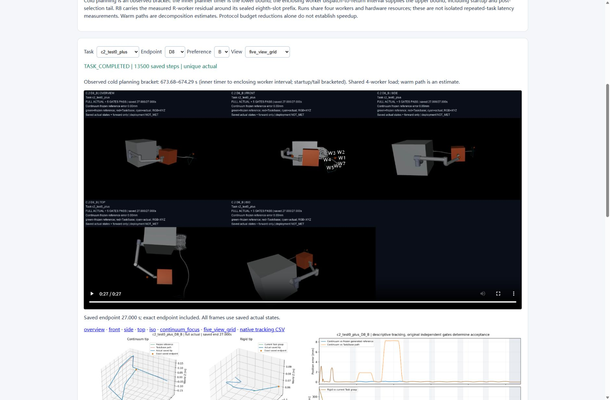
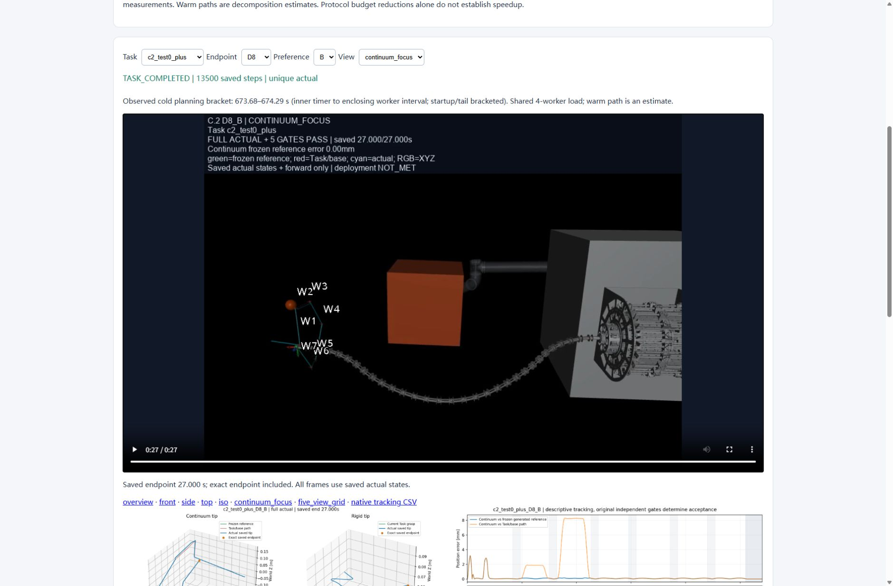
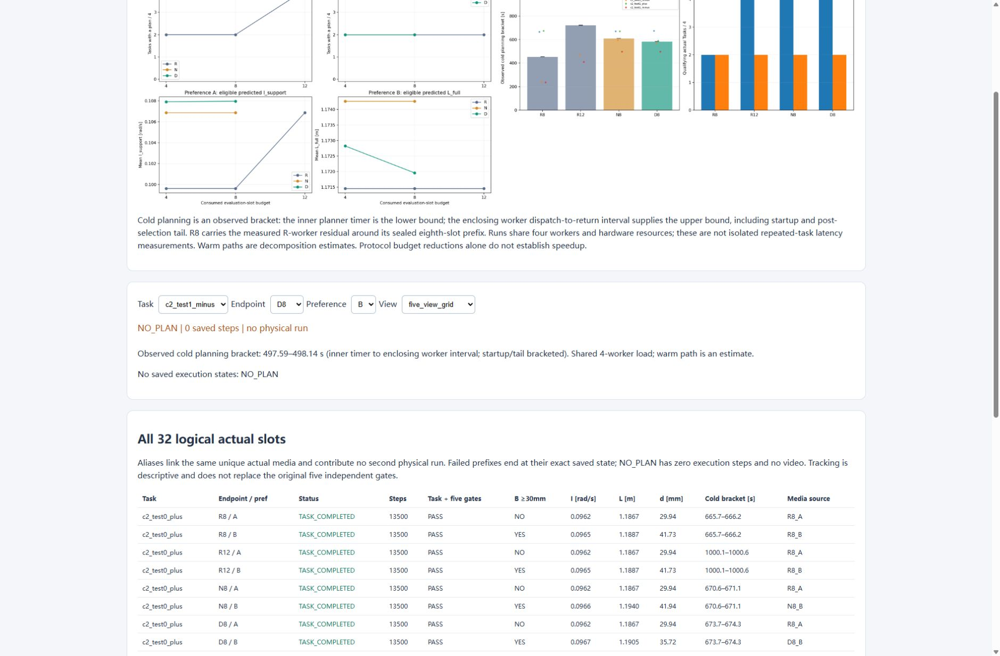

# C.2 浏览器交互复核

复核结果：**PASS**。此前因连接故障未完成的浏览器交互检查已补齐。[机器记录](C2_BROWSER_INTERACTION_CHECKS.json)保存各次 UI 选择后的 DOM 状态、媒体解码信息、播放时间、下载身份及截图哈希。

原 Tabbit `Target.createTarget` 通道未能创建页面。本次在已提供的 Codex 内置浏览器中建立并绑定实际查看器标签页，使用 CUA 的选择、点击、键盘和下载事件 API 完成检查。没有调整浏览器安全设置或启动额外的浏览器运行服务。本次恢复的是可用的内置浏览器交互连接，不声称原 Tabbit 创建通道已经修好；结束诊断显示该 Tabbit 实例没有活动任务。

实际交互覆盖：

- 四个 Task × 四个端点 × 两个偏好，共 32 个不同组合；22 个完整执行、10 个 `NO_PLAN` 和 10 个别名均与表格及媒体来源一致。
- 完整执行与 `NO_PLAN` 往返切换时，无计划状态清除视频源、隐藏视频及轨迹/误差图、清空下载链接；恢复完整执行后媒体重新加载。
- 十二条唯一执行的五视角视频全部成功解码，轨迹图和跟踪误差图均加载完成；两张核心图加载完成。
- 在 `c2_test0_plus / D8 / B` 实际切换全部七种视角。普通视角为 640×480、连续体特写为 960×720、五视角组合为 1920×960；时长均为 406 帧 / 15 fps，即 27.066667 s。
- 点击播放后时间推进 6.551123 s；暂停后时间保持。通过 View → Tab 将焦点移入原生视频控件，再用 Home / End 验证跳转到起点与末帧。五视角和连续体末帧均显示保存的物理终点 27.000 s。
- 实际点击 `native tracking CSV`，捕获浏览器下载事件；下载的 2,038,838 字节与源 CSV 的 SHA256 完全一致。
- 本次捕获的浏览器 console error 为空。该结论仅表示所记录的控制台错误，不替代全部网络请求的检查。

原生坐标与未正确聚焦时的早期跳转尝试没有确认时间改变，因此不作为通过证据。最终通过结果来自正确聚焦后的实际 `currentTime` 和截图。独立只读复核确认上述有限覆盖足以支持本次 PASS，未发现查看器代码缺陷。

浏览器解码覆盖十二条唯一执行的组合视频，以及一个 D8-B 来源的全部七种视角；不声称逐一播放了全部 84 个视频。完整 84 视频的资产清单与字节核验由既有[交付记录](C2_DELIVERY_CHECKS.json)保存。本次新增物理步、模型推理样本和训练更新均为零，实验报告、查看器源码、媒体及封存清单保持原字节。

