# V6.2-B.2 历史五场景可视化

本页保留 2026-09-30 的 B.2 冻结结果。当前研究、压力与模型敏感性的完整展示见[最新结果全套可视化](V6_2_LATEST_VISUALIZATION.md)。以下“最新”仅指当时 B.2 的生成来源。

本页由 `python -m v6_lite.visualization.generate_b2_latest_full` 从已保存的最新正式运行自动生成。
数据源：`v6_lite/output/v6_2_b2/online_dense_slices_five_20260930`；五个 27 秒场景；原生 MuJoCo 力矩重放 26/26、执行合同 11/11。
图和视频使用该运行的五条 trace；墙钟计时取保存样本。历史 V6-lite/V6.1-B 图保留，仅作历史记录。

[完整清单](../v6_lite/visualization/output_v6_2_b2_latest_20260930/visualization_manifest.json) · [独立文件校验](../v6_lite/visualization/output_v6_2_b2_latest_20260930/visualization_validation.json) · [B.2 总证据](V6_2_B2_ONLINE_EVIDENCE.md)

## 五场景总览


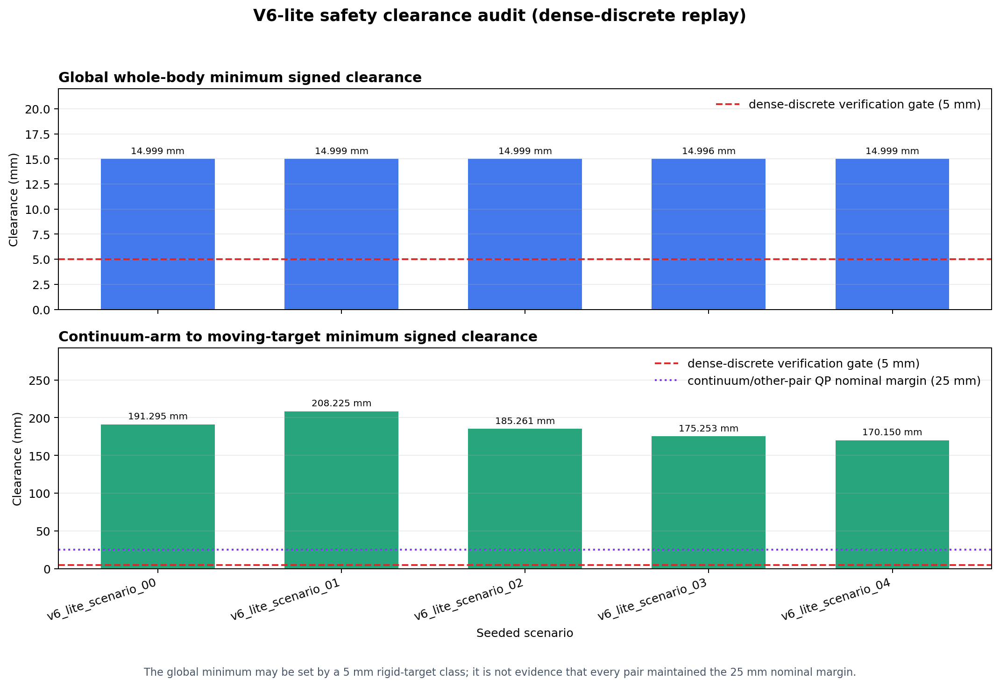


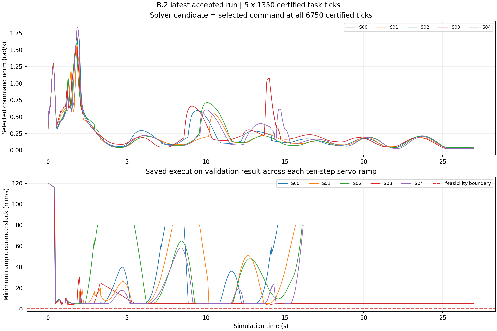

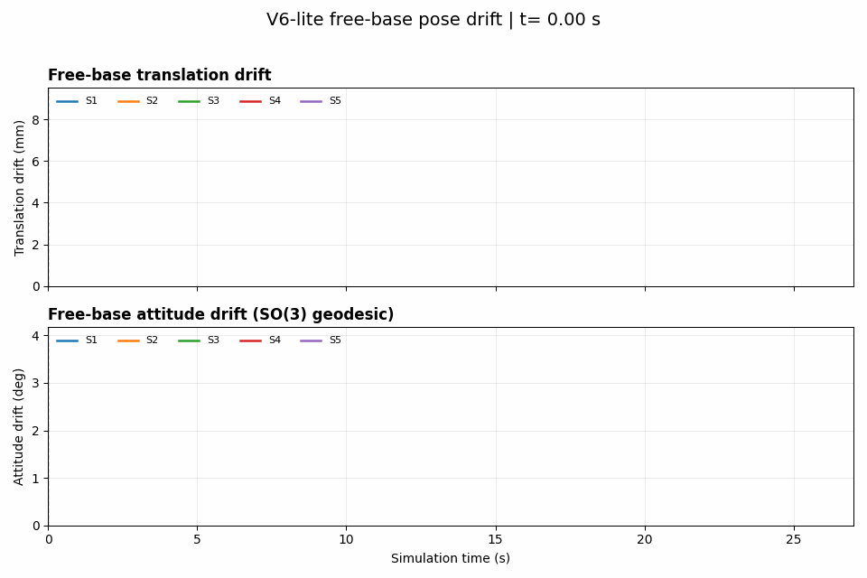

## 每个场景的路径与五视角回放

### v6_lite_scenario_00

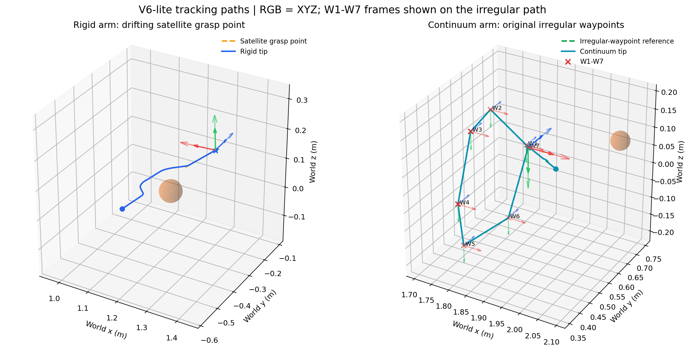

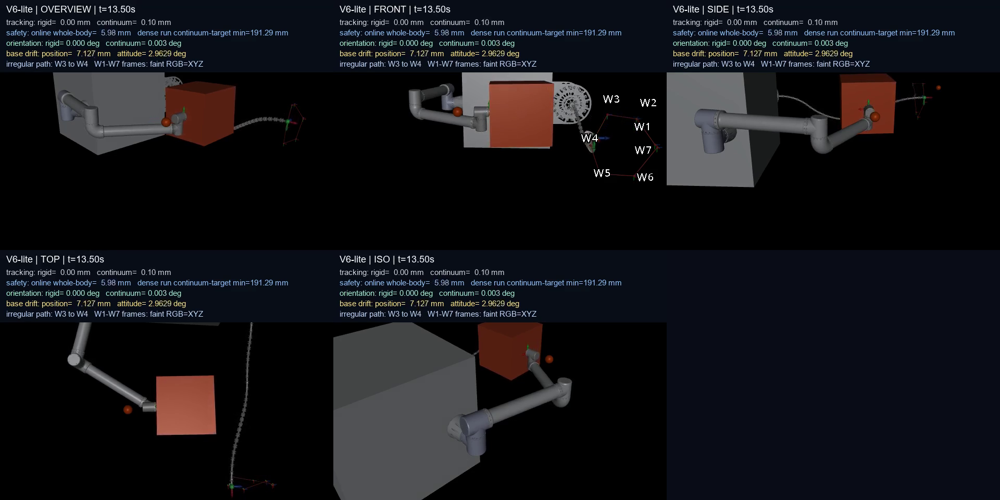

[五视角组合视频](../v6_lite/visualization/output_v6_2_b2_latest_20260930/videos/v6_lite_scenario_00_five_view_grid.mp4) · [overview](../v6_lite/visualization/output_v6_2_b2_latest_20260930/videos/v6_lite_scenario_00_overview.mp4) · [front](../v6_lite/visualization/output_v6_2_b2_latest_20260930/videos/v6_lite_scenario_00_front.mp4) · [side](../v6_lite/visualization/output_v6_2_b2_latest_20260930/videos/v6_lite_scenario_00_side.mp4) · [top](../v6_lite/visualization/output_v6_2_b2_latest_20260930/videos/v6_lite_scenario_00_top.mp4) · [iso](../v6_lite/visualization/output_v6_2_b2_latest_20260930/videos/v6_lite_scenario_00_iso.mp4)

最新 PCC 对照：[距离](../v6_lite/output/v6_2_b2/online_dense_slices_five_20260930/pcc_monitor/v6_lite_scenario_00/plots/distance_comparison.png) · [梯度](../v6_lite/output/v6_2_b2/online_dense_slices_five_20260930/pcc_monitor/v6_lite_scenario_00/plots/gradient_comparison.png) · [最小间隙](../v6_lite/output/v6_2_b2/online_dense_slices_five_20260930/pcc_monitor/v6_lite_scenario_00/plots/minimum_clearance_comparison.png)

### v6_lite_scenario_01

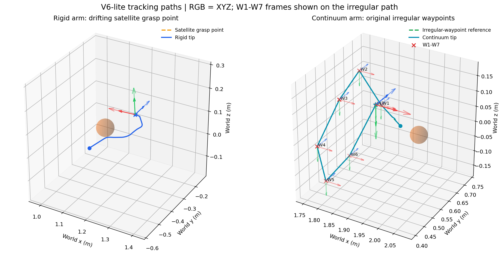

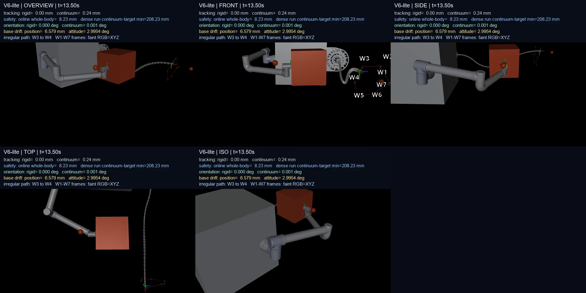

[五视角组合视频](../v6_lite/visualization/output_v6_2_b2_latest_20260930/videos/v6_lite_scenario_01_five_view_grid.mp4) · [overview](../v6_lite/visualization/output_v6_2_b2_latest_20260930/videos/v6_lite_scenario_01_overview.mp4) · [front](../v6_lite/visualization/output_v6_2_b2_latest_20260930/videos/v6_lite_scenario_01_front.mp4) · [side](../v6_lite/visualization/output_v6_2_b2_latest_20260930/videos/v6_lite_scenario_01_side.mp4) · [top](../v6_lite/visualization/output_v6_2_b2_latest_20260930/videos/v6_lite_scenario_01_top.mp4) · [iso](../v6_lite/visualization/output_v6_2_b2_latest_20260930/videos/v6_lite_scenario_01_iso.mp4)

最新 PCC 对照：[距离](../v6_lite/output/v6_2_b2/online_dense_slices_five_20260930/pcc_monitor/v6_lite_scenario_01/plots/distance_comparison.png) · [梯度](../v6_lite/output/v6_2_b2/online_dense_slices_five_20260930/pcc_monitor/v6_lite_scenario_01/plots/gradient_comparison.png) · [最小间隙](../v6_lite/output/v6_2_b2/online_dense_slices_five_20260930/pcc_monitor/v6_lite_scenario_01/plots/minimum_clearance_comparison.png)

### v6_lite_scenario_02

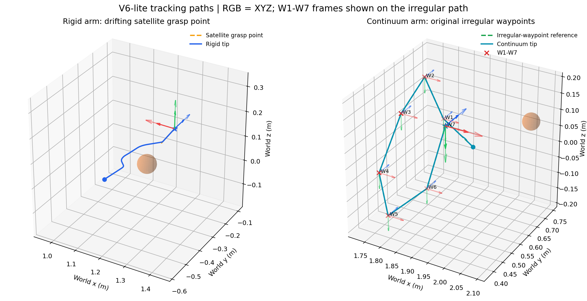

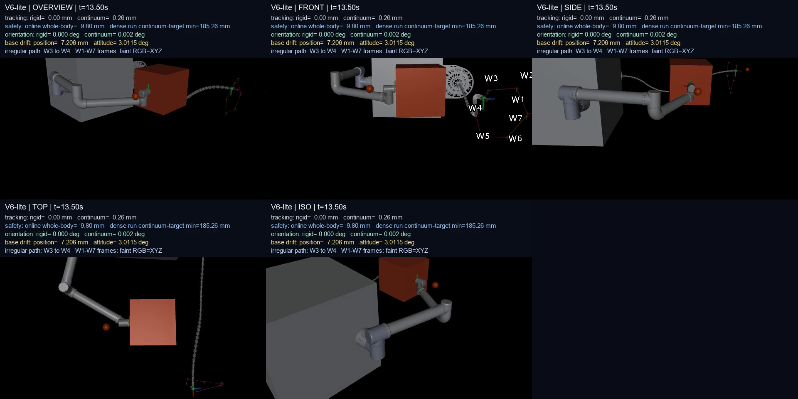

[五视角组合视频](../v6_lite/visualization/output_v6_2_b2_latest_20260930/videos/v6_lite_scenario_02_five_view_grid.mp4) · [overview](../v6_lite/visualization/output_v6_2_b2_latest_20260930/videos/v6_lite_scenario_02_overview.mp4) · [front](../v6_lite/visualization/output_v6_2_b2_latest_20260930/videos/v6_lite_scenario_02_front.mp4) · [side](../v6_lite/visualization/output_v6_2_b2_latest_20260930/videos/v6_lite_scenario_02_side.mp4) · [top](../v6_lite/visualization/output_v6_2_b2_latest_20260930/videos/v6_lite_scenario_02_top.mp4) · [iso](../v6_lite/visualization/output_v6_2_b2_latest_20260930/videos/v6_lite_scenario_02_iso.mp4)

最新 PCC 对照：[距离](../v6_lite/output/v6_2_b2/online_dense_slices_five_20260930/pcc_monitor/v6_lite_scenario_02/plots/distance_comparison.png) · [梯度](../v6_lite/output/v6_2_b2/online_dense_slices_five_20260930/pcc_monitor/v6_lite_scenario_02/plots/gradient_comparison.png) · [最小间隙](../v6_lite/output/v6_2_b2/online_dense_slices_five_20260930/pcc_monitor/v6_lite_scenario_02/plots/minimum_clearance_comparison.png)

### v6_lite_scenario_03

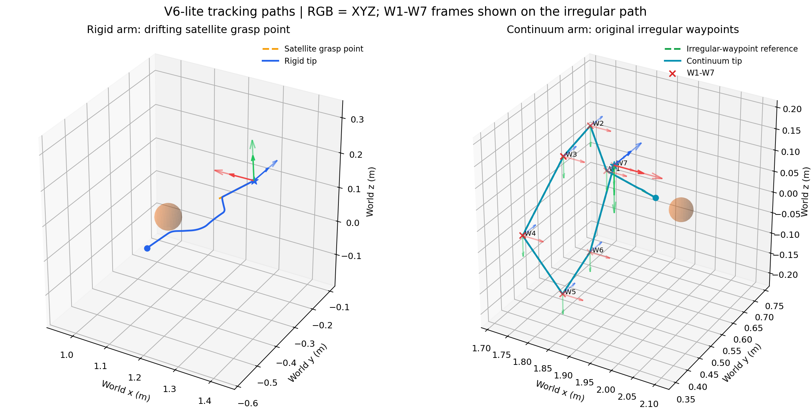

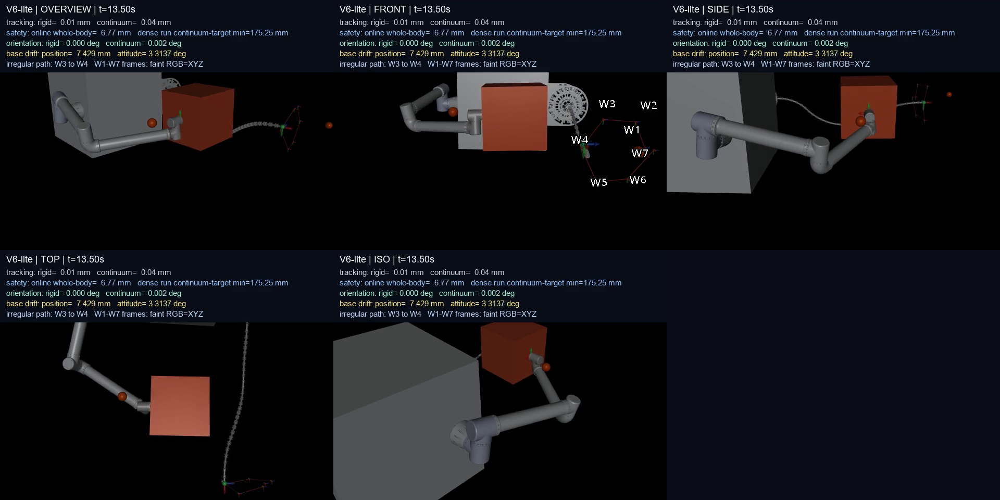

[五视角组合视频](../v6_lite/visualization/output_v6_2_b2_latest_20260930/videos/v6_lite_scenario_03_five_view_grid.mp4) · [overview](../v6_lite/visualization/output_v6_2_b2_latest_20260930/videos/v6_lite_scenario_03_overview.mp4) · [front](../v6_lite/visualization/output_v6_2_b2_latest_20260930/videos/v6_lite_scenario_03_front.mp4) · [side](../v6_lite/visualization/output_v6_2_b2_latest_20260930/videos/v6_lite_scenario_03_side.mp4) · [top](../v6_lite/visualization/output_v6_2_b2_latest_20260930/videos/v6_lite_scenario_03_top.mp4) · [iso](../v6_lite/visualization/output_v6_2_b2_latest_20260930/videos/v6_lite_scenario_03_iso.mp4)

最新 PCC 对照：[距离](../v6_lite/output/v6_2_b2/online_dense_slices_five_20260930/pcc_monitor/v6_lite_scenario_03/plots/distance_comparison.png) · [梯度](../v6_lite/output/v6_2_b2/online_dense_slices_five_20260930/pcc_monitor/v6_lite_scenario_03/plots/gradient_comparison.png) · [最小间隙](../v6_lite/output/v6_2_b2/online_dense_slices_five_20260930/pcc_monitor/v6_lite_scenario_03/plots/minimum_clearance_comparison.png)

### v6_lite_scenario_04

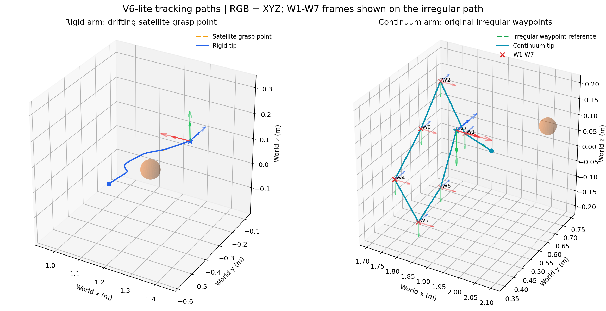

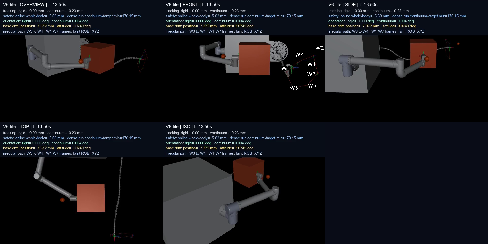

[五视角组合视频](../v6_lite/visualization/output_v6_2_b2_latest_20260930/videos/v6_lite_scenario_04_five_view_grid.mp4) · [overview](../v6_lite/visualization/output_v6_2_b2_latest_20260930/videos/v6_lite_scenario_04_overview.mp4) · [front](../v6_lite/visualization/output_v6_2_b2_latest_20260930/videos/v6_lite_scenario_04_front.mp4) · [side](../v6_lite/visualization/output_v6_2_b2_latest_20260930/videos/v6_lite_scenario_04_side.mp4) · [top](../v6_lite/visualization/output_v6_2_b2_latest_20260930/videos/v6_lite_scenario_04_top.mp4) · [iso](../v6_lite/visualization/output_v6_2_b2_latest_20260930/videos/v6_lite_scenario_04_iso.mp4)

最新 PCC 对照：[距离](../v6_lite/output/v6_2_b2/online_dense_slices_five_20260930/pcc_monitor/v6_lite_scenario_04/plots/distance_comparison.png) · [梯度](../v6_lite/output/v6_2_b2/online_dense_slices_five_20260930/pcc_monitor/v6_lite_scenario_04/plots/gradient_comparison.png) · [最小间隙](../v6_lite/output/v6_2_b2/online_dense_slices_five_20260930/pcc_monitor/v6_lite_scenario_04/plots/minimum_clearance_comparison.png)

## 最新 PCC 对照及计时边界

五个场景各自的距离、梯度、最小间隙图来自同一正式运行的 `pcc_monitor/`，逐图 SHA-256 见清单。


[三轮重复计时原始摘要](../v6_lite/output/v6_2_b2/online_dense_slices_repeated_timing_20260930/online_repeated_timing_summary.json)

完整五场景运行的 p95 最大值低于 20 ms；三轮 6 秒重复计时 p95 超过 20 ms。图中的计时是观测值，不构成稳定硬实时或连续时间安全证明。

重建：

```powershell
python -m v6_lite.visualization.generate_b2_latest_full --output-dir v6_lite/visualization/output_v6_2_b2_rebuild
python -m v6_lite.visualization.generate_b2_latest_full --output-dir v6_lite/visualization/output_v6_2_b2_rebuild --validate-only
```
