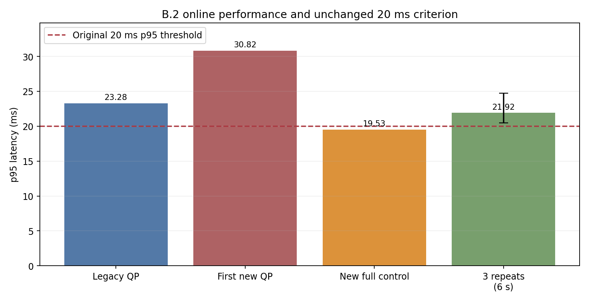

# V6.2-B.2 开关式区间 PCC 在线证据

本报告由已保存的运行、重放和故障注入文件自动生成。`legacy_pcc` 与 `bounded_interval_pcc` 都从同一五场景配置运行；后者关闭旧 PCC 查询，保留原 MuJoCo 与实际链胶囊约束、17 维加权速度 QP、67 路力矩执行和 0.45/0.55 十步斜坡。

## 功能与原门槛

| 项目 | 旧 PCC 新运行 | 区间 PCC 新运行 |
| --- | ---: | ---: |
| 五场景完整 trace | 5/5 | 5/5 |
| 原 26 项真实 MuJoCo 力矩重放 | 24/26 | 26/26 |
| 原 11 项执行合同 | 11/11 | 11/11 |
| 完整控制或旧 QP p95 最大值 | 23.281 ms | 19.529 ms |
| 整机最小 signed clearance | 14.996 mm | 14.996 mm |

新区间模式五场景完整调用 p95 最大值 19.529 ms，本次低于原 20 ms 门槛，原 26 项真实力矩重放全部通过。三轮预声明的 6 s 计时 p95 为 20.457 / 20.571 / 24.729 ms；重复计时的超时结果按原值保留，不能据单次五场景通过推断稳定的硬实时保证。

## 独立与故障证据

新区间行从保存的真实力矩轨迹独立重算：6755 个规划边界、12350 条区间行、0 个不一致。此重算不调用在线 QP 求解或约束装配，但共享声明的几何与动力学模型。

故障注入 4/4：查询未知、QP 故障、斜坡包络失效、命令过期均在下一力矩步前拒绝。

新旧在线实现的五场景非计时 trace 逐项相同，包括全部选中命令和67 路力矩；性能优化只改变计算路径与实测耗时。

A.1 历史产物仅是开发基线；本报告的 26 项检查从本次保存的 67 路力矩重新运行 MuJoCo。失败轨迹和性能反例保留在各自独立目录。数值区间实现没有形式化浮点认证，代理包络与真实机器人全域安全不能等同，本报告不宣称连续时间安全证明。

## 输入 SHA-256

- `old_metrics`: `331a8fb4bce64c2fa196bd1dfe4bd4e0cb22091428f43f093f7244133dd4f634`
- `old_native_validation`: `40e6bdf8263925b4a244d02d7e70a73d3df8c23b8bd59e96556414d4c31e352d`
- `old_execution_validation`: `212b7df6ad3132c32eb63effb706b9488b0a961248e30774b31446826c268b08`
- `new_metrics`: `d2da0dad81e306c8714d6d1527ceca78d47a993f414c4cdeda7a653d8fd193f1`
- `new_native_validation`: `20816e79081d4efca10f82ed0c19bc07bdee2272ef443d0de0c4c1cf9359167e`
- `new_execution_validation`: `51a4c2390d78b92084d7a3711539638b0d79008bf1d65e99d0f65940b795c46f`
- `unoptimized_metrics`: `c2e244778d3c73bac44f3a2b5b59136ea580f095c4b86d8e71171ab890f69a8c`
- `interval_recompute`: `d7bb5194905de9b9e63b4db2bef33f952e84adcb178c889f741b5a5c157a500f`
- `failure_injection`: `f9c5c9b682060dd8f8399963f7151478273ac2bc4c3697f35806bfd3607e1bcb`
- `repeated_timing`: `fc8f6ec2c9a31c66a6ef34975e3d093e6fb213ce2e9828a7665570c1960af4c9`
- `online_visual`: `0136503d5b04be53ceb2d9f4c86eb47a1719111765ee45a1f3432ec4e0d70004`
- `aabb_negative`: `6e95e3696ddad2bc64063130483ce58038d1808b758e79643ff67a2c1b257c57`
- `qp_breakdown`: `6731ae2d445fdec029be9ee800d77aab8e0bb970fb4c50c9d202424f78fbb65c`
- `trace_parity`: `0307e0f72322d4d1e781c5c24fd2fd0e406d2e1fadd83b2f337bfa65a506823c`
