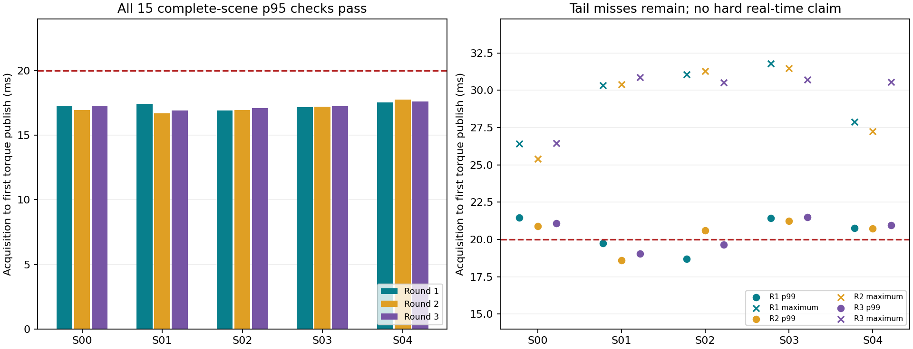

# V6.2-C.1 运行时合同与验收证据

三项实现已提交，冻结基点 `0e76aba`，正式试验源码 `8b44f3c`。三轮各五场景、每场景 27 s，共 20,250 个规划周期，原算法与状态采集到首次力矩发布的 p95 均低于 20 ms。15 个场景运行的全部非计时数组严格相同，包括 17 维选中命令和 67 路力矩。

独立验证固定使用预声明的第一轮：真实力矩重放 26/26、原合同 11/11；区间重算完整结果见机器可读摘要。任务误差与 B.2 完全一致，安全距离、PCC 半径、数值容差、约束和物理频率保持原定义。

**持续墙钟执行验收尚未满足。** 正式五场景采样显式采用 `offline_replay`：计算期间物理被冻结，测量发布时延，不强制墙钟有效期。首次默认 `wall_deadline` 探测在 6 ms 仿真时刻因墙钟过期拒绝后续力矩消费；当前源码又对五场景分别执行了墙钟持续执行探测，完成情况见机器摘要。停止仿真不是安全备份。有限重复 p95 通过不能证明每周期按时、最坏执行时间或连续时间安全。

发布 p95 最差 17.775 ms；p99 最差 21.504 ms；最大 31.772 ms。238/20250 个周期超过 20 ms，最长连续 11 个。工程目标 p95≤16 ms 且 p99≤20 ms 未满足。初始化另行记录，首周期没有删去。

## 完整时延表

所有时间列单位为 ms；子阶段分位数不能相加。

| 轮次 | 场景 | 算法 p95 | 发布 p95 | 发布 p99 | 最大值 | 超期数 | 连续超期 | 首周期 |
| --- | --- | ---: | ---: | ---: | ---: | ---: | ---: | ---: |
| 1 | 00 | 16.483 | 17.267 | 21.454 | 26.430 | 22 | 11 | 17.653 |
| 1 | 01 | 16.584 | 17.416 | 19.735 | 30.313 | 11 | 4 | 17.966 |
| 1 | 02 | 16.094 | 16.905 | 18.695 | 31.055 | 10 | 3 | 17.420 |
| 1 | 03 | 16.402 | 17.182 | 21.417 | 31.772 | 17 | 8 | 17.441 |
| 1 | 04 | 16.806 | 17.531 | 20.766 | 27.871 | 18 | 7 | 17.516 |
| 2 | 00 | 16.204 | 16.946 | 20.900 | 25.385 | 21 | 11 | 17.159 |
| 2 | 01 | 15.957 | 16.703 | 18.586 | 30.403 | 9 | 4 | 17.381 |
| 2 | 02 | 16.199 | 16.952 | 20.606 | 31.280 | 17 | 3 | 17.559 |
| 2 | 03 | 16.428 | 17.219 | 21.227 | 31.459 | 17 | 8 | 16.929 |
| 2 | 04 | 16.977 | 17.775 | 20.727 | 27.230 | 20 | 7 | 17.492 |
| 3 | 00 | 16.503 | 17.268 | 21.073 | 26.459 | 21 | 11 | 18.435 |
| 3 | 01 | 16.094 | 16.897 | 19.033 | 30.850 | 10 | 4 | 17.357 |
| 3 | 02 | 16.350 | 17.104 | 19.661 | 30.509 | 9 | 3 | 16.641 |
| 3 | 03 | 16.484 | 17.239 | 21.504 | 30.701 | 17 | 9 | 21.363 |
| 3 | 04 | 16.884 | 17.628 | 20.953 | 30.557 | 19 | 7 | 17.038 |

## 实现与边界

- `runtime_identity` 分开历史 trace schema、控制器、PCC 模式、伺服、积分器和模型；保留 A.1 原验证格式。
- 私有 `MjData`、关节地址、质量矩阵、十一微状态与十个力矩缓冲区在初始化分配。每次预演复制 MuJoCo 完整 integration state，包括外力、控制量、warm start、mocap、userdata 与 plugin state；逐微状态重新刷新空间量。同状态反作用映射只在输入完全一致时复用。离线验证器不读取在线缓存。
- 每周期保存不重叠墙钟/线程 CPU 阶段、嵌套关系、迭代次数和罚参数更新。Windows 线程 CPU 样本可能较粗，不能直接把墙钟减去 CPU 作为精确调度抖动。
- 命令有效期固定从状态采集起算 20 ms，不在求解结束续期；每个力矩步检查模型、区间、命令内容、次序、墙钟及真实执行起点。支持范围为名义模型的离散预演微状态，不是测量误差或模型失配的鲁棒界。
- 延迟 0/5/10/20/40/80 ms 在 QP、预演、下一起点检查和发布前四处注入，共 24 个基础条件，另加连续三次迟到、目标过期和乱序，共 27 个拒绝测试通过。正延迟期间独立执行状态按固定 2 ms 物理步继续演化，机器人和目标均改变。5 ms 延迟包含 4 ms 已完成物理步及 1 ms 调度余量。延迟期保持的旧力矩未经备份验证；拒绝用例记为无法保证继续执行。
- 调度器的名义服务时间 12 ms 是声明的虚拟条件；只有注入服务段推进外部物理，0 ms 条件是调度对照，不是异步硬件持续运动验收。
- 原查询未知、QP 故障、包络失效与旧合同过期四项故障注入继续通过。初次延迟框架因缺少前一速度热启动而中止的目录也保留，未覆盖或替代为通过结果。

## 回归与证据

当前定向合同/证据/C.1 测试 26 项通过；最终全量回归 138 项中 122 项通过，14 项失败、2 项错误均为历史源码哈希检查，日志见 `v6_lite/output/runs/c1_regression_final/tests.utf8.log`。原始本地编码日志另行保留，UTF-8 副本不改变结果。详细名称及与冻结基点的哈希对照见摘要，不能把这些结果标为全量通过。两项新增元数据兼容性错误已修复并复验。

原始三轮运行、每周期时间线、所有失败、源码与模型身份和 SHA-256 清单保留在 `v6_lite/output/runs/c1_*`；这些大文件不纳入 Git。小型摘要与输入哈希纳入本报告。墙钟数据不能由物理重放重新生成。

正式计时对应源码 `8b44f3c`；其后补充了失败路径的拒绝时间线与报告，成功路径的数值动作保持不变。补充的四类失败时间线已复验，当前拒绝前、拒绝后及未消费下一力矩步均可追溯。
