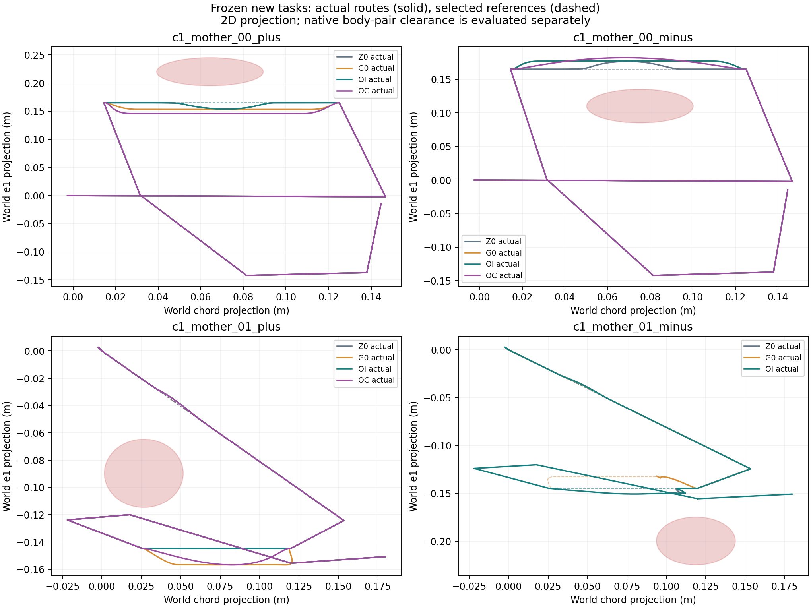
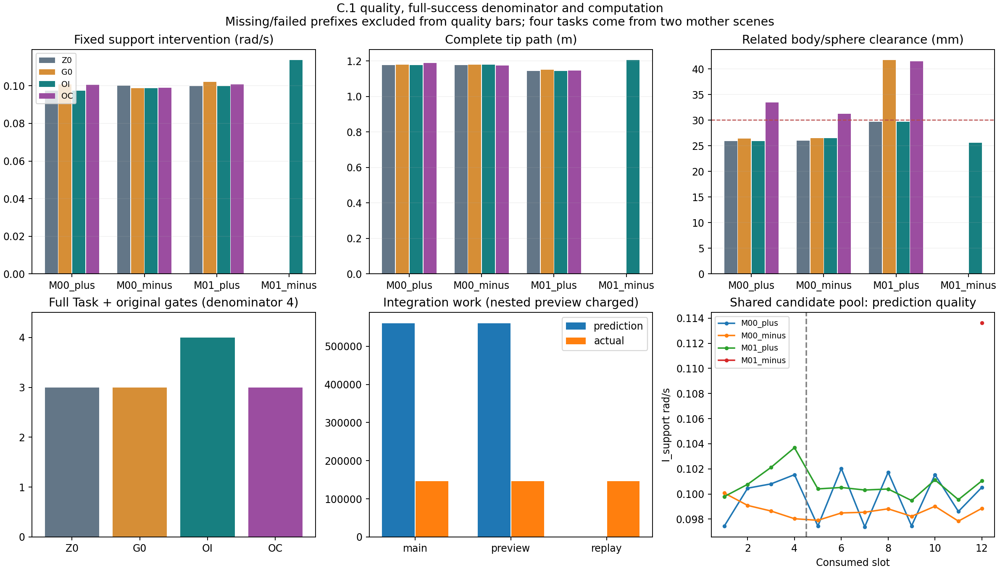

# V6.4-C.1 连续路线优化与多目标质量教师

实现可调用的非学习连续路线规划器；四个冻结新任务来自两个母场景。两偏好共享每任务最多12候选槽。完整预测与最终独立执行分别记账。

Producer `6f603437b300de882d24234130b6669b00f62bd6`；开发基点 `cd288d7c2db74dc938903332400c7e97dd56bca8`。历史 B.2/B.3/B.3.1 结论保持。

## 完整方法状态（各分母4）

|方法|进入actual|完整Task|原独立门禁|完整且30mm|NO_PLAN|
|---|---:|---:|---:|---:|---:|
|Z0|4|3/4|3/4|0/4|0|
|G0|4|3/4|3/4|1/4|0|
|OI|4|4/4|4/4|0/4|0|
|OC|3|3/4|3/4|3/4|1|

## 同任务质量

|任务|方法|完整成功|I_support rad/s|I_key legacy|I_full|L_full m|d_support mm|
|---|---|---|---:|---:|---:|---:|---:|
|c1_mother_00_plus|Z0|True|0.097434105|0.10800918|0.092201795|1.1752415|25.935342|
|c1_mother_00_plus|G0|True|0.100804|0.11361443|0.093381265|1.1783755|26.431152|
|c1_mother_00_plus|OI|True|0.097434105|0.10800918|0.092201795|1.1752415|25.935342|
|c1_mother_00_plus|OC|True|0.10052658|0.11315643|0.092887818|1.1882111|33.462636|
|c1_mother_00_minus|Z0|True|0.10007743|0.11242636|0.093524893|1.1752764|25.970943|
|c1_mother_00_minus|G0|True|0.09864263|0.1100431|0.09307244|1.1783835|26.47234|
|c1_mother_00_minus|OI|True|0.09864263|0.1100431|0.09307244|1.1783835|26.47234|
|c1_mother_00_minus|OC|True|0.09885595|0.11039849|0.093099367|1.1750686|31.261479|
|c1_mother_01_plus|Z0|True|0.099790799|0.11822241|0.10232134|1.1441983|29.718636|
|c1_mother_01_plus|G0|True|0.10211947|0.12207714|0.1028388|1.1514848|41.71919|
|c1_mother_01_plus|OI|True|0.099790799|0.11822241|0.10232134|1.1441983|29.718636|
|c1_mother_01_plus|OC|True|0.10076895|0.11984582|0.10260074|1.1461665|41.518663|
|c1_mother_01_minus|Z0|False|0.10909539|0.14373462|0.13456302|0.37849009|25.505946|
|c1_mother_01_minus|G0|False|0.1078208|0.14546945|0.13466233|0.38035552|25.42933|
|c1_mother_01_minus|OI|True|0.11363409|0.14096718|0.099530772|1.2041407|25.610857|
|c1_mother_01_minus|OC|False|null|null|null|null|null|

完整质量配对只使用双方同任务均完整成功的子集；缺失不填惩罚常数。源向量、10D/7D分量、最小几何witness、基座漂移和力矩饱和见质量原件与CSV。

## 连续搜索贡献

|任务|四初值strict|全池strict|OI输出|OC输出|strict新增收益 rad/s|OI来自初值|
|---|---|---|---|---|---:|---|
|c1_mother_00_plus|C00|C06|C00|C11|4.3843085e-05|True|
|c1_mother_00_minus|C03|C10|C02|C11|0.0001927068|True|
|c1_mother_01_plus|C00|C08|C00|C01|0.0003125044|True|
|c1_mother_01_minus|None|C11|C11|None|null|False|

A的工程并列组锚定strict最低值+0.001rad/s，再按完整路径、系数范数、family、ID选取；strict与实际输出分别保存。B严格要求离散相关连续体—路线球净空≥0.030m，再最小完整路径；未满足返回NO_PLAN。30mm是新增质量偏好，不替换任何原硬安全距离。

## 配对效果—成本

|方法|基线|完整配对数|平均ΔI_support|平均ΔL_full m|平均Δd_support mm|
|---|---|---:|---:|---:|---:|
|OI|Z0|3|-0.00047826795|0.0010357|0.16713242|
|OI|G0|3|-0.0018995225|-0.0034735042|-4.1654548|
|OC|Z0|3|0.00094971293|0.0049099696|8.2059521|
|OC|G0|3|-0.00047154158|0.00040076541|3.8733648|

差值为优化方法−基线。优化器拥有额外私有模型预测，不能宣称同计算预算优势。I_support是固定前驱/关键两段并集的新指标，不能重算或改判旧key-only 3.27%/1.03%结论。

候选槽 48/48；内部预测 48；非历史连续点评价 31。最终逻辑方法槽 16/16，唯一实际运行 12。

```json
{
  "main_physics_steps": 706480,
  "private_preview_physics_steps": 706610,
  "preview_calls": 70661,
  "independent_saved_torque_replay_steps": 145940,
  "native_geometry_query_calls": 971330465,
  "qp_solve_calls": 70661,
  "elapsed_wall_s": 4866.3827999019995,
  "initial_geometry_queries": 11956,
  "phase_nesting": "main prediction/actual, nested private ten-step preview, independent final torque replay, and quality geometry are separate integrations/queries; native geometry total includes quality"
}
```

搜索阶段复用原完整控制链与全部在线守卫；原runner自带全身检查的成本也计入。搜索未追加独立力矩/区间重放，状态为NOT_RUN_SEARCH_SCREENING。最终actual从初态重新计算反馈力矩，执行原五项独立门禁；whole-body为50Hz/subdivisions4，robot-target为原生500Hz，不能称作连续时间安全。





## 结论边界与有限教师

研究执行完成：`True`。工程能力、预测偏好、actual确认与相对基线收益按summary.json独立列示；正结果缺失不追加预算。教师共96行，其中20行关联独立通过且预测复现的最终执行；其余prediction_only，不作成功示范。左右任务与全部候选保留同一group_id。

新训练、神经采样、学习optimizer updates均为0。本轮效果如有，来自计费的非学习搜索。Diffusion优势、总体泛化、模型误差鲁棒性、连续时间或硬件安全均未建立。部署保持NOT_MET。

## 实际命令

```sh
python -B -X utf8 -m v6_4.continuous_route_optimizer prepare --output v6_4/output/continuous_route_optimizer_20261007_01
python -B -X utf8 -m v6_4.continuous_route_optimizer run-all --run v6_4/output/continuous_route_optimizer_20261007_01
```

环境、sys.argv、cwd、开始/结束时间与各阶段状态见source_identity、candidate started/result、actual slot和command_receipts.jsonl。run-all完成阶段仅验哈希后跳过。validate只对已执行的原验证原件作一致性核对，不额外产生重放。
