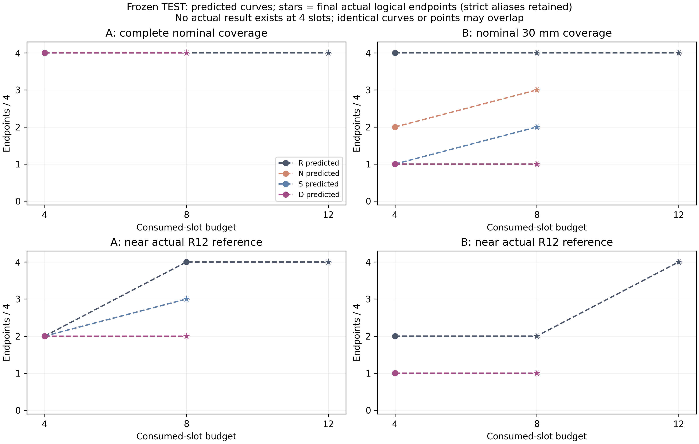
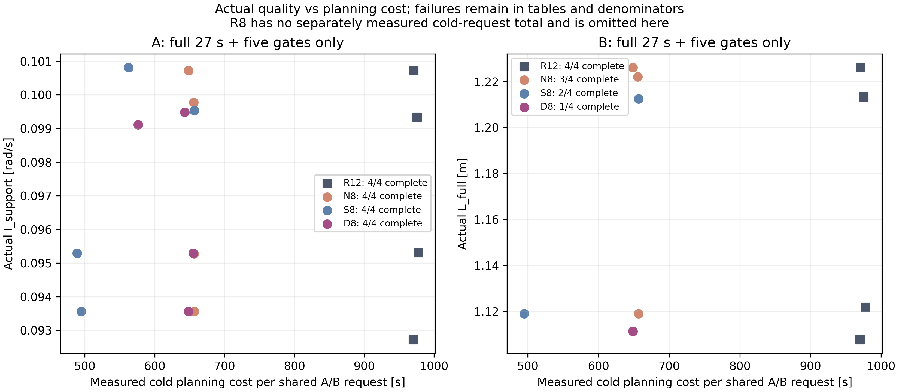

# V6.4-C.3 搜索导向初值、闭环 VAL 与简单回归对照

研究执行完成：**true**；独立 TEST 完成：**true**。
默认决策：**KEEP_C1_RULE**。deployment=NOT_MET；DATA_LIMITED。

## 边界、身份与样本范围

C.2 维持研究完成、总体学习收益未建立和默认 C.1；B.2/B.3/B.3.1/C.1/C.2 的记录、失败和权重均只读。C.3 是新方法包，跨轮差异不能拆成教师、模型选择或回归对照的独立因果贡献。
固定基点 `1758e13b01735b80c5a512b81cbc1d5e47a07ec9`；本轮实现及实验 producer `9f39b42775283432eb933f63a9047c488ba22070`。发布提交在最终发布记录中单列，不能冒充早期 producer。
外部分组：`{"train": {"tasks": 6, "mothers": 3}, "val": {"tasks": 2, "mothers": 1}, "test": {"tasks": 4, "mothers": 2}}`。原 TaskSpec split 未据此重写。新母场景按来源 seed 一次性冻结，失败不重抽。
三个 TRAIN、一个 VAL、两个 TEST 母场景，以及每模型一个初始化 seed，只支持冻结先导；128000 次曝光并非独立参考或母场景数。无统计非劣、连续时间安全、误差鲁棒性或硬件安全结论。

## 教师与统一监督池

历史去重物理候选：72；证据层级 `{"VALIDATED_EXECUTION": 10, "PREDICTED_COMPLETE": 40, "FAILED_OR_INCOMPLETE": 22, "MISSING_OR_UNBOUND": 0}`。A/B 视图和 actual alias 不增加物理候选。
有限教师组合完成 12/12，消耗槽 96/96；formal_actual_validation=NOT_RUN_TEACHER_SEARCH。
统一唯一标签 55；具有 route_quality 来源 52，具有 initializer_effect 来源 8，零残差视图 3。双来源可能重叠，不能相加冒充样本总量。
搜索效果证据状态：`FINITE_SEARCH_EFFECT_EVIDENCE_AVAILABLE`。新增效果标签保存原送入 slot1/3 的 raw 初值，带固定伙伴和 seed_pair_id；最终最优参数不自动取得初值效果资格。RULE_ONLY、B NO_PLAN 或 B 不足30mm不得成为 B 成功监督。
T_local 与留一母场景 T_transfer 均在教师运行前冻结。D/S/N 共用统一 TRAIN 池；source1:1（同时存在时）及 mother→Task→偏好/family→唯一参考抽样。谱系/直接合格只表示有限共享搜索参与证据，不证明单一初值因果必要。

|TRAIN Task|组合|入选监督组合|A合格/近质量/效果标签|B合格30mm/近质量/效果标签|A/B来源状态|
|---|---|---|---|---|---|
|c1_mother_00_plus|T_local|true|true/true/false|true/true/true|RULE_ONLY/INITIALIZER_EFFECT_EVIDENCED|
|c1_mother_00_plus|T_transfer|false|true/true/true|false/false/false|INITIALIZER_EFFECT_EVIDENCED/NO_QUALIFIED_INITIALIZER_EFFECT_LABEL|
|c1_mother_00_minus|T_local|true|true/true/true|true/false/true|INITIALIZER_EFFECT_EVIDENCED/INITIALIZER_EFFECT_EVIDENCED|
|c1_mother_00_minus|T_transfer|false|true/true/true|true/false/false|INITIALIZER_EFFECT_EVIDENCED/RULE_ONLY|
|c1_mother_01_plus|T_local|true|true/true/false|true/false/false|RULE_ONLY/RULE_ONLY|
|c1_mother_01_plus|T_transfer|true|true/true/false|true/false/true|RULE_ONLY/INITIALIZER_EFFECT_EVIDENCED|
|c1_mother_01_minus|T_local|true|true/true/true|false/false/false|INITIALIZER_EFFECT_EVIDENCED/NO_QUALIFIED_INITIALIZER_EFFECT_LABEL|
|c1_mother_01_minus|T_transfer|true|true/true/true|false/false/false|INITIALIZER_EFFECT_EVIDENCED/NO_QUALIFIED_INITIALIZER_EFFECT_LABEL|
|c2_new_train_plus|T_local|false|true/true/false|true/false/false|RULE_ONLY/RULE_ONLY|
|c2_new_train_plus|T_transfer|true|true/true/true|true/true/true|INITIALIZER_EFFECT_EVIDENCED/INITIALIZER_EFFECT_EVIDENCED|
|c2_new_train_minus|T_local|true|true/true/true|false/false/false|INITIALIZER_EFFECT_EVIDENCED/NO_QUALIFIED_INITIALIZER_EFFECT_LABEL|
|c2_new_train_minus|T_transfer|true|true/true/true|false/false/false|INITIALIZER_EFFECT_EVIDENCED/NO_QUALIFIED_INITIALIZER_EFFECT_LABEL|

## 两次真实训练与闭环选权重

D 直接复用 C.2 的 cosine100、内部 v-prediction MSE、DDIM20；S 直接回归同归一化 z。两者使用相同条件、scaler、12维容器与最多4维非零 mask，均为两层128 SiLU。反归一化后无 clamp/project/补抽。
每模型固定4000 optimizer updates、batch32、AdamW lr1e-4/weight_decay0.01、gradient norm clip1。共享预冻结参考抽样文件，各128000曝光；TRAIN-only scaler。训练不生成 DDIM、不根据 loss 选权重，仅保留250/4000。

|模型|真实训练完成|更新|曝光|有效参数|初始化seed|训练秒|闭环选中|
|---|---:|---:|---:|---:|---:|---:|---|
|D|true|4000|128000|152332|64321|9.79422|D4000|
|S|true|4000|128000|134412|64331|8.69457|S4000|

条件维数 896；D/S 逐参考曝光身份必须相同。checkpoint、scaler 和 schema 身份见模型报告与 model_freeze.json。
闭环 VAL 先完成全部生成/八槽搜索并封存选择，再从初态实际执行与原五门禁；两个 checkpoint 同任务同冻结噪声。R12 只作封存后的评分参考。顺序：完整实际端点→B30→近质量→raw非法较少→同参考集合首次命中（未命中右删失，编码9非真实命中）→物理/预演/几何/冷总时间→较早update。

|VAL checkpoint|完整端点/4|B30/2|近质量端点|raw非法|首次近质量预算编码和|选中|
|---|---:|---:|---:|---:|---:|---|
|D250|3|1|1|0|14|false|
|D4000|3|1|3|0|9|true|
|S250|2|1|2|0|12|false|
|S4000|3|1|3|0|5|true|

一个新 VAL 母场景只用于有限权重选择。TEST 在模型、N库、scaler、mask、seed、噪声规则和协议冻结后开始；不据 TEST 重训或改选250。

## TEST 实际端点主表

所有分母固定4 Task；当前 TEST logical slots 40/40，unique actual attempts 28，alias 6。Alias 是同 Task/模型/配置/历史/plan 的同一证据，不增加独立实际样本。
完整指13500个2ms步、27s及原五门禁全过。N/A不算通过；NO_PLAN保留0步，不等于碰撞或任务不可行。raw拒绝是该方法A/B共享搜索计数，每偏好行重复展示，不能再次相加。

|端点|偏好|完整27s+五门禁/4|B30/4|NO_PLAN/4|raw共享拒绝|actual前拒绝|actual失败|工具错误|缺测|unique|alias|近R12/合格参考|
|---|---|---:|---:|---:|---:|---:|---:|---:|---:|---:|---:|---|
|R8|A|4/4|N/A|0/4|0|0|0|0|0|4|0|3/4 (N/A 0)|
|R8|B|4/4|4|0/4|0|0|0|0|0|4|0|2/4 (N/A 0)|
|R12|A|4/4|N/A|0/4|0|0|0|0|0|3|1|4/4 (N/A 0)|
|R12|B|4/4|4|0/4|0|0|0|0|0|4|0|4/4 (N/A 0)|
|N8|A|4/4|N/A|0/4|0|0|0|0|0|3|1|3/4 (N/A 0)|
|N8|B|3/4|3|1/4|0|0|0|0|0|3|0|1/4 (N/A 0)|
|S8|A|4/4|N/A|0/4|5|0|0|0|0|3|1|3/4 (N/A 0)|
|S8|B|2/4|2|2/4|5|0|0|0|0|1|1|1/4 (N/A 0)|
|D8|A|4/4|N/A|0/4|1|0|0|0|0|2|2|2/4 (N/A 0)|
|D8|B|1/4|1|3/4|1|0|0|0|0|1|0|1/4 (N/A 0)|

A近质量：I_support≤R12-A+0.001rad/s且L_full≤R12-A+0.005m。B近质量：完整五门禁、d_support≥0.030m且L_full≤R12-B+0.005m；R12无完整实际参考时记N/A。

## 逐Task质量、成本和来源

完整配对比较只使用双方实际完整端点。失败前缀的质量保留在CSV并标明scope，不能以较短路径或较低干预赢过完整任务。规划时间A/B共用；R8只有封存搜索器前缀计时，其请求冷总时间缺测，不能套用R12总时间。

|Task|端点/偏好|状态|I_support rad/s|L_full m|d_support m|基座平移m/转角rad|冷规划s|源/谱系|
|---|---|---|---:|---:|---:|---|---:|---|
|c3_test0_plus|R8/A|FULL_TASK_AND_FIVE_GATES_PASSED|0.0952802|1.10553|0.0263176|0.00722957/0.0548877|N/A|geometry/rule_seed_or_descendant|
|c3_test0_minus|R8/A|FULL_TASK_AND_FIVE_GATES_PASSED|0.0937487|1.10553|0.0263226|0.00722974/0.0548917|N/A|geometry/rule_seed_or_descendant|
|c3_test1_plus|R8/A|FULL_TASK_AND_FIVE_GATES_PASSED|0.100724|1.21288|0.0259625|0.00813931/0.0600506|N/A|zero/rule_seed_or_descendant|
|c3_test1_minus|R8/A|FULL_TASK_AND_FIVE_GATES_PASSED|0.0997775|1.2114|0.0264429|0.00813404/0.060015|N/A|geometry/rule_seed_or_descendant|
|c3_test0_plus|R8/B|FULL_TASK_AND_FIVE_GATES_PASSED|0.0959658|1.12164|0.0342157|0.00722911/0.0548817|N/A|geometry/rule_seed_or_descendant|
|c3_test0_minus|R8/B|FULL_TASK_AND_FIVE_GATES_PASSED|0.0929135|1.12165|0.0342188|0.00722981/0.0548958|N/A|geometry/rule_seed_or_descendant|
|c3_test1_plus|R8/B|FULL_TASK_AND_FIVE_GATES_PASSED|0.102476|1.22617|0.034278|0.00813473/0.0600161|N/A|geometry/rule_seed_or_descendant|
|c3_test1_minus|R8/B|FULL_TASK_AND_FIVE_GATES_PASSED|0.100087|1.22617|0.0341986|0.00814596/0.0601129|N/A|geometry/rule_seed_or_descendant|
|c3_test0_plus|R12/A|FULL_TASK_AND_FIVE_GATES_PASSED|0.0953121|1.10536|0.0259118|0.00722947/0.0548871|977.72|geometry/rule_seed_or_descendant|
|c3_test0_minus|R12/A|FULL_TASK_AND_FIVE_GATES_PASSED|0.0927234|1.1059|0.0262011|0.00722968/0.0548901|970.111|geometry/rule_seed_or_descendant|
|c3_test1_plus|R12/A|FULL_TASK_AND_FIVE_GATES_PASSED|0.100724|1.21288|0.0259625|0.00813931/0.0600506|970.814|zero/rule_seed_or_descendant|
|c3_test1_minus|R12/A|FULL_TASK_AND_FIVE_GATES_PASSED|0.0993293|1.21174|0.0263374|0.00813356/0.0600105|975.516|geometry/rule_seed_or_descendant|
|c3_test0_plus|R12/B|FULL_TASK_AND_FIVE_GATES_PASSED|0.0951805|1.12164|0.0334216|0.00722942/0.0548838|977.72|geometry/rule_seed_or_descendant|
|c3_test0_minus|R12/B|FULL_TASK_AND_FIVE_GATES_PASSED|0.0933923|1.10761|0.0312833|0.00722974/0.0548922|970.111|geometry/rule_seed_or_descendant|
|c3_test1_plus|R12/B|FULL_TASK_AND_FIVE_GATES_PASSED|0.101919|1.22616|0.033471|0.0081425/0.0600727|970.814|geometry/rule_seed_or_descendant|
|c3_test1_minus|R12/B|FULL_TASK_AND_FIVE_GATES_PASSED|0.0995034|1.21325|0.0312604|0.00813391/0.0600146|975.516|geometry/rule_seed_or_descendant|
|c3_test0_plus|N8/A|FULL_TASK_AND_FIVE_GATES_PASSED|0.0952802|1.10553|0.0263176|0.00722957/0.0548877|656.341|retrieval/learning_seed_descendant|
|c3_test0_minus|N8/A|FULL_TASK_AND_FIVE_GATES_PASSED|0.093566|1.11106|0.0263772|0.00722986/0.0548936|656.694|geometry/rule_seed_or_descendant|
|c3_test1_plus|N8/A|FULL_TASK_AND_FIVE_GATES_PASSED|0.100724|1.21288|0.0259625|0.00813931/0.0600506|648.666|zero/rule_seed_or_descendant|
|c3_test1_minus|N8/A|FULL_TASK_AND_FIVE_GATES_PASSED|0.0997775|1.2114|0.0264429|0.00813404/0.060015|655.833|retrieval/learning_seed_descendant|
|c3_test0_plus|N8/B|NO_PLAN|N/A|N/A|N/A|N/A/N/A|656.341|N/A/no_plan|
|c3_test0_minus|N8/B|FULL_TASK_AND_FIVE_GATES_PASSED|0.0931862|1.119|0.0312304|0.00722987/0.0548959|656.694|geometry/rule_seed_or_descendant|
|c3_test1_plus|N8/B|FULL_TASK_AND_FIVE_GATES_PASSED|0.102476|1.22617|0.034278|0.00813473/0.0600161|648.666|retrieval/direct_learning_seed|
|c3_test1_minus|N8/B|FULL_TASK_AND_FIVE_GATES_PASSED|0.100173|1.22211|0.0312095|0.00813709/0.0600455|655.833|retrieval/direct_learning_seed|
|c3_test0_plus|S8/A|FULL_TASK_AND_FIVE_GATES_PASSED|0.0952905|1.10722|0.025878|0.00722931/0.054886|489.066|zero/rule_seed_or_descendant|
|c3_test0_minus|S8/A|FULL_TASK_AND_FIVE_GATES_PASSED|0.093566|1.11106|0.0263772|0.00722986/0.0548936|494.828|geometry/rule_seed_or_descendant|
|c3_test1_plus|S8/A|FULL_TASK_AND_FIVE_GATES_PASSED|0.100817|1.21162|0.0259038|0.00813713/0.0600344|562.826|regression/direct_learning_seed|
|c3_test1_minus|S8/A|FULL_TASK_AND_FIVE_GATES_PASSED|0.0995322|1.21284|0.0302726|0.00813397/0.060015|656.805|regression/learning_seed_descendant|
|c3_test0_plus|S8/B|NO_PLAN|N/A|N/A|N/A|N/A/N/A|489.066|N/A/no_plan|
|c3_test0_minus|S8/B|FULL_TASK_AND_FIVE_GATES_PASSED|0.0931862|1.119|0.0312304|0.00722987/0.0548959|494.828|geometry/rule_seed_or_descendant|
|c3_test1_plus|S8/B|NO_PLAN|N/A|N/A|N/A|N/A/N/A|562.826|N/A/no_plan|
|c3_test1_minus|S8/B|FULL_TASK_AND_FIVE_GATES_PASSED|0.100835|1.21246|0.0302734|0.00813273/0.0600064|656.805|regression/direct_learning_seed|
|c3_test0_plus|D8/A|FULL_TASK_AND_FIVE_GATES_PASSED|0.0952905|1.10722|0.025878|0.00722931/0.054886|654.943|zero/rule_seed_or_descendant|
|c3_test0_minus|D8/A|FULL_TASK_AND_FIVE_GATES_PASSED|0.093566|1.11106|0.0263772|0.00722986/0.0548936|648.612|geometry/rule_seed_or_descendant|
|c3_test1_plus|D8/A|FULL_TASK_AND_FIVE_GATES_PASSED|0.0994893|1.21428|0.0258946|0.00813942/0.06005|643.117|diffusion/direct_learning_seed|
|c3_test1_minus|D8/A|FULL_TASK_AND_FIVE_GATES_PASSED|0.0991161|1.21761|0.026512|0.00814/0.0600577|576.354|geometry/rule_seed_or_descendant|
|c3_test0_plus|D8/B|NO_PLAN|N/A|N/A|N/A|N/A/N/A|654.943|N/A/no_plan|
|c3_test0_minus|D8/B|FULL_TASK_AND_FIVE_GATES_PASSED|0.100272|1.1112|0.0326111|0.00722816/0.0548799|648.612|diffusion/direct_learning_seed|
|c3_test1_plus|D8/B|NO_PLAN|N/A|N/A|N/A|N/A/N/A|643.117|N/A/no_plan|
|c3_test1_minus|D8/B|NO_PLAN|N/A|N/A|N/A|N/A/N/A|576.354|N/A/no_plan|

prediction→actual逐指标差值、五门禁、候选ID、plan SHA、源与完整谱系见 `result_tables/per_task_endpoints.csv`。谱系不等于因果必要；成功归因于初始化方式+同一搜索器+原控制器，不能称raw端到端策略成功。

## 首次命中和预测预算曲线

`first_hits.csv/json` 保留每Task每方法4/8/12前缀的首次完整、B30、A/B近R12命中。HIT为消耗评价槽位置；RIGHT_CENSORED不填0，sort encoding预算+1仅排序。NOT_RUN、TECHNICAL_INCOMPLETE及N/A分开。R8在R9前封存，4槽从未自动视作实际通过。

|Task|方法/预算|首次完整|首次B30|首次近R12-A|首次近R12-B|
|---|---|---|---|---|---|
|c3_test0_plus|R/4|1|4|1|4|
|c3_test0_plus|R/8|1|4|1|4|
|c3_test0_plus|R/12|1|4|1|4|
|c3_test0_plus|N/4|1|RIGHT_CENSORED@4|1|RIGHT_CENSORED@4|
|c3_test0_plus|N/8|1|RIGHT_CENSORED@8|1|RIGHT_CENSORED@8|
|c3_test0_plus|S/4|1|RIGHT_CENSORED@4|1|RIGHT_CENSORED@4|
|c3_test0_plus|S/8|1|RIGHT_CENSORED@8|1|RIGHT_CENSORED@8|
|c3_test0_plus|D/4|1|RIGHT_CENSORED@4|1|RIGHT_CENSORED@4|
|c3_test0_plus|D/8|1|RIGHT_CENSORED@8|1|RIGHT_CENSORED@8|
|c3_test0_minus|R/4|1|4|RIGHT_CENSORED@4|RIGHT_CENSORED@4|
|c3_test0_minus|R/8|1|4|5|RIGHT_CENSORED@8|
|c3_test0_minus|R/12|1|4|5|9|
|c3_test0_minus|N/4|1|RIGHT_CENSORED@4|RIGHT_CENSORED@4|RIGHT_CENSORED@4|
|c3_test0_minus|N/8|1|8|RIGHT_CENSORED@8|RIGHT_CENSORED@8|
|c3_test0_minus|S/4|1|RIGHT_CENSORED@4|RIGHT_CENSORED@4|RIGHT_CENSORED@4|
|c3_test0_minus|S/8|1|8|RIGHT_CENSORED@8|RIGHT_CENSORED@8|
|c3_test0_minus|D/4|1|2|RIGHT_CENSORED@4|2|
|c3_test0_minus|D/8|1|2|RIGHT_CENSORED@8|2|
|c3_test1_plus|R/4|1|4|1|4|
|c3_test1_plus|R/8|1|4|1|4|
|c3_test1_plus|R/12|1|4|1|4|
|c3_test1_plus|N/4|1|4|1|4|
|c3_test1_plus|N/8|1|4|1|4|
|c3_test1_plus|S/4|1|RIGHT_CENSORED@4|1|RIGHT_CENSORED@4|
|c3_test1_plus|S/8|1|RIGHT_CENSORED@8|1|RIGHT_CENSORED@8|
|c3_test1_plus|D/4|1|RIGHT_CENSORED@4|1|RIGHT_CENSORED@4|
|c3_test1_plus|D/8|1|RIGHT_CENSORED@8|1|RIGHT_CENSORED@8|
|c3_test1_minus|R/4|1|4|RIGHT_CENSORED@4|RIGHT_CENSORED@4|
|c3_test1_minus|R/8|1|4|5|RIGHT_CENSORED@8|
|c3_test1_minus|R/12|1|4|5|9|
|c3_test1_minus|N/4|1|4|RIGHT_CENSORED@4|RIGHT_CENSORED@4|
|c3_test1_minus|N/8|1|4|5|RIGHT_CENSORED@8|
|c3_test1_minus|S/4|1|2|RIGHT_CENSORED@4|2|
|c3_test1_minus|S/8|1|2|5|2|
|c3_test1_minus|D/4|1|RIGHT_CENSORED@4|RIGHT_CENSORED@4|RIGHT_CENSORED@4|
|c3_test1_minus|D/8|1|RIGHT_CENSORED@8|RIGHT_CENSORED@8|RIGHT_CENSORED@8|

## 工作量与离线成本

预留上限包括拒绝与NO_PLAN，预留不等于已消耗候选或真实rollout。三种计数各自保留：参数构造、消耗槽、真实预测；合法精确重复由原缓存处理。

|阶段|完整搜索流/预计|参数构造|消耗槽|真实rollout|raw拒绝|合法cache hit|主预测步|预演步|几何查询|冷规划service秒|实际logical/unique/alias|主actual步|
|---|---:|---:|---:|---:|---:|---:|---:|---:|---:|---:|---|---:|
|teacher|12/12|105|96|96|0|9|1198050|1198170|1399791908|7143.52|0/0/0|0|
|val|10/10|89|88|88|0|1|997920|998160|1070364078|5946.77|20/11/3|148500|
|test|16/16|149|144|138|6|5|1863000|1863000|2289739016|11238.2|40/28/6|378000|

预算预留 `{"D_training_runs": 1, "S_training_runs": 1, "teacher_candidate_slots": 96, "test_actual_slots": 40, "test_candidate_slots": 144, "test_ddim_samples": 8, "val_actual_slots": 20, "val_candidate_slots": 88, "val_ddim_samples": 8}`；上限328候选槽、60最终actual逻辑槽、32 DDIM样本。主预测理论上限4,428,000步，主actual上限810,000步；预演、独立力矩重放和几何查询额外分账。
两个训练离线service合计 18.4888秒。教师/VAL搜索与VAL实际成本均为离线；数据整理计时、外层进程墙钟和阶段makespan未测则null，不将累计worker service冒充makespan。仅测cold，不推算warm通过。
完整分账及每流失败、原预算/缓存计数见 `cost_accounting.json` 与 `stream_accounting.csv`。非法提案或提前失败减少物理步不自动构成更优初值；实际能力和质量未保持时，不作成本收益或摊销肯定结论。

逐流 nominal_status_counts、nominal_failed_rollouts 和 nominal_positive_step_incomplete_rollouts 单列名义预检查拒绝、执行拒绝、未完成预测和工具错误；缺失搜索流保留null。较少物理步可能来自提前拒绝或短失败轨迹，不能直接归因于更好的初值。

## 两条比较线与默认决策

同8槽比较R8/N8/S8/D8；缩预算比较N8/S8/D8对R12。8比12少33.3%只描述配额。下面先检查同Task能力、质量和B30，再比较全部四Task的实测总成本；不只挑成功/最快任务。额外raw拒绝造成的节省不满足学习收益。

|比较|相同Task能力保持|相对比较器近质量|R12近质量保持|冷总成本减少比例|有效预测步减少比例|10%工程目标|
|---|---|---|---|---:|---:|---|
|R8 vs R12|true|false|false|N/A|0.333333|false|
|N8 vs R12|false|false|false|0.327831|0.333333|false|
|S8 vs R12|false|false|false|0.434146|0.4375|false|
|D8 vs R12|false|false|false|0.3521|0.354167|false|
|D8 vs R8|false|false|false|N/A|0.03125|false|
|D8 vs N8|false|false|false|0.036106|0.03125|false|
|D8 vs S8|false|false|false|-0.144995|-0.148148|false|

学习收益：对规则 `False`；对检索 `False`；对简单回归 `False`。下一轮D候选工程条件满足 `False`。
该判据要求D有实际成功端点的种子/后代参与证据；仅共同规则成功不称神经收益。若D只优于R8，未优于N/S，只能说明相对规则局部改善。D与便宜方法相等但更贵时保留简单方法。当前默认仍KEEP_C1_RULE，任何候选建议均不自动用于硬件。

## 缺测、失败与完整状态

工具/管线错误、真实NO_PLAN、预演或actual前拒绝、actual失败、未运行分列。未消费拒绝与非有限raw不修复；失败不追加候选、不换计划、不重抽、不拼接actual。当前安全几何范围不升级，缺测保持null/NOT_RUN。

```json
{
  "research_execution_completed": true,
  "implementation_completed": true,
  "search_effect_teacher_evidence_available": true,
  "training_executed_D": true,
  "training_executed_S": true,
  "training_completed_D": true,
  "training_completed_S": true,
  "selected_checkpoint_D": "D4000",
  "selected_checkpoint_S": "S4000",
  "closed_loop_val_completed": true,
  "independent_test_completed": true,
  "full_actual_task_by_method_and_preference": {
    "R8": {
      "A": {
        "passed": 4,
        "denominator": 4
      },
      "B": {
        "passed": 4,
        "denominator": 4
      }
    },
    "R12": {
      "A": {
        "passed": 4,
        "denominator": 4
      },
      "B": {
        "passed": 4,
        "denominator": 4
      }
    },
    "N8": {
      "A": {
        "passed": 4,
        "denominator": 4
      },
      "B": {
        "passed": 3,
        "denominator": 4
      }
    },
    "S8": {
      "A": {
        "passed": 4,
        "denominator": 4
      },
      "B": {
        "passed": 2,
        "denominator": 4
      }
    },
    "D8": {
      "A": {
        "passed": 4,
        "denominator": 4
      },
      "B": {
        "passed": 1,
        "denominator": 4
      }
    }
  },
  "near_quality_preserved_by_method": {
    "R8": {
      "A": {
        "preserved": false,
        "passed": 3,
        "qualified_R12_reference_count": 4,
        "missing_R12_references": 0,
        "method_quality_missing": 0
      },
      "B": {
        "preserved": false,
        "passed": 2,
        "qualified_R12_reference_count": 4,
        "missing_R12_references": 0,
        "method_quality_missing": 0
      }
    },
    "R12": {
      "A": {
        "preserved": true,
        "passed": 4,
        "qualified_R12_reference_count": 4,
        "missing_R12_references": 0,
        "method_quality_missing": 0
      },
      "B": {
        "preserved": true,
        "passed": 4,
        "qualified_R12_reference_count": 4,
        "missing_R12_references": 0,
        "method_quality_missing": 0
      }
    },
    "N8": {
      "A": {
        "preserved": false,
        "passed": 3,
        "qualified_R12_reference_count": 4,
        "missing_R12_references": 0,
        "method_quality_missing": 0
      },
      "B": {
        "preserved": false,
        "passed": 1,
        "qualified_R12_reference_count": 4,
        "missing_R12_references": 0,
        "method_quality_missing": 0
      }
    },
    "S8": {
      "A": {
        "preserved": false,
        "passed": 3,
        "qualified_R12_reference_count": 4,
        "missing_R12_references": 0,
        "method_quality_missing": 0
      },
      "B": {
        "preserved": false,
        "passed": 1,
        "qualified_R12_reference_count": 4,
        "missing_R12_references": 0,
        "method_quality_missing": 0
      }
    },
    "D8": {
      "A": {
        "preserved": false,
        "passed": 2,
        "qualified_R12_reference_count": 4,
        "missing_R12_references": 0,
        "method_quality_missing": 0
      },
      "B": {
        "preserved": false,
        "passed": 1,
        "qualified_R12_reference_count": 4,
        "missing_R12_references": 0,
        "method_quality_missing": 0
      }
    }
  },
  "learning_benefit_over_rules": false,
  "learning_benefit_over_retrieval": false,
  "learning_benefit_over_simple_regression": false,
  "D_next_round_candidate_engineering_criteria_met": false,
  "default_initializer_decision": "KEEP_C1_RULE",
  "deployment": "NOT_MET",
  "continuous_time_safety": "NOT_ESTABLISHED",
  "hardware_safety": "NOT_ESTABLISHED",
  "data_status": "DATA_LIMITED"
}
```

报告只读复核原actual及alias封存、VAL/TEST选择源、模型/数据冻结身份，以及当前候选/actual/预算计数与终态验证收据。已有封存哈希冲突会拒绝生成报告；尚未形成的封存或收据保持未完成。完整actual但缺少必要质量指标仍计入能力保持集合，近质量记N/A并阻止收益判定。

```json
{
  "complete": true,
  "actual_slot_and_alias_seals_verified": true,
  "phase_selections_verified": true,
  "model_freeze_verified": true,
  "closed_loop_selection_verified": true,
  "current_terminal_accounting_verified": true,
  "missing_or_pending": [],
  "read_only": true,
  "no_new_physics_training_or_sampling": true
}
```

## 可核验产物

`plan.json`、`source_identity.json`、`learning_split_manifest.json`、`teacher_search/`、`dataset/`、`models/`、`closed_loop_val/`、`model_selection.json`、`model_freeze.json`、`test_search/`、`frozen_test/actual/`、`validation/`。报告输入哈希、生成器源码哈希和派生表/图身份见 `result_tables/report_artifact_identity.json`。




