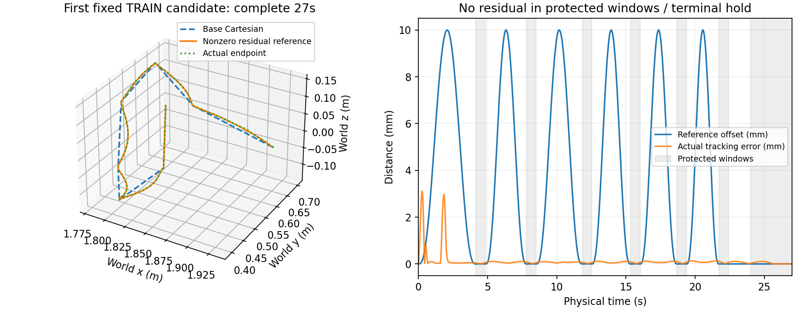
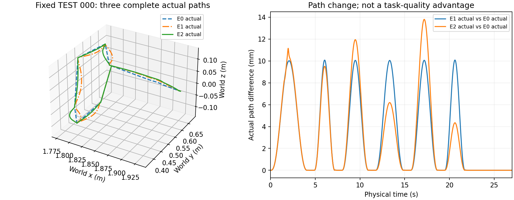

# GitHub evidence view — V6.4-B.2

This portable release contains 718 original lightweight files with unchanged
bytes. The original sealed report is [snapshot/REPORT.md](snapshot/REPORT.md); the text
below changes only its two image destinations to portable relative paths.

**The Git clone does not contain complete replay evidence.** 294 large files
(2,371,599,908 bytes), including physics/replay traces and per-cycle records, remain
in the sealed local archive. Their exact hashes and sizes are retained in
[release_manifest.json](release_manifest.json). Historical JSON absolute paths remain
unchanged; [portable_paths.json](portable_paths.json) resolves available artifacts and
explicitly identifies unavailable heavy or external evidence.

An additional 328 frozen repository source/document inputs (4,512,637
bytes) are preserved under `frozen_repository_inputs/`. This keeps the original
working-file hashes verifiable across Git checkout newline settings. The current
repository files remain the executable source; [repository_blob_review.json](repository_blob_review.json)
records each original working-file SHA and Git blob SHA separately. Where they differ,
the only byte difference is CRLF versus LF; these distinct byte hashes are not equated.

Research outcome: E0 4/4, E1 4/4, E2 3/4; learning advantage not established;
deployment NOT_MET. Refreshed visualizations do not add trials, training, or samples.

Verify this lightweight release from a repository checkout:

```sh
python -m v6_4.export_residual_release --verify --output v6_4/releases/task_anchored_residual_20261007_01
```

The verifier checks all included bytes, the complete omitted-file ledger, and available
repository mappings. It does not claim to verify omitted physical traces from a clone.

---

# V6.4-B.2 task-anchored Cartesian residual pilot

This independent supplement preserves B.1 conclusions and its complete failure evidence.

Research delivery: **True**. Zero interface parity: **True**.
Nonzero full-task results: **30**; successful teacher tasks: **8**.
Training executed: **True**; DATA_LIMITED: **False**; learning advantage: **not_established**.

Stop reason: completed frozen protocol.

| Group | Full 27s Task /4 | Actual attempts | Precheck rejects | Not run |
|---|---:|---:|---:|---:|
| E0 | 4/4 | 4 | 0 | 0 |
| E1 | 4/4 | 4 | 0 | 0 |
| E2 | 3/4 | 4 | 0 | 0 |

Reference anchor acceptance is a property of the analytic representation, not an improvement over historical 0/24 joint-codec Task results.

Geometry: original native robot-target 500Hz; original whole-body 50Hz with configuration subdivisions4. No continuous-time claim. Missing geometry is NOT_RUN, never zero clearance.

Budget: 37/37 runner entries; 37 nonzero-step actual attempts; 488260 actual physical steps. Preview, independent replay and geometry are separate costs.

Timing: 20ms planner / 2ms physics / 27s Task remain frozen. Inherited C.1 dispatch timelines and algorithm/preparation wall clocks are retained but do not gate research success. Deployment remains **NOT_MET**; command validity while the real state continues evolving under calculation delay remains unverified.

See summary.json, table_A.json, table_B.json, teacher_manifest.json and dataset/manifest.json for every slot, failure and independent evidence binding. No automatic fallback, coefficient repair, additional teacher or TEST retry was used.

## 本轮结论与取舍

本轮是已封存 V6.4-B.1 之后的独立补充。有限研究交付完成；任务锚定的非零 Cartesian 路线残差可执行；Diffusion 相对检索的学习收益未建立。保留原基础 Cartesian 参考及非学习检索，E2 作为研究产物保留，不升级为默认规划器。不追加网络层数、训练种子、候选或 actual 重试。

固定 TEST：E0 **4/4**、E1 **4/4**、E2 **3/4**，各实际尝试4次；K1始终slot0，K4 actual **NOT_RUN**。E0/E1为全部4个新TEST提供非学习可执行性见证，其actual没有作为E2训练或推理输入。4个任务、一次训练只支持本先导范围，不能据3/4对4/4作总体统计优劣保证。

## 表示、示范与训练

零残差接口完成27秒，10项实际QP参考字段与原Cartesian provider精确一致。固定首个非零teacher_00实际消费约10mm偏置并完成全部Task/独立安全验收。23/24个teacher完整成功：TRAIN17条/6任务、VAL6条/2任务，失败teacher_17不入标签。标签是实际送入provider的z，不是actual q拟合。建议数据量达到（DATA_LIMITED=false），仍仅有8个独立源任务。

共30次非零完整成功 = teacher23 + TEST检索4 + TEST学习3；这是尝试数，不能写成30个独立任务。全部37条actual含失败前缀均已形成独立证据。

训练为一次全新两层128 MLP，denoiser **150,028**参数（另200个噪声schedule buffer元素），878维Task/几何条件，12维残差。实际4000次更新、batch32、128000次参考曝光；TRAIN17条与VAL6条分离，VAL训练曝光为0。预声明VAL严格选中update250：该选中权重只经历8000次训练曝光；不能把最后4000次权重的128000次曝光赋给它。选中VAL损失0.9856387367472053，最终训练损失0.5686649084091187。全部scaler只拟合TRAIN，旧M0/M1权重未加载，TEST未重选checkpoint。

16/16 raw为有限非零6×2系数，精确重复0/16，每任务4个不同raw；14/16满足固定20mm幅值并通过参考锚点/速度预检。test_000 slot1为20.498345778mm、test_001 slot1为20.679655465mm，直接拒绝，保留原raw；这两项参考Task/速度状态为NOT_EVALUATED_INVALID_AMPLITUDE，未构造合法参考，也没有clamp/project/替换。合法参考峰值约11.009100–19.958655mm。4个K1均合法，K4只作参考接受性统计。

锚点满足主要来自解析表示（固定世界横向基与C²端点零残差），不能把旧joint-codec的0/24与新参考14/16画成网络精度提升。现有47项必要检查通过，其中固定seed20261007的12组合法随机z检查解析锚定；没有因交付重跑单测或增加物理。旧joint codec范围、名义q_ref全身几何为N/A；参考锚点通过不代替实际关节/整机安全检查。

## 固定TEST的实际指标

仅完整Task和全部独立安全门禁通过的运行参与路径质量比较；失败前缀的路径长度与干预比较留空。净空同时列整机最小值和arm-obstacle分类最小值，避免把主要由rigid-target主导的全局距离解释为绕障收益。

| Slot | 完整Task | 连续体路径 m | 整机最小 mm | arm-obstacle最小 mm | 干预RMS rad/s | 消费参考峰值 mm |
|---|---:|---:|---:|---:|---:|---:|
| TEST_00_E0 | PASS | 1.047455 | 14.999176 | 25.929158 | 0.089126 | 0.000000 |
| TEST_00_E1 | PASS | 1.058069 | 14.999207 | 25.929314 | 0.088251 | 9.999998 |
| TEST_00_E2 | PASS | 1.057735 | 14.999068 | 25.932052 | 0.089985 | 13.752986 |
| TEST_01_E0 | PASS | 1.165569 | 14.998741 | 25.727398 | 0.105877 | 0.000000 |
| TEST_01_E1 | PASS | 1.175321 | 14.998783 | 25.727865 | 0.104313 | 9.999895 |
| TEST_01_E2 | FAIL | 不比较 | 14.998748（前缀） | 25.726687（前缀） | 不比较 | 11.007904 |
| TEST_02_E0 | PASS | 1.071650 | 14.998729 | 25.928243 | 0.104133 | 0.000000 |
| TEST_02_E1 | PASS | 1.082249 | 14.998951 | 25.924414 | 0.100040 | 9.999995 |
| TEST_02_E2 | PASS | 1.080189 | 14.998912 | 25.930434 | 0.102434 | 12.629359 |
| TEST_03_E0 | PASS | 1.146468 | 14.999528 | 25.743479 | 0.111864 | 0.000000 |
| TEST_03_E1 | PASS | 1.156078 | 14.999064 | 25.741477 | 0.110807 | 9.999999 |
| TEST_03_E2 | PASS | 1.153535 | 14.998979 | 25.743557 | 0.114264 | 12.504724 |

| Slot | 连续体终态误差 µm | 刚性终态误差 µm | waypoint选中时刻最大位置误差 µm | 各要求选中时刻最大姿态误差 µrad |
|---|---:|---:|---:|---:|
| TEST_00_E0 | 2.830241 | 1.436849 | 3.776272 | 0.744760 |
| TEST_00_E1 | 2.936152 | 1.446314 | 3.540927 | 0.718662 |
| TEST_00_E2 | 2.902478 | 1.438553 | 3.725438 | 0.746547 |
| TEST_01_E0 | 2.180988 | 0.666628 | 5.930060 | 1.966389 |
| TEST_01_E1 | 2.290847 | 0.685716 | 6.128756 | 2.032357 |
| TEST_01_E2 | 未到达 | 未到达 | 未完成全部要求 | 不作完整比较 |
| TEST_02_E0 | 1.551932 | 1.177317 | 6.020343 | 3.480562 |
| TEST_02_E1 | 2.201965 | 1.211657 | 5.812138 | 3.767431 |
| TEST_02_E2 | 1.889103 | 1.248656 | 6.128844 | 3.264885 |
| TEST_03_E0 | 2.411344 | 1.436960 | 57.194737 | 16.592495 |
| TEST_03_E1 | 2.540016 | 1.476692 | 53.509743 | 15.961836 |
| TEST_03_E2 | 2.671569 | 1.455407 | 88.781567 | 9.666548 |

表中waypoint/姿态数值是各冻结要求选定的同一达标时刻best_time_s的误差及其跨要求最大值，不是整个窗口或全程的最大跟踪误差；终态仍在27.0s评价。全部逐点误差、同一时刻位置/姿态匹配、原容差和窗口见 `delivery_analysis.json: TEST_rows[].requirements` 与各独立evaluation/report.json。上述数字属于本模型仿真，不能解释为硬件精度。

完成的三个E2 Task相对E1连续体路径短约0.334/2.059/2.543mm，但相对E0均更长；E2干预RMS均高于对应E1，arm-obstacle净空变化仅微米量级。这些描述性差异与失败Task共同保留，不足以建立学习质量优势。第一个固定TEST的E2实际路径相对E0峰值差约13.801mm，证明实际运动改变，不证明更优。逐任务配对见`delivery_analysis.json: paired_completed_task_quality`与`paired_path_comparison.json`。

## 原始失败与验收语义

两个actual拒绝均为原`RAMP_MICROSTATE_OUTSIDE_DECLARED_DOMAIN; no further servo step executed`：teacher_17在14.900s/7450步，TEST_01_E2在16.620s/8310步。其已消费前缀的合同、区间、原生几何及参考绑定通过，后续未执行要求仍判失败。停止仿真推进不构成真实机器人备份控制保证。无候选替换、无控制器救援、无零残差fallback。

所有30条成功非零运行的`runtime_reported_passed`保留为false，因为旧运行报告中的历史continuum_irregular_waypoint_path_rmse检查未通过；失败前缀为null。实际完整成功按生成候选前冻结的补充`end_effector_detour` TaskSpec要求及合同/区间/native/binding共同判定，允许合法锚点间绕行，保留指定窗口、终态和姿态。旧严格全时域曲线协议与历史0/24、0/6、A.1修复2/4均不改写，也不直接跨协议比精度。

独立几何范围：robot-target原生500Hz；整机50Hz边界加configuration-space subdivisions4。并非整机500Hz扫描，未证明连续时间安全、硬实时或模型失配鲁棒性。

## 预算与计时

实际37/37次、488260个物理步；另做保存力矩独立重放488260步。区间独立重算48863边界、90901行、0不一致。robot-target原生查询36622275次；整机声明范围查询571763107次。私有预演由原执行器执行，精确步数未另汇总，不冒充新增actual。

16次DDIM同步调用墙钟合计0.533364s；候选流程合计3.233955s（含采样、解码、参考预检和部分文件写入）。两计时嵌套，不相加；条件编码/模型加载不在DDIM调用计时内。E0生成与E1检索独立墙钟NOT_MEASURED，不用执行总耗时代替。37次attempt elapsed合计4203.465050s，其中独立evaluation合计2012.831270s，亦为包含关系。

20ms仿真规划周期、2ms物理步长、27s任务时长不变。墙钟20ms不作本研究门禁。37次运行各自dispatch p95范围约17.102–19.090ms；各run p99最大24.680ms，单周期最大61.305ms，共638周期超过20ms、最长连续超限24周期；这些是逐run统计汇总，非合并分位数，不丢弃启动或长尾。逐条计时与哈希保留。本轮Cartesian新provider没有验证计算期间真实状态继续演化的异步部署路径，因此部署NOT_MET，real calculation-delay validity NOT_VERIFIED。

## 来源与元数据解释

实际源码producer commit为`7d0a3fd4bd17f41b99b388c30c5ac4897ac4d31d`，321个冻结源码、70个受保护输入在每条actual前后验证。继承的308个B.1运行源码字节不变。QP配置、制动、PCC、安全距离、工作域、预演与拒绝守卫未修改。

`teacher_manifest.records[].status`保留初始声明状态DECLARED_NOT_EXECUTED，不是终态；实际终态以`teacher_results.records[].actual_status`及各attempt_result为准。`plan.json.plan_sha256`是canonical对象SHA，teacher_manifest中的plan_sha256是plan文件字节SHA；training_config中的plan_sha256仅绑定training子配置，完整plan另由source_identity保护。各口径独立校验，不能当成同一哈希。

旧B.1封存manifest保持`f70d022b70fa9440541151f4a17ea6dca17c45dc415d21f805b238ef12631eec`；4849个payload与13个external重新校验，0缺失、0不一致。

独立result-to-claim审阅与封存校验见本目录审计文件及项目`paper/review-traces/experiment-result-to-claim/2026-10-07_run01/`。不存在paper claim audit时，后续论文措辞仍为provisional，不阻碍本有限研究交付。

## 固定来源图

第一张为固定首个非零teacher，第二张为固定首个TEST三组实际路径，均不按最好结果挑选，未新增运行。




