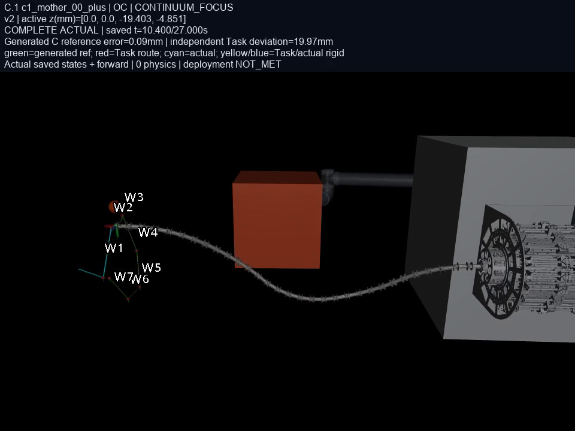
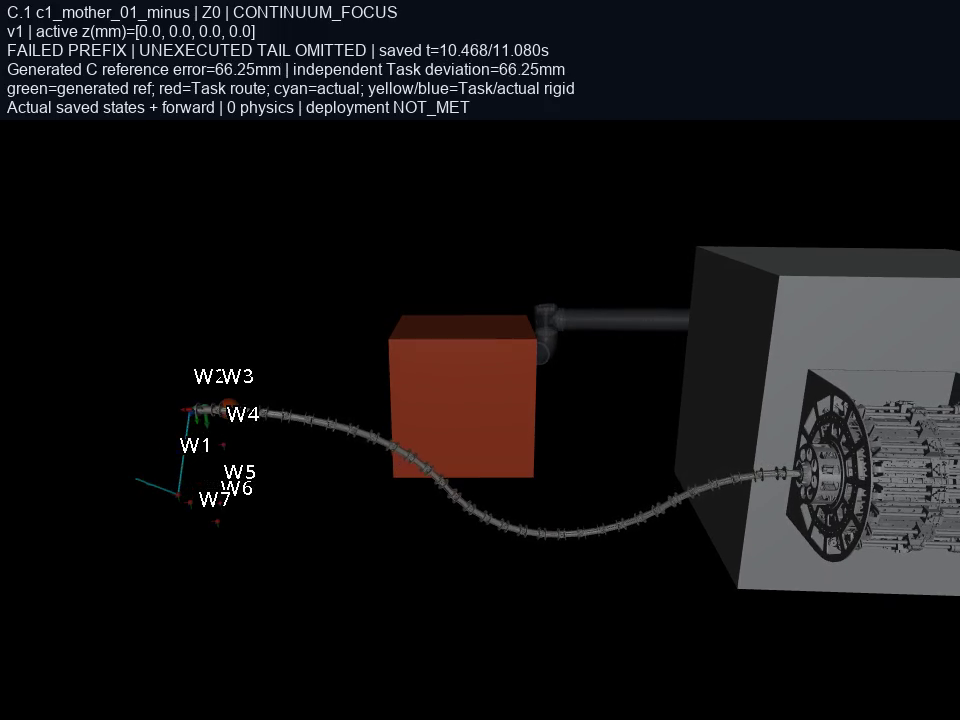
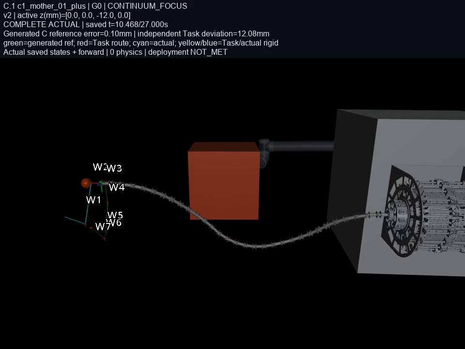

# V6.4-C.1 当前媒体目录

84段视频、48张诊断图、36个CSV，覆盖全部16逻辑槽。12条独立actual包括10条完整轨迹和2条失败前缀；3个别名共享资产，1个NO_PLAN无轨迹。

[HTML总目录](index.html) · [C.1结果总览](../continuous_route_optimizer_20261007_01/index.html) · [来源与验证说明](../../../docs/V6_4_C1_MEDIA_SUPPLEMENT.md) · [完整帧时序与机器验证](collection.json)

|任务|方法|状态/别名|完整诊断|视频|
|---|---|---|---|---|
|c1_mother_00_minus|Z0|TASK_COMPLETED|[视频、图与CSV](replays/c1_mother_00_minus_Z0/index.html)|[五视角](replays/c1_mother_00_minus_Z0/c1_mother_00_minus_Z0_five_view_grid.mp4) · [连续体侧视](replays/c1_mother_00_minus_Z0/c1_mother_00_minus_Z0_continuum_focus.mp4)|
|c1_mother_00_minus|G0|TASK_COMPLETED|[视频、图与CSV](replays/c1_mother_00_minus_G0/index.html)|[五视角](replays/c1_mother_00_minus_G0/c1_mother_00_minus_G0_five_view_grid.mp4) · [连续体侧视](replays/c1_mother_00_minus_G0/c1_mother_00_minus_G0_continuum_focus.mp4)|
|c1_mother_00_minus|OI|复用G0|[视频、图与CSV](replays/c1_mother_00_minus_OI/index.html)|[五视角](replays/c1_mother_00_minus_G0/c1_mother_00_minus_G0_five_view_grid.mp4) · [连续体侧视](replays/c1_mother_00_minus_G0/c1_mother_00_minus_G0_continuum_focus.mp4)|
|c1_mother_00_minus|OC|TASK_COMPLETED|[视频、图与CSV](replays/c1_mother_00_minus_OC/index.html)|[五视角](replays/c1_mother_00_minus_OC/c1_mother_00_minus_OC_five_view_grid.mp4) · [连续体侧视](replays/c1_mother_00_minus_OC/c1_mother_00_minus_OC_continuum_focus.mp4)|
|c1_mother_00_plus|Z0|TASK_COMPLETED|[视频、图与CSV](replays/c1_mother_00_plus_Z0/index.html)|[五视角](replays/c1_mother_00_plus_Z0/c1_mother_00_plus_Z0_five_view_grid.mp4) · [连续体侧视](replays/c1_mother_00_plus_Z0/c1_mother_00_plus_Z0_continuum_focus.mp4)|
|c1_mother_00_plus|G0|TASK_COMPLETED|[视频、图与CSV](replays/c1_mother_00_plus_G0/index.html)|[五视角](replays/c1_mother_00_plus_G0/c1_mother_00_plus_G0_five_view_grid.mp4) · [连续体侧视](replays/c1_mother_00_plus_G0/c1_mother_00_plus_G0_continuum_focus.mp4)|
|c1_mother_00_plus|OI|复用Z0|[视频、图与CSV](replays/c1_mother_00_plus_OI/index.html)|[五视角](replays/c1_mother_00_plus_Z0/c1_mother_00_plus_Z0_five_view_grid.mp4) · [连续体侧视](replays/c1_mother_00_plus_Z0/c1_mother_00_plus_Z0_continuum_focus.mp4)|
|c1_mother_00_plus|OC|TASK_COMPLETED|[视频、图与CSV](replays/c1_mother_00_plus_OC/index.html)|[五视角](replays/c1_mother_00_plus_OC/c1_mother_00_plus_OC_five_view_grid.mp4) · [连续体侧视](replays/c1_mother_00_plus_OC/c1_mother_00_plus_OC_continuum_focus.mp4)|
|c1_mother_01_minus|Z0|EXECUTION_REFUSED|[视频、图与CSV](replays/c1_mother_01_minus_Z0/index.html)|[五视角](replays/c1_mother_01_minus_Z0/c1_mother_01_minus_Z0_five_view_grid.mp4) · [连续体侧视](replays/c1_mother_01_minus_Z0/c1_mother_01_minus_Z0_continuum_focus.mp4)|
|c1_mother_01_minus|G0|EXECUTION_REFUSED|[视频、图与CSV](replays/c1_mother_01_minus_G0/index.html)|[五视角](replays/c1_mother_01_minus_G0/c1_mother_01_minus_G0_five_view_grid.mp4) · [连续体侧视](replays/c1_mother_01_minus_G0/c1_mother_01_minus_G0_continuum_focus.mp4)|
|c1_mother_01_minus|OI|TASK_COMPLETED|[视频、图与CSV](replays/c1_mother_01_minus_OI/index.html)|[五视角](replays/c1_mother_01_minus_OI/c1_mother_01_minus_OI_five_view_grid.mp4) · [连续体侧视](replays/c1_mother_01_minus_OI/c1_mother_01_minus_OI_continuum_focus.mp4)|
|c1_mother_01_minus|OC|NO_PLAN|[视频、图与CSV](replays/c1_mother_01_minus_OC/index.html)|无计划，无视频|
|c1_mother_01_plus|Z0|TASK_COMPLETED|[视频、图与CSV](replays/c1_mother_01_plus_Z0/index.html)|[五视角](replays/c1_mother_01_plus_Z0/c1_mother_01_plus_Z0_five_view_grid.mp4) · [连续体侧视](replays/c1_mother_01_plus_Z0/c1_mother_01_plus_Z0_continuum_focus.mp4)|
|c1_mother_01_plus|G0|TASK_COMPLETED|[视频、图与CSV](replays/c1_mother_01_plus_G0/index.html)|[五视角](replays/c1_mother_01_plus_G0/c1_mother_01_plus_G0_five_view_grid.mp4) · [连续体侧视](replays/c1_mother_01_plus_G0/c1_mother_01_plus_G0_continuum_focus.mp4)|
|c1_mother_01_plus|OI|复用Z0|[视频、图与CSV](replays/c1_mother_01_plus_OI/index.html)|[五视角](replays/c1_mother_01_plus_Z0/c1_mother_01_plus_Z0_five_view_grid.mp4) · [连续体侧视](replays/c1_mother_01_plus_Z0/c1_mother_01_plus_Z0_continuum_focus.mp4)|
|c1_mother_01_plus|OC|TASK_COMPLETED|[视频、图与CSV](replays/c1_mother_01_plus_OC/index.html)|[五视角](replays/c1_mother_01_plus_OC/c1_mother_01_plus_OC_five_view_grid.mp4) · [连续体侧视](replays/c1_mother_01_plus_OC/c1_mother_01_plus_OC_continuum_focus.mp4)|

## c1_mother_00_minus_Z0

保存终点 **27.000s**，完整27秒。

[五视角合成](replays/c1_mother_00_minus_Z0/c1_mother_00_minus_Z0_five_view_grid.mp4) · [连续体侧视](replays/c1_mother_00_minus_Z0/c1_mother_00_minus_Z0_continuum_focus.mp4) · [overview](replays/c1_mother_00_minus_Z0/c1_mother_00_minus_Z0_overview.mp4) · [front](replays/c1_mother_00_minus_Z0/c1_mother_00_minus_Z0_front.mp4) · [side](replays/c1_mother_00_minus_Z0/c1_mother_00_minus_Z0_side.mp4) · [top](replays/c1_mother_00_minus_Z0/c1_mother_00_minus_Z0_top.mp4) · [iso](replays/c1_mother_00_minus_Z0/c1_mother_00_minus_Z0_iso.mp4)

[末端轨迹](figures/c1_mother_00_minus_Z0/trajectory.png) · [跟踪误差](figures/c1_mother_00_minus_Z0/tracking.png) · [净空与基座](figures/c1_mother_00_minus_Z0/safety_base.png) · [控制诊断](figures/c1_mother_00_minus_Z0/control.png) · [consumed_tracking.csv](figures/c1_mother_00_minus_Z0/consumed_tracking.csv) · [native_diagnostics.csv](figures/c1_mother_00_minus_Z0/native_diagnostics.csv) · [support_clearance.csv](figures/c1_mother_00_minus_Z0/support_clearance.csv)

## c1_mother_00_minus_G0

保存终点 **27.000s**，完整27秒。

[五视角合成](replays/c1_mother_00_minus_G0/c1_mother_00_minus_G0_five_view_grid.mp4) · [连续体侧视](replays/c1_mother_00_minus_G0/c1_mother_00_minus_G0_continuum_focus.mp4) · [overview](replays/c1_mother_00_minus_G0/c1_mother_00_minus_G0_overview.mp4) · [front](replays/c1_mother_00_minus_G0/c1_mother_00_minus_G0_front.mp4) · [side](replays/c1_mother_00_minus_G0/c1_mother_00_minus_G0_side.mp4) · [top](replays/c1_mother_00_minus_G0/c1_mother_00_minus_G0_top.mp4) · [iso](replays/c1_mother_00_minus_G0/c1_mother_00_minus_G0_iso.mp4)

[末端轨迹](figures/c1_mother_00_minus_G0/trajectory.png) · [跟踪误差](figures/c1_mother_00_minus_G0/tracking.png) · [净空与基座](figures/c1_mother_00_minus_G0/safety_base.png) · [控制诊断](figures/c1_mother_00_minus_G0/control.png) · [consumed_tracking.csv](figures/c1_mother_00_minus_G0/consumed_tracking.csv) · [native_diagnostics.csv](figures/c1_mother_00_minus_G0/native_diagnostics.csv) · [support_clearance.csv](figures/c1_mother_00_minus_G0/support_clearance.csv)

## c1_mother_00_minus_OC

保存终点 **27.000s**，完整27秒。

[五视角合成](replays/c1_mother_00_minus_OC/c1_mother_00_minus_OC_five_view_grid.mp4) · [连续体侧视](replays/c1_mother_00_minus_OC/c1_mother_00_minus_OC_continuum_focus.mp4) · [overview](replays/c1_mother_00_minus_OC/c1_mother_00_minus_OC_overview.mp4) · [front](replays/c1_mother_00_minus_OC/c1_mother_00_minus_OC_front.mp4) · [side](replays/c1_mother_00_minus_OC/c1_mother_00_minus_OC_side.mp4) · [top](replays/c1_mother_00_minus_OC/c1_mother_00_minus_OC_top.mp4) · [iso](replays/c1_mother_00_minus_OC/c1_mother_00_minus_OC_iso.mp4)

[末端轨迹](figures/c1_mother_00_minus_OC/trajectory.png) · [跟踪误差](figures/c1_mother_00_minus_OC/tracking.png) · [净空与基座](figures/c1_mother_00_minus_OC/safety_base.png) · [控制诊断](figures/c1_mother_00_minus_OC/control.png) · [consumed_tracking.csv](figures/c1_mother_00_minus_OC/consumed_tracking.csv) · [native_diagnostics.csv](figures/c1_mother_00_minus_OC/native_diagnostics.csv) · [support_clearance.csv](figures/c1_mother_00_minus_OC/support_clearance.csv)

## c1_mother_00_plus_Z0

保存终点 **27.000s**，完整27秒。

[五视角合成](replays/c1_mother_00_plus_Z0/c1_mother_00_plus_Z0_five_view_grid.mp4) · [连续体侧视](replays/c1_mother_00_plus_Z0/c1_mother_00_plus_Z0_continuum_focus.mp4) · [overview](replays/c1_mother_00_plus_Z0/c1_mother_00_plus_Z0_overview.mp4) · [front](replays/c1_mother_00_plus_Z0/c1_mother_00_plus_Z0_front.mp4) · [side](replays/c1_mother_00_plus_Z0/c1_mother_00_plus_Z0_side.mp4) · [top](replays/c1_mother_00_plus_Z0/c1_mother_00_plus_Z0_top.mp4) · [iso](replays/c1_mother_00_plus_Z0/c1_mother_00_plus_Z0_iso.mp4)

[末端轨迹](figures/c1_mother_00_plus_Z0/trajectory.png) · [跟踪误差](figures/c1_mother_00_plus_Z0/tracking.png) · [净空与基座](figures/c1_mother_00_plus_Z0/safety_base.png) · [控制诊断](figures/c1_mother_00_plus_Z0/control.png) · [consumed_tracking.csv](figures/c1_mother_00_plus_Z0/consumed_tracking.csv) · [native_diagnostics.csv](figures/c1_mother_00_plus_Z0/native_diagnostics.csv) · [support_clearance.csv](figures/c1_mother_00_plus_Z0/support_clearance.csv)

## c1_mother_00_plus_G0

保存终点 **27.000s**，完整27秒。

[五视角合成](replays/c1_mother_00_plus_G0/c1_mother_00_plus_G0_five_view_grid.mp4) · [连续体侧视](replays/c1_mother_00_plus_G0/c1_mother_00_plus_G0_continuum_focus.mp4) · [overview](replays/c1_mother_00_plus_G0/c1_mother_00_plus_G0_overview.mp4) · [front](replays/c1_mother_00_plus_G0/c1_mother_00_plus_G0_front.mp4) · [side](replays/c1_mother_00_plus_G0/c1_mother_00_plus_G0_side.mp4) · [top](replays/c1_mother_00_plus_G0/c1_mother_00_plus_G0_top.mp4) · [iso](replays/c1_mother_00_plus_G0/c1_mother_00_plus_G0_iso.mp4)

[末端轨迹](figures/c1_mother_00_plus_G0/trajectory.png) · [跟踪误差](figures/c1_mother_00_plus_G0/tracking.png) · [净空与基座](figures/c1_mother_00_plus_G0/safety_base.png) · [控制诊断](figures/c1_mother_00_plus_G0/control.png) · [consumed_tracking.csv](figures/c1_mother_00_plus_G0/consumed_tracking.csv) · [native_diagnostics.csv](figures/c1_mother_00_plus_G0/native_diagnostics.csv) · [support_clearance.csv](figures/c1_mother_00_plus_G0/support_clearance.csv)

## c1_mother_00_plus_OC

保存终点 **27.000s**，完整27秒。

[五视角合成](replays/c1_mother_00_plus_OC/c1_mother_00_plus_OC_five_view_grid.mp4) · [连续体侧视](replays/c1_mother_00_plus_OC/c1_mother_00_plus_OC_continuum_focus.mp4) · [overview](replays/c1_mother_00_plus_OC/c1_mother_00_plus_OC_overview.mp4) · [front](replays/c1_mother_00_plus_OC/c1_mother_00_plus_OC_front.mp4) · [side](replays/c1_mother_00_plus_OC/c1_mother_00_plus_OC_side.mp4) · [top](replays/c1_mother_00_plus_OC/c1_mother_00_plus_OC_top.mp4) · [iso](replays/c1_mother_00_plus_OC/c1_mother_00_plus_OC_iso.mp4)

[末端轨迹](figures/c1_mother_00_plus_OC/trajectory.png) · [跟踪误差](figures/c1_mother_00_plus_OC/tracking.png) · [净空与基座](figures/c1_mother_00_plus_OC/safety_base.png) · [控制诊断](figures/c1_mother_00_plus_OC/control.png) · [consumed_tracking.csv](figures/c1_mother_00_plus_OC/consumed_tracking.csv) · [native_diagnostics.csv](figures/c1_mother_00_plus_OC/native_diagnostics.csv) · [support_clearance.csv](figures/c1_mother_00_plus_OC/support_clearance.csv)

## c1_mother_01_minus_Z0

保存终点 **11.080s**，失败前缀，后续未执行。

[五视角合成](replays/c1_mother_01_minus_Z0/c1_mother_01_minus_Z0_five_view_grid.mp4) · [连续体侧视](replays/c1_mother_01_minus_Z0/c1_mother_01_minus_Z0_continuum_focus.mp4) · [overview](replays/c1_mother_01_minus_Z0/c1_mother_01_minus_Z0_overview.mp4) · [front](replays/c1_mother_01_minus_Z0/c1_mother_01_minus_Z0_front.mp4) · [side](replays/c1_mother_01_minus_Z0/c1_mother_01_minus_Z0_side.mp4) · [top](replays/c1_mother_01_minus_Z0/c1_mother_01_minus_Z0_top.mp4) · [iso](replays/c1_mother_01_minus_Z0/c1_mother_01_minus_Z0_iso.mp4)

[末端轨迹](figures/c1_mother_01_minus_Z0/trajectory.png) · [跟踪误差](figures/c1_mother_01_minus_Z0/tracking.png) · [净空与基座](figures/c1_mother_01_minus_Z0/safety_base.png) · [控制诊断](figures/c1_mother_01_minus_Z0/control.png) · [consumed_tracking.csv](figures/c1_mother_01_minus_Z0/consumed_tracking.csv) · [native_diagnostics.csv](figures/c1_mother_01_minus_Z0/native_diagnostics.csv) · [support_clearance.csv](figures/c1_mother_01_minus_Z0/support_clearance.csv)

## c1_mother_01_minus_G0

保存终点 **10.800s**，失败前缀，后续未执行。

[五视角合成](replays/c1_mother_01_minus_G0/c1_mother_01_minus_G0_five_view_grid.mp4) · [连续体侧视](replays/c1_mother_01_minus_G0/c1_mother_01_minus_G0_continuum_focus.mp4) · [overview](replays/c1_mother_01_minus_G0/c1_mother_01_minus_G0_overview.mp4) · [front](replays/c1_mother_01_minus_G0/c1_mother_01_minus_G0_front.mp4) · [side](replays/c1_mother_01_minus_G0/c1_mother_01_minus_G0_side.mp4) · [top](replays/c1_mother_01_minus_G0/c1_mother_01_minus_G0_top.mp4) · [iso](replays/c1_mother_01_minus_G0/c1_mother_01_minus_G0_iso.mp4)

[末端轨迹](figures/c1_mother_01_minus_G0/trajectory.png) · [跟踪误差](figures/c1_mother_01_minus_G0/tracking.png) · [净空与基座](figures/c1_mother_01_minus_G0/safety_base.png) · [控制诊断](figures/c1_mother_01_minus_G0/control.png) · [consumed_tracking.csv](figures/c1_mother_01_minus_G0/consumed_tracking.csv) · [native_diagnostics.csv](figures/c1_mother_01_minus_G0/native_diagnostics.csv) · [support_clearance.csv](figures/c1_mother_01_minus_G0/support_clearance.csv)

## c1_mother_01_minus_OI

保存终点 **27.000s**，完整27秒。

[五视角合成](replays/c1_mother_01_minus_OI/c1_mother_01_minus_OI_five_view_grid.mp4) · [连续体侧视](replays/c1_mother_01_minus_OI/c1_mother_01_minus_OI_continuum_focus.mp4) · [overview](replays/c1_mother_01_minus_OI/c1_mother_01_minus_OI_overview.mp4) · [front](replays/c1_mother_01_minus_OI/c1_mother_01_minus_OI_front.mp4) · [side](replays/c1_mother_01_minus_OI/c1_mother_01_minus_OI_side.mp4) · [top](replays/c1_mother_01_minus_OI/c1_mother_01_minus_OI_top.mp4) · [iso](replays/c1_mother_01_minus_OI/c1_mother_01_minus_OI_iso.mp4)

[末端轨迹](figures/c1_mother_01_minus_OI/trajectory.png) · [跟踪误差](figures/c1_mother_01_minus_OI/tracking.png) · [净空与基座](figures/c1_mother_01_minus_OI/safety_base.png) · [控制诊断](figures/c1_mother_01_minus_OI/control.png) · [consumed_tracking.csv](figures/c1_mother_01_minus_OI/consumed_tracking.csv) · [native_diagnostics.csv](figures/c1_mother_01_minus_OI/native_diagnostics.csv) · [support_clearance.csv](figures/c1_mother_01_minus_OI/support_clearance.csv)

## c1_mother_01_plus_Z0

保存终点 **27.000s**，完整27秒。

[五视角合成](replays/c1_mother_01_plus_Z0/c1_mother_01_plus_Z0_five_view_grid.mp4) · [连续体侧视](replays/c1_mother_01_plus_Z0/c1_mother_01_plus_Z0_continuum_focus.mp4) · [overview](replays/c1_mother_01_plus_Z0/c1_mother_01_plus_Z0_overview.mp4) · [front](replays/c1_mother_01_plus_Z0/c1_mother_01_plus_Z0_front.mp4) · [side](replays/c1_mother_01_plus_Z0/c1_mother_01_plus_Z0_side.mp4) · [top](replays/c1_mother_01_plus_Z0/c1_mother_01_plus_Z0_top.mp4) · [iso](replays/c1_mother_01_plus_Z0/c1_mother_01_plus_Z0_iso.mp4)

[末端轨迹](figures/c1_mother_01_plus_Z0/trajectory.png) · [跟踪误差](figures/c1_mother_01_plus_Z0/tracking.png) · [净空与基座](figures/c1_mother_01_plus_Z0/safety_base.png) · [控制诊断](figures/c1_mother_01_plus_Z0/control.png) · [consumed_tracking.csv](figures/c1_mother_01_plus_Z0/consumed_tracking.csv) · [native_diagnostics.csv](figures/c1_mother_01_plus_Z0/native_diagnostics.csv) · [support_clearance.csv](figures/c1_mother_01_plus_Z0/support_clearance.csv)

## c1_mother_01_plus_G0

保存终点 **27.000s**，完整27秒。

[五视角合成](replays/c1_mother_01_plus_G0/c1_mother_01_plus_G0_five_view_grid.mp4) · [连续体侧视](replays/c1_mother_01_plus_G0/c1_mother_01_plus_G0_continuum_focus.mp4) · [overview](replays/c1_mother_01_plus_G0/c1_mother_01_plus_G0_overview.mp4) · [front](replays/c1_mother_01_plus_G0/c1_mother_01_plus_G0_front.mp4) · [side](replays/c1_mother_01_plus_G0/c1_mother_01_plus_G0_side.mp4) · [top](replays/c1_mother_01_plus_G0/c1_mother_01_plus_G0_top.mp4) · [iso](replays/c1_mother_01_plus_G0/c1_mother_01_plus_G0_iso.mp4)

[末端轨迹](figures/c1_mother_01_plus_G0/trajectory.png) · [跟踪误差](figures/c1_mother_01_plus_G0/tracking.png) · [净空与基座](figures/c1_mother_01_plus_G0/safety_base.png) · [控制诊断](figures/c1_mother_01_plus_G0/control.png) · [consumed_tracking.csv](figures/c1_mother_01_plus_G0/consumed_tracking.csv) · [native_diagnostics.csv](figures/c1_mother_01_plus_G0/native_diagnostics.csv) · [support_clearance.csv](figures/c1_mother_01_plus_G0/support_clearance.csv)

## c1_mother_01_plus_OC

保存终点 **27.000s**，完整27秒。

[五视角合成](replays/c1_mother_01_plus_OC/c1_mother_01_plus_OC_five_view_grid.mp4) · [连续体侧视](replays/c1_mother_01_plus_OC/c1_mother_01_plus_OC_continuum_focus.mp4) · [overview](replays/c1_mother_01_plus_OC/c1_mother_01_plus_OC_overview.mp4) · [front](replays/c1_mother_01_plus_OC/c1_mother_01_plus_OC_front.mp4) · [side](replays/c1_mother_01_plus_OC/c1_mother_01_plus_OC_side.mp4) · [top](replays/c1_mother_01_plus_OC/c1_mother_01_plus_OC_top.mp4) · [iso](replays/c1_mother_01_plus_OC/c1_mother_01_plus_OC_iso.mp4)

[末端轨迹](figures/c1_mother_01_plus_OC/trajectory.png) · [跟踪误差](figures/c1_mother_01_plus_OC/tracking.png) · [净空与基座](figures/c1_mother_01_plus_OC/safety_base.png) · [控制诊断](figures/c1_mother_01_plus_OC/control.png) · [consumed_tracking.csv](figures/c1_mother_01_plus_OC/consumed_tracking.csv) · [native_diagnostics.csv](figures/c1_mother_01_plus_OC/native_diagnostics.csv) · [support_clearance.csv](figures/c1_mother_01_plus_OC/support_clearance.csv)

视频为原始actual保存状态重绘；新增物理步/距离查询/QP求解均为0。跟踪误差使用实际消耗的QP输入，Task路线偏差单列；失败前缀不补齐。部署NOT_MET。
