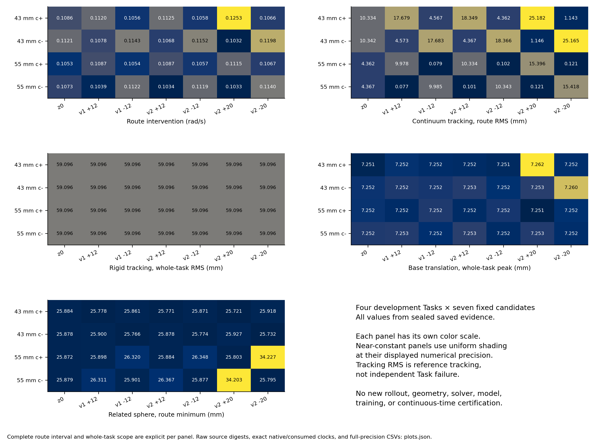
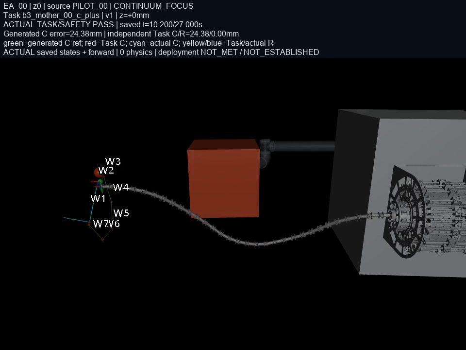

# V6.4-B.3.1 全套保存状态可视化

覆盖四任务 × 七参考的全部 28 槽：196 个视频、末端轨迹与误差、姿态、基座漂移及保存的净空诊断。视频读取保存状态并调用 mj_forward，不重跑闭环；轨迹/误差图使用原实际状态绑定的 fresh 运动学及真正消费的参考。

[交互式目录](index.html) · [视频来源](videos.json) · [图表与数值来源](figures/plots_final.json) · [原研究图表](../execution_aware_route_teacher_20261007_01/index.html)

执行参考误差和独立 Task/base 曲线偏差分开显示。中间绕行导致的 base 偏差不等同于 Task 失败；28/28 原 Task 与门禁结论保持，部署状态仍为 NOT_MET。

[EA_00 五视角视频](replays/EA_00/EA_00_five_view_grid.mp4) · [EA_00 连续体侧视视频](replays/EA_00/EA_00_continuum_focus.mp4) · [EA_00 末端轨迹](figures/EA_00_trajectory.png) · [EA_00 跟踪误差](figures/EA_00_tracking.png)

| 槽位 | 任务 / 参考 | 原来源 | 五视角 | 连续体侧视 | 末端轨迹 | 跟踪误差 | 净空 / 基座 | 控制诊断 |
|---|---|---|---|---|---|---|---|---|
| EA_00 | b3_mother_00_c_plus / z0 | PILOT_00 | [五视角](replays/EA_00/EA_00_five_view_grid.mp4) | [连续体侧视](replays/EA_00/EA_00_continuum_focus.mp4) | [末端轨迹](figures/EA_00_trajectory.png) | [跟踪误差](figures/EA_00_tracking.png) | [净空 / 基座](figures/EA_00_safety_base.png) | [控制诊断](figures/EA_00_control_diagnostics_layout_v2.png) |
| EA_01 | b3_mother_00_c_plus / v1_plus12 | PILOT_01 | [五视角](replays/EA_01/EA_01_five_view_grid.mp4) | [连续体侧视](replays/EA_01/EA_01_continuum_focus.mp4) | [末端轨迹](figures/EA_01_trajectory.png) | [跟踪误差](figures/EA_01_tracking.png) | [净空 / 基座](figures/EA_01_safety_base.png) | [控制诊断](figures/EA_01_control_diagnostics_layout_v2.png) |
| EA_02 | b3_mother_00_c_plus / v1_minus12 | PILOT_02 | [五视角](replays/EA_02/EA_02_five_view_grid.mp4) | [连续体侧视](replays/EA_02/EA_02_continuum_focus.mp4) | [末端轨迹](figures/EA_02_trajectory.png) | [跟踪误差](figures/EA_02_tracking.png) | [净空 / 基座](figures/EA_02_safety_base.png) | [控制诊断](figures/EA_02_control_diagnostics_layout_v2.png) |
| EA_03 | b3_mother_00_c_plus / v2_plus12 | EA_03 | [五视角](replays/EA_03/EA_03_five_view_grid.mp4) | [连续体侧视](replays/EA_03/EA_03_continuum_focus.mp4) | [末端轨迹](figures/EA_03_trajectory.png) | [跟踪误差](figures/EA_03_tracking.png) | [净空 / 基座](figures/EA_03_safety_base.png) | [控制诊断](figures/EA_03_control_diagnostics.png) |
| EA_04 | b3_mother_00_c_plus / v2_minus12 | EA_04 | [五视角](replays/EA_04/EA_04_five_view_grid.mp4) | [连续体侧视](replays/EA_04/EA_04_continuum_focus.mp4) | [末端轨迹](figures/EA_04_trajectory.png) | [跟踪误差](figures/EA_04_tracking.png) | [净空 / 基座](figures/EA_04_safety_base.png) | [控制诊断](figures/EA_04_control_diagnostics.png) |
| EA_05 | b3_mother_00_c_plus / v2_plus20 | EA_05 | [五视角](replays/EA_05/EA_05_five_view_grid.mp4) | [连续体侧视](replays/EA_05/EA_05_continuum_focus.mp4) | [末端轨迹](figures/EA_05_trajectory.png) | [跟踪误差](figures/EA_05_tracking.png) | [净空 / 基座](figures/EA_05_safety_base.png) | [控制诊断](figures/EA_05_control_diagnostics.png) |
| EA_06 | b3_mother_00_c_plus / v2_minus20 | EA_06 | [五视角](replays/EA_06/EA_06_five_view_grid.mp4) | [连续体侧视](replays/EA_06/EA_06_continuum_focus.mp4) | [末端轨迹](figures/EA_06_trajectory.png) | [跟踪误差](figures/EA_06_tracking.png) | [净空 / 基座](figures/EA_06_safety_base.png) | [控制诊断](figures/EA_06_control_diagnostics.png) |
| EA_07 | b3_mother_00_c_minus / z0 | PILOT_03 | [五视角](replays/EA_07/EA_07_five_view_grid.mp4) | [连续体侧视](replays/EA_07/EA_07_continuum_focus.mp4) | [末端轨迹](figures/EA_07_trajectory.png) | [跟踪误差](figures/EA_07_tracking.png) | [净空 / 基座](figures/EA_07_safety_base.png) | [控制诊断](figures/EA_07_control_diagnostics_layout_v2.png) |
| EA_08 | b3_mother_00_c_minus / v1_plus12 | PILOT_04 | [五视角](replays/EA_08/EA_08_five_view_grid.mp4) | [连续体侧视](replays/EA_08/EA_08_continuum_focus.mp4) | [末端轨迹](figures/EA_08_trajectory.png) | [跟踪误差](figures/EA_08_tracking.png) | [净空 / 基座](figures/EA_08_safety_base.png) | [控制诊断](figures/EA_08_control_diagnostics_layout_v2.png) |
| EA_09 | b3_mother_00_c_minus / v1_minus12 | PILOT_05 | [五视角](replays/EA_09/EA_09_five_view_grid.mp4) | [连续体侧视](replays/EA_09/EA_09_continuum_focus.mp4) | [末端轨迹](figures/EA_09_trajectory.png) | [跟踪误差](figures/EA_09_tracking.png) | [净空 / 基座](figures/EA_09_safety_base.png) | [控制诊断](figures/EA_09_control_diagnostics_layout_v2.png) |
| EA_10 | b3_mother_00_c_minus / v2_plus12 | EA_10 | [五视角](replays/EA_10/EA_10_five_view_grid.mp4) | [连续体侧视](replays/EA_10/EA_10_continuum_focus.mp4) | [末端轨迹](figures/EA_10_trajectory.png) | [跟踪误差](figures/EA_10_tracking.png) | [净空 / 基座](figures/EA_10_safety_base.png) | [控制诊断](figures/EA_10_control_diagnostics.png) |
| EA_11 | b3_mother_00_c_minus / v2_minus12 | EA_11 | [五视角](replays/EA_11/EA_11_five_view_grid.mp4) | [连续体侧视](replays/EA_11/EA_11_continuum_focus.mp4) | [末端轨迹](figures/EA_11_trajectory.png) | [跟踪误差](figures/EA_11_tracking.png) | [净空 / 基座](figures/EA_11_safety_base.png) | [控制诊断](figures/EA_11_control_diagnostics.png) |
| EA_12 | b3_mother_00_c_minus / v2_plus20 | EA_12 | [五视角](replays/EA_12/EA_12_five_view_grid.mp4) | [连续体侧视](replays/EA_12/EA_12_continuum_focus.mp4) | [末端轨迹](figures/EA_12_trajectory.png) | [跟踪误差](figures/EA_12_tracking.png) | [净空 / 基座](figures/EA_12_safety_base.png) | [控制诊断](figures/EA_12_control_diagnostics.png) |
| EA_13 | b3_mother_00_c_minus / v2_minus20 | EA_13 | [五视角](replays/EA_13/EA_13_five_view_grid.mp4) | [连续体侧视](replays/EA_13/EA_13_continuum_focus.mp4) | [末端轨迹](figures/EA_13_trajectory.png) | [跟踪误差](figures/EA_13_tracking.png) | [净空 / 基座](figures/EA_13_safety_base.png) | [控制诊断](figures/EA_13_control_diagnostics.png) |
| EA_14 | b31_mother_00_d055_c_plus / z0 | EA_14 | [五视角](replays/EA_14/EA_14_five_view_grid.mp4) | [连续体侧视](replays/EA_14/EA_14_continuum_focus.mp4) | [末端轨迹](figures/EA_14_trajectory.png) | [跟踪误差](figures/EA_14_tracking.png) | [净空 / 基座](figures/EA_14_safety_base.png) | [控制诊断](figures/EA_14_control_diagnostics.png) |
| EA_15 | b31_mother_00_d055_c_plus / v1_plus12 | EA_15 | [五视角](replays/EA_15/EA_15_five_view_grid.mp4) | [连续体侧视](replays/EA_15/EA_15_continuum_focus.mp4) | [末端轨迹](figures/EA_15_trajectory.png) | [跟踪误差](figures/EA_15_tracking.png) | [净空 / 基座](figures/EA_15_safety_base.png) | [控制诊断](figures/EA_15_control_diagnostics.png) |
| EA_16 | b31_mother_00_d055_c_plus / v1_minus12 | EA_16 | [五视角](replays/EA_16/EA_16_five_view_grid.mp4) | [连续体侧视](replays/EA_16/EA_16_continuum_focus.mp4) | [末端轨迹](figures/EA_16_trajectory.png) | [跟踪误差](figures/EA_16_tracking.png) | [净空 / 基座](figures/EA_16_safety_base.png) | [控制诊断](figures/EA_16_control_diagnostics.png) |
| EA_17 | b31_mother_00_d055_c_plus / v2_plus12 | EA_17 | [五视角](replays/EA_17/EA_17_five_view_grid.mp4) | [连续体侧视](replays/EA_17/EA_17_continuum_focus.mp4) | [末端轨迹](figures/EA_17_trajectory.png) | [跟踪误差](figures/EA_17_tracking.png) | [净空 / 基座](figures/EA_17_safety_base.png) | [控制诊断](figures/EA_17_control_diagnostics.png) |
| EA_18 | b31_mother_00_d055_c_plus / v2_minus12 | EA_18 | [五视角](replays/EA_18/EA_18_five_view_grid.mp4) | [连续体侧视](replays/EA_18/EA_18_continuum_focus.mp4) | [末端轨迹](figures/EA_18_trajectory.png) | [跟踪误差](figures/EA_18_tracking.png) | [净空 / 基座](figures/EA_18_safety_base.png) | [控制诊断](figures/EA_18_control_diagnostics.png) |
| EA_19 | b31_mother_00_d055_c_plus / v2_plus20 | EA_19 | [五视角](replays/EA_19/EA_19_five_view_grid.mp4) | [连续体侧视](replays/EA_19/EA_19_continuum_focus.mp4) | [末端轨迹](figures/EA_19_trajectory.png) | [跟踪误差](figures/EA_19_tracking.png) | [净空 / 基座](figures/EA_19_safety_base.png) | [控制诊断](figures/EA_19_control_diagnostics.png) |
| EA_20 | b31_mother_00_d055_c_plus / v2_minus20 | EA_20 | [五视角](replays/EA_20/EA_20_five_view_grid.mp4) | [连续体侧视](replays/EA_20/EA_20_continuum_focus.mp4) | [末端轨迹](figures/EA_20_trajectory.png) | [跟踪误差](figures/EA_20_tracking.png) | [净空 / 基座](figures/EA_20_safety_base.png) | [控制诊断](figures/EA_20_control_diagnostics.png) |
| EA_21 | b31_mother_00_d055_c_minus / z0 | EA_21 | [五视角](replays/EA_21/EA_21_five_view_grid.mp4) | [连续体侧视](replays/EA_21/EA_21_continuum_focus.mp4) | [末端轨迹](figures/EA_21_trajectory.png) | [跟踪误差](figures/EA_21_tracking.png) | [净空 / 基座](figures/EA_21_safety_base.png) | [控制诊断](figures/EA_21_control_diagnostics.png) |
| EA_22 | b31_mother_00_d055_c_minus / v1_plus12 | EA_22 | [五视角](replays/EA_22/EA_22_five_view_grid.mp4) | [连续体侧视](replays/EA_22/EA_22_continuum_focus.mp4) | [末端轨迹](figures/EA_22_trajectory.png) | [跟踪误差](figures/EA_22_tracking.png) | [净空 / 基座](figures/EA_22_safety_base.png) | [控制诊断](figures/EA_22_control_diagnostics.png) |
| EA_23 | b31_mother_00_d055_c_minus / v1_minus12 | EA_23 | [五视角](replays/EA_23/EA_23_five_view_grid.mp4) | [连续体侧视](replays/EA_23/EA_23_continuum_focus.mp4) | [末端轨迹](figures/EA_23_trajectory.png) | [跟踪误差](figures/EA_23_tracking.png) | [净空 / 基座](figures/EA_23_safety_base.png) | [控制诊断](figures/EA_23_control_diagnostics.png) |
| EA_24 | b31_mother_00_d055_c_minus / v2_plus12 | EA_24 | [五视角](replays/EA_24/EA_24_five_view_grid.mp4) | [连续体侧视](replays/EA_24/EA_24_continuum_focus.mp4) | [末端轨迹](figures/EA_24_trajectory.png) | [跟踪误差](figures/EA_24_tracking.png) | [净空 / 基座](figures/EA_24_safety_base.png) | [控制诊断](figures/EA_24_control_diagnostics.png) |
| EA_25 | b31_mother_00_d055_c_minus / v2_minus12 | EA_25 | [五视角](replays/EA_25/EA_25_five_view_grid.mp4) | [连续体侧视](replays/EA_25/EA_25_continuum_focus.mp4) | [末端轨迹](figures/EA_25_trajectory.png) | [跟踪误差](figures/EA_25_tracking.png) | [净空 / 基座](figures/EA_25_safety_base.png) | [控制诊断](figures/EA_25_control_diagnostics.png) |
| EA_26 | b31_mother_00_d055_c_minus / v2_plus20 | EA_26 | [五视角](replays/EA_26/EA_26_five_view_grid.mp4) | [连续体侧视](replays/EA_26/EA_26_continuum_focus.mp4) | [末端轨迹](figures/EA_26_trajectory.png) | [跟踪误差](figures/EA_26_tracking.png) | [净空 / 基座](figures/EA_26_safety_base.png) | [控制诊断](figures/EA_26_control_diagnostics.png) |
| EA_27 | b31_mother_00_d055_c_minus / v2_minus20 | EA_27 | [五视角](replays/EA_27/EA_27_five_view_grid.mp4) | [连续体侧视](replays/EA_27/EA_27_continuum_focus.mp4) | [末端轨迹](figures/EA_27_trajectory.png) | [跟踪误差](figures/EA_27_tracking.png) | [净空 / 基座](figures/EA_27_safety_base.png) | [控制诊断](figures/EA_27_control_diagnostics.png) |
