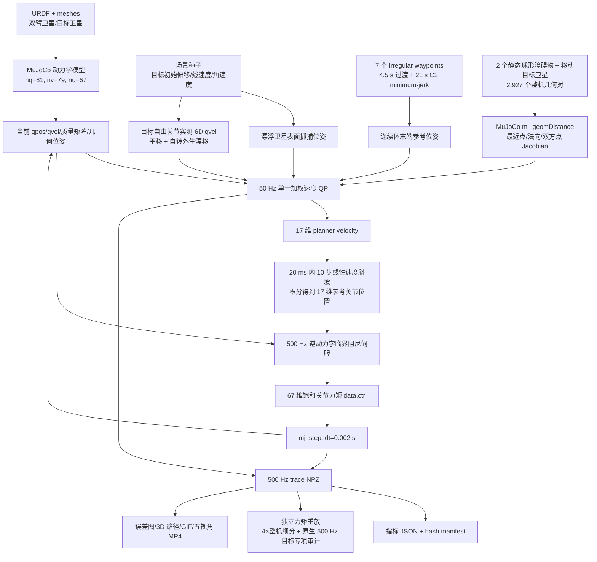

# V6-lite 全逻辑架构、建模、控制与输入输出说明

> 代码与静态合同审计日期：2026-09-24
> 当前运行合同：`v6_lite_6`  
> 本文只描述仓库中已经实现并有代码/产物支持的功能。

## 1. 一句话结论

V6-lite 是一个**完全确定性、无学习模块的自由漂浮双臂 MuJoCo 闭环控制基线**：刚性 7 自由度机械臂追踪漂浮目标卫星上的指定抓捕位姿，60 个底层关节离散表示的连续体机械臂追踪 7 个随机不规则航点；控制器每 20 ms 求解一次 17 维单一加权约束速度 QP，再由 500 Hz、67 路饱和逆动力学临界阻尼伺服输出关节力矩。

它虽然位于 Diffusion 项目仓库中，但 V6-lite 在线链路**没有**加载数据集、神经网络权重、归一化器或 Diffusion 模块，也没有候选采样、轨迹排序、轨迹投影、oracle 关节目标或第二个在线优化器。

## 2. 顶层逻辑架构



在线单步时序如下：

1. 每 10 个物理步，从 MuJoCo 当前状态计算目标卫星抓捕点位姿、连续体航点参考、整机有符号距离和反作用感知 Jacobian。
2. 求解一次 17 维加权约束速度 QP，得到新的 `planner_velocity`。
3. 在接下来的 10 个 2 ms 物理步内，把上一个和新速度指令线性插值。
4. 由 17 维参考位置/速度/加速度编码到 67 个底层关节，并计算饱和模型补偿力矩。
5. 写入 `data.ctrl` 后调用 `mujoco.mj_step`，记录状态、目标、误差、力矩和时延。
6. 场景结束后计算验收指标、保存 trace，并以相同力矩序列独立重放验证。

## 3. 文件与职责

| 文件 | 职责 |
| --- | --- |
| `v6_lite/run_v6_lite.py` | 顶层入口、运行配置、五场景生成、500/50 Hz 闭环、低层力矩伺服、指标与 trace 落盘 |
| `v6_lite/irregular_waypoints.py` | 原 V4/V5 irregular-waypoint 几何合同、随机化、分段时长和 minimum-jerk 参考采样 |
| `v6_lite/hierarchical_qp.py` | 自由基座反作用映射、任务 Jacobian、距离 barrier、关节/速度约束、17 维 ADMM QP |
| `model_test/robot_model_spec_v5.py` | 17↔67 坐标合同、URDF 编译、关节参数、直接力矩执行器、模型哈希 |
| `model_test/angle_convention.py` | 10 维连续体形状坐标、7 维刚性臂坐标及 60↔10 映射约定 |
| `model_test/whole_body_verifier_v5.py` | 碰撞几何对生成、V6 opt-in 目标 pair、`mj_geomDistance` 有符号距离、构型空间细分验证 |
| `v6_lite/validate_v6_lite.py` | 结果/策略 hash、指标复算、原生力矩重放、4×整机细分和原生 500 Hz 连续体—目标专项验证 |
| `v6_lite/test_v6_lite.py` | 控制频率、反作用映射、末端偏置、Jacobian/距离梯度与目标平移/旋转漂移有限差分、无学习依赖等回归测试 |
| `v6_lite/test_target_collision_policy.py` | 75 个目标 pair 的分类、精确终端白名单、穿透拒绝和 shared-V5 opt-in 隔离回归测试 |
| `v6_lite/visualization/generate_visualizations.py` | 误差总图、3D 路径、基座漂移 GIF、五视角 MuJoCo 力矩重放视频 |
| `v6_lite/visualization/validate_visualizations.py` | 图像解码、视频编码/运动性/视角差异、hash 和预览一致性审计 |

## 4. 当前已经实现的功能

### 4.1 双臂位姿跟踪

- 刚性臂同时跟踪目标卫星表面点的位置和姿态。
- 抓捕点固定在目标卫星本体坐标系 `[0, -0.205, 0] m`。
- 目标卫星拥有自由关节，每个场景具有不同初始位置偏移、线速度和角速度。
- 连续体臂同时跟踪不规则航点位置和固定世界姿态。
- 两臂的位置与姿态目标同时进入同一个 QP，刚性抓捕任务权重大于连续体任务。

### 4.2 不规则航点生成与平滑参考

- 基础几何为中心 `[1.800, 0.626, 0] m`、半径 `0.150 m`、360° 的闭合路径模板。
- 从模板弧线/折线按长度均匀重采样为 7 个航点 W1–W7。
- 每个航点使用固定种子随机化：径向比例 `[0.9, 1.4]`、前后比例 `[0.6, 2.0]`、前后抖动 `[-0.030, 0.020] m`。
- 整组航点沿世界 `-Y` 再平移未平移质心绝对 Y 值的 15%。
- 初始真实末端到 W1 使用 4.5 s minimum-jerk 过渡。
- W1→W7 的 6 段总时长为 21 s，各段时间与段长成比例；每段使用五次 minimum-jerk 标量进度，段端速度为零。
- 25.5 s 后保持 W7，到 27 s 结束。

### 4.3 自由漂浮基座耦合

- 基座不冻结，不在运行过程中直接覆写 `qpos` 或 `qvel`。
- 通过瞬时质量矩阵构造零基座动量反作用映射，把 17 维臂速度映射到全部 79 维广义速度。
- 任务 Jacobian 和距离梯度都乘以同一反作用映射，因此规划显式考虑机械臂运动引起的基座反作用。
- QP 目标中还有小权重的基座反作用速度惩罚。
- 基座漂移从初始化后的精确自由关节位姿计算：位置用欧氏距离，姿态用四元数符号不变的 SO(3) 测地角。

### 4.4 在线整机避障

- 使用 MuJoCo `mj_geomDistance`，不依赖接触列表 `data.ncon`。
- shared verifier 原有 6 类几何对为 `continuum_self`、`rigid_self`、`arm_arm`、`arm_base`、`arm_obstacle`、`base_obstacle`；`v6_lite_6` 通过 `include_target_satellite_pairs=True` opt-in 增加 `continuum_target`、`rigid_target`、`base_target`，不改变未 opt-in 的 V5 pair 集合。
- 含两个工作区障碍的 V6 场景共建立 2,927 个碰撞对：连续体自碰 1,711、刚性臂自碰 15、双臂互碰 558、臂-基座 414、臂-障碍 142、基座-障碍 12，以及目标相关 75 个（连续体-目标 62、刚性臂-目标 7、基座-目标 6）。
- 只有 `collision_0072`（附着 `end_link`）与 `collision_0073`（附着 `end_effector_r`）被精确列为终端预期接触豁免；`collision_0071/wrist` 仍属 `rigid_target`，连续体与基座没有目标接触豁免。
- 在线查询上限 90 mm，距离小于等于 80 mm 时激活线性距离 barrier。`continuum_target`、`base_target` 与其他普通 pair 的在线安全缓冲为 25 mm；`rigid_target` 为 5 mm。
- 正式验收门槛为最小 5 mm；整机在 50 Hz 构型间做 4 倍细分，连续体—目标另对全部原生 500 Hz 重放状态（含初始状态）逐状态检查。
- 接触响应被禁用，所以通过间隙门槛不能归因于接触冲量把机器人“顶开”。

### 4.5 动态执行与结果审计

- 运行期间只写 `data.ctrl` 并调用 `mj_step`。
- QP 失败分支只把 17 维速度设为零，不调用另一个优化器或 oracle；当前合同是否触发安全停止以重新生成并独立验证的正式产物为准。
- 每个场景输出完整 500 Hz 状态/力矩 trace 和 50 Hz QP 诊断。
- 指标文件与每个 trace 都有 SHA-256 清单。
- 独立验证脚本从初始 `qpos/qvel` 和保存的 67 维力矩逐步重放 MuJoCo，重新计算末端、姿态和基座漂移；同时重算 pair policy 的数量/hash、4×整机稠密离散间隙，以及 62 个 `continuum_target` pair 在全部原生 500 Hz 状态上的最小间隙、低于 5 mm 状态数和穿透状态数。

## 5. 建模方法

### 5.1 MuJoCo 多体动力学模型

- 模型来源：`dual_arm_space_robot_2026/urdf/dual_arm_space_robot_2026.urdf` 与对应 meshes。
- 仿真空间：`nq=81`、`nv=79`、`nu=67`、69 个关节、75 个 body；场景模型加入 2 个障碍后为 156 个 geom。
- `qpos=81` 可理解为：卫星基座自由关节 7 + 机械臂标量关节 67 + 目标卫星自由关节 7。
- `qvel=79` 可理解为：卫星基座自由关节速度 6 + 机械臂关节速度 67 + 目标卫星自由关节速度 6。
- 零重力，MuJoCo `implicitfast` 积分器，物理步长 0.002 s。
- 每个臂关节使用直接力矩电机，不使用 MuJoCo 内建位置执行器。

### 5.2 17 维规划坐标与 67 维底层坐标

规划变量为

```text
q_plan = [theta1 ... theta10, theta_R1 ... theta_R7] ∈ R^17
```

- 前 10 维：连续体臂的 5 个离散段、每段 2 个形状/弯曲坐标。
- 后 7 维：刚性机械臂 7 个关节。
- 连续体物理模型含 60 个标量关节，即每段 12 个底层关节；每段用固定 `12×2`、系数为 `1/6` 的重复映射从 2 个规划坐标展开。
- 刚性臂 7 维到 7 个底层关节为单位映射。
- 因而编码矩阵 `B = planner_to_low_level ∈ R^(67×17)`，解码矩阵为其伪逆 `B⁺ ∈ R^(17×67)`，并验证 `B⁺B=I_17`。
- 连续体 home 为 10 个零角；刚性臂 home 为 `[0,45,0,90,0,45,0]°`。
- 规划角度上下界均为 `[-π, π]`；速度上限为连续体 0.8 rad/s、刚性臂 1.2 rad/s，QP 实际使用其 70%；加速度上限为连续体 2.5 rad/s²、刚性臂 4.0 rad/s²。

### 5.3 末端运动学

- 刚性末端：body `end_effector_r` 的 body 原点。
- 连续体真实末端：

```text
p_ee = xpos(link_30) + R(link_30) · [0.0475, 0, 0] m
```

- 连续体零构型初始世界位置为 `[1.930, 0.626, 0] m`。
- 位置与旋转 Jacobian 由 MuJoCo `mj_jac` 在真实末端点求得。
- 姿态误差使用世界坐标表达的 SO(3) 对数映射；报告的基座姿态漂移使用四元数最短测地角 `2 acos(|q0ᵀq|)`。

### 5.4 自由基座反作用模型

令 `M_bb` 为 6×6 基座质量块，`M_ba` 为基座-67 臂自由度耦合块，`B` 为 67×17 映射，则零基座动量条件给出：

```text
v_base = - M_bb⁻¹ M_ba B qdot_plan
```

由此组装 `G ∈ R^(79×17)`：基座 6 行使用上述映射，67 个臂自由度行使用 `B`，目标卫星自由度行保持零。任务和由决策变量引起的距离 Jacobian 使用 `J_eff = J_mujoco G`。目标卫星的 6D 自由关节速度不是决策列；控制器另构造只在目标自由关节切片非零的 `qvel_T^exo`，作为时变距离的已知外生漂移，因此不会因 `G` 的目标行是零而丢失目标运动。

### 5.5 几何距离模型

- 每个候选几何对直接调用 `mj_geomDistance` 得到有符号距离、两侧最近点。
- 由最近点法向与两 body 的点 Jacobian 得到距离对 17 维规划速度的解析梯度；混合几何的 witness 顺序先按 geom 类型规范化，再映射回 pair 顺序。
- 对移动目标 pair，同时计算目标平移/自转引起的 witness-point 外生距离漂移；解析方向与外生漂移均由非零目标平移、旋转的中心有限差分回归测试锁定。
- 后处理整机验证在相邻 50 Hz `qpos` 之间使用 `mj_differentiatePos` 与 `mj_integratePos` 插入 3 个中间构型，因此每个 27 s 场景由 1,351 个原始构型扩展为 5,401 个检查构型。
- 独立于上述细分，力矩重放还对初始状态和 13,500 个积分后状态逐一查询全部 62 个 `continuum_target` pair，即 13,501 个原生 500 Hz 离散状态。

## 6. 控制方法

### 6.1 50 Hz 任务层：单一加权约束速度 QP

文件名使用 `HierarchicalVelocityQP`，但实际实现是**单一加权优先级 QP**，不是逐级求解的严格 lexicographic QP。

两臂的期望笛卡尔速度为：

```text
v_r* = clip(v_target,r + Kp,r (p_target,r - p_r), 0.24 m/s)
v_c* = clip(v_target,c + Kp,c (p_target,c - p_c), 0.24 m/s)
ω_r* = clip(ω_target,r + Ko,r log(R_target,r R_rᵀ), 0.45 rad/s)
ω_c* = clip(ω_target,c + Ko,c log(R_target,c R_cᵀ), 0.45 rad/s)
```

位置增益为刚性臂 5、连续体 12；姿态增益为刚性臂 8、连续体 10。

忽略与决策变量无关的常数，QP 目标等价于：

```text
min_qdot  1/2 · 500  ||Jp,r qdot - v_r*||²
         +1/2 · 260  ||Jp,c qdot - v_c*||²
         +1/2 · 4000 ||JR,r qdot - ω_r*||²
         +1/2 · 2500 ||JR,c qdot - ω_c*||²
         +1/2 · 0.02 ||qdot - qdot_posture||²
         +1/2 · 0.05 ||G_base qdot||²
```

其中 `qdot_posture = -0.08(q_plan-q_home)`。刚性位置权重高于连续体位置权重；姿态项整体权重更高。

硬约束包括：

1. 速度盒约束：不超过规划速度上限的 70%。
2. 相邻指令加速度约束：`qdot_prev ± qddot_limit·0.02`。
3. 关节位置 barrier：在 `[-π,π]` 边界内保留 0.04 rad margin，增益 4。
4. 距离 barrier：对每个激活碰撞对定义

```text
A = nᵀ (J_a - J_b) G
d_dot_T = nᵀ (J_a - J_b) qvel_T^exo
A qdot_plan ≥ -8 · (d - d_safe(pair)) - d_dot_T
```

其中 `d_safe(pair)=0.005 m` 仅用于 `rigid_target`；`continuum_target`、`base_target` 和其他 pair 使用 `0.025 m`。`d_dot_T` 是目标自由体实测 6D `qvel` 在双方 witness-point Jacobian 上的外生漂移，包含目标平移和旋转。该行等价于 `d_dot + 8(d-d_safe) >= 0`，其中 `d_dot=A qdot_plan+d_dot_T`。

QP 用自实现的 OSQP 风格 ADMM 求解，17×17 Cholesky 分解，`rho=50`、`sigma=1e-6`、松弛系数 1.6、最多 1,200 次迭代。

输出是 17 维 `planner_velocity` 与成功状态、迭代数、时延、任务残差、在线最小间隙、激活/绑定约束数、约束 slack、避障干预量和反作用映射残差。

### 6.2 500 Hz 执行层：模型补偿临界阻尼力矩伺服

1. 在 10 个物理步内将上一个 QP 速度线性斜坡到当前 QP 速度。
2. 以 2 ms 步长积分得到 17 维参考位置，并同时限制在规划上下界和实测规划位置 `±0.012 rad` 范围内。
3. 将 17 维位置/速度/前馈加速度编码到 67 维。
4. 形成临界阻尼期望臂加速度：

```text
qddot_a* = qddot_ff + ωn²(q_ref-q) + 2ωn(qdot_ref-qdot)
```

- 连续体 60 路 `ωn=42 rad/s`，加速度限幅 `±45 rad/s²`。
- 刚性臂 7 路 `ωn=34 rad/s`，加速度限幅 `±70 rad/s²`。

5. 从完整质量矩阵中消去 6 个未驱动基座加速度：

```text
qddot_b = -M_bb⁻¹(M_ba qddot_a* + bias_b - passive_b)
tau_a = M_ab qddot_b + M_aa qddot_a* + bias_a - passive_a
```

6. 力矩限幅后写入 `data.ctrl`：连续体每关节 `±4 N·m`，刚性臂每关节 `±80 N·m`。

该执行层是直接确定性控制律，不是第二个 QP。

## 7. 输入合同

### 7.1 离线/启动输入

| 输入 | 形状/类型 | 含义 |
| --- | --- | --- |
| URDF + meshes | 文件集合 | 双臂自由漂浮卫星与目标卫星几何/惯性模型 |
| `--scenario-count` | int，默认 5 | 场景数，代码要求至少 3；固定交付为 5 |
| `--seed` | int，默认 20260801 | 首场景随机种子，后续每场景增加 104729 |
| `--duration` | float，默认 27.0 s | 单场景时长 |
| `--verification-subdivisions` | int，默认 4 | 碰撞验证构型空间细分数 |
| 控制/验收配置 | dataclass | 50/500 Hz、任务增益、权重、限幅、间隙与精度门槛 |

### 7.2 场景输入

| 输入 | 形状 | 含义 |
| --- | ---: | --- |
| `target_satellite_position_shift_m` | `(3,)` | 目标卫星初始位置偏移；各轴随机范围分别为 ±12、±8、±10 mm |
| `target_satellite_linear_velocity_m_s` | `(3,)` | 目标卫星初始世界线速度 |
| `target_satellite_angular_velocity_rad_s` | `(3,)` | 目标卫星初始角速度，各轴 ±0.0015 rad/s |
| `grasp_point_target_frame_m` | `(3,)` | 目标本体坐标系抓捕点 `[0,-0.205,0] m` |
| `grasp_rotation_target_frame` | `(3,3)` | 抓捕末端相对目标卫星的指定姿态 |
| `continuum_target_rotation_world` | `(3,3)` | 连续体末端固定世界目标姿态 |
| `waypoint_points_m` | `(7,3)` | 随机化后的 W1–W7 世界坐标 |
| `segment_durations_s` | `(6,)` | 6 个 minimum-jerk 航段时长，总和 21 s |
| `workspace_obstacles` | 2 个球体 | 刚性臂路径附近半径 35 mm；连续体侧方半径 25 mm |

### 7.3 QP 在线输入

| 输入 | 形状 | 来源 |
| --- | ---: | --- |
| MuJoCo `qpos/qvel/qM/xpos/xmat` | `(81,)`、`(79,)` 等 | 当前动力学状态、质量矩阵和 body 位姿 |
| 刚性目标位置/速度 | `(3,)` / `(3,)` | 漂浮目标卫星上的抓捕点与点速度 |
| 刚性目标姿态/角速度 | `(3,3)` / `(3,)` | 目标卫星姿态组合与卫星角速度 |
| 连续体目标位置/速度 | `(3,)` / `(3,)` | irregular-waypoint minimum-jerk 采样器 |
| 连续体目标姿态/角速度 | `(3,3)` / `(3,)` | 固定姿态与零目标角速度 |
| 最近几何距离/点 | 标量 / `(6,)` | `mj_geomDistance` |
| 目标自由关节实测速度 | `(6,)`（嵌入 `(79,)` 外生向量） | 移动目标 witness-point 平移/旋转距离漂移 |
| 上一次 QP 速度 | `(17,)` | 加速度边界和 warm start |

## 8. 输出合同

### 8.1 在线控制输出

| 层级 | 主要输出 | 形状/频率 |
| --- | --- | --- |
| QP | `planner_velocity` | `(17,)`，50 Hz |
| QP 诊断 | success/status/iterations/latency、任务残差、距离约束等 | 标量，50 Hz |
| 参考生成 | `reference_q/reference_velocity/feedforward_acceleration` | 各 `(17,)`，500 Hz |
| 逆动力学伺服 | `desired_arm_acceleration` | `(67,)`，500 Hz |
| 执行器 | `torque = data.ctrl` | `(67,)`，500 Hz |
| MuJoCo | 新 `qpos/qvel` 与 body/geom 派生量 | `(81,)` / `(79,)`，500 Hz |

### 8.2 每个 NPZ trace 的完整字段

固定 27 s 场景中，500 Hz 数组长度为 13,500，50 Hz 数组长度为 1,350。

| 分组 | 字段与形状 |
| --- | --- |
| 时间与标量误差 | `time (13500,)`；`rigid_error`、`continuum_error`、`rigid_orientation_error_deg`、`continuum_orientation_error_deg` 各 `(13500,)` |
| 刚性臂目标/实测 | `rigid_tip`、`rigid_target` 各 `(13500,3)`；`rigid_rotation`、`rigid_target_rotation` 各 `(13500,3,3)` |
| 连续体目标/实测 | `continuum_tip`、`continuum_tip_body_origin`、`continuum_target`、`continuum_target_velocity` 各 `(13500,3)`；`continuum_rotation`、`continuum_target_rotation` 各 `(13500,3,3)` |
| 17 维规划/参考 | `planner_q`、`planner_dq`、`command_velocity`、`reference_q`、`reference_velocity`、`feedforward_acceleration` 各 `(13500,17)` |
| 67 维执行层 | `desired_arm_acceleration`、`torque` 各 `(13500,67)` |
| 基座与动量 | `base_qpos (13500,7)`、`base_twist (13500,6)`、`robot_momentum (13500,6)`、`base_translation_drift_m (13500,)`、`base_orientation_drift_deg (13500,)` |
| 500 Hz 时延 | `torque_latency (13500,)` |
| 50 Hz 基本诊断 | `task_time`、`task_full_latency`、`task_solver_latency`、`task_success`、`task_iterations`、`task_solver_status` 各 `(1350,)` |
| 50 Hz 避障诊断 | `task_active_clearance`、`task_binding_clearance`、`task_minimum_queried_clearance`、`task_minimum_constraint_slack`、`task_avoidance_intervention`、`task_degenerate_clearance_gradients` 各 `(1350,)` |
| 50 Hz 残差 | `task_momentum_map_residual`、`task_rigid_velocity_residual`、`task_continuum_velocity_residual`、`task_rigid_angular_velocity_residual`、`task_continuum_angular_velocity_residual` 各 `(1350,)` |
| 重放初值/关键帧 | `task_qpos (1351,81)`、`initial_qpos (81,)`、`initial_qvel (79,)` |

### 8.3 结构化结果文件

| 产物 | 作用 |
| --- | --- |
| `v6_lite/output/v6_lite_metrics.json` | 权威配置、模型身份、五场景指标、聚合指标、验收结论和证据边界 |
| `v6_lite/output/traces/*.npz` | 五个完整状态/目标/QP/力矩 trace，每个约 27.7 MB |
| `v6_lite/output/artifact_manifest.json` | 指标和五个 trace 的 SHA-256 |
| `v6_lite/output/validation.json` | 独立合同/hash/指标审计、五场景原生力矩重放、4×整机细分和原生 500 Hz 连续体—目标验证 |

## 9. `v6_lite_6` 正式结果

`v6_lite_6` 已按固定种子完成五个 27 s 场景并由 `validate_v6_lite.py` 从保存的 67 维力矩序列独立重放。验证门禁为 26/26 通过；以下均为五场景最差值，不沿用 `v6_lite_5` 数字。

| 指标 | 验收门槛 | `v6_lite_6` 五场景最差值 | 结论 |
| --- | ---: | ---: | --- |
| 刚性抓捕点终误差 | ≤ 0.10 mm | 0.009011 mm | 通过 |
| 刚性抓捕点稳态 RMSE | ≤ 0.15 mm | 0.009617 mm | 通过 |
| 连续体活动航点路径 RMSE | ≤ 0.18 mm | 0.159450 mm | 通过 |
| 刚性臂全程最大姿态误差 | < 0.25° | 0.041769° | 通过 |
| 连续体全程最大姿态误差 | < 0.25° | 0.019170° | 通过 |
| 整机 4×细分最小离散间隙 | ≥ 5 mm | 14.995557 mm | 通过 |
| 连续体—目标 4×细分最小离散间隙 | ≥ 5 mm | 24.995132 mm | 通过 |
| 连续体—目标原生 500 Hz 最小离散间隙 | ≥ 5 mm | 24.994694 mm | 通过 |
| 连续体—目标低于 5 mm/穿透状态数 | 0 / 0 | 0 / 0 | 通过 |
| QP 失败/安全停止次数 | 0 / 0 | 0 / 0 | 通过 |
| 50 Hz 任务全链路 p95 | ≤ 20 ms | 7.809830 ms | 通过 |
| 500 Hz 力矩计算 p95 | ≤ 2 ms | 0.339205 ms | 通过 |
| 基座最大平移/姿态漂移 | 仅报告，无门槛 | 8.633348 mm / 3.773870° | 已复算 |

固定运行结构为每个 27 s 场景 13,500 个物理步和 1,350 次 QP，五场景实际完成 67,500/6,750，QP 失败为 0，clearance 约束绑定 1,031 次。每场景整机离散审计执行 5,401×2,927 次距离查询；连续体—目标专项审计执行 13,501×62 次查询，五场景合计 4,185,310 次目标专项查询。

## 10. 结果呈现与可视化输出产物

下列规格描述生成器的输出合同。`v6_lite_6` 的正式图、GIF、视频和可视化 manifest 必须以通过当前验证的五场景 trace 重新生成；旧合同产物不构成当前结果证据。

### 10.1 静态图与 GIF

| 文件 | 规格 | 内容 |
| --- | --- | --- |
| `visualization/output/error_curves.png` | 2409×3319 | 六面板、五场景：刚性位置误差、连续体位置误差、两臂姿态误差、基座平移漂移、基座姿态漂移、整机在线最小间隙；叠加验收线、稳态区间、活动路径和 W1–W7 时刻 |
| `visualization/output/safety_clearance_summary.png` | 2140×1469 | 双面板、五场景：整机全局最小 signed clearance 与连续体—移动目标最小 signed clearance；分别标出 5 mm 验收门槛和 25 mm 名义连续体裕度 |
| `visualization/output/tracking_paths_3d.png` | 2331×1195 | 场景 00 的双 3D 图：刚性抓捕点目标/实际路径，连续体 irregular-waypoint 目标/实际路径，W1–W7 坐标系和两个球形障碍物 |
| `visualization/output/base_pose_drift.gif` | 960×640，5 FPS，136 帧，约 27.2 s | 五场景基座平移漂移与 SO(3) 姿态漂移的动态展开 |

### 10.2 视频

视频只针对代表场景 `v6_lite_scenario_00`，不是五个场景各一套。它们不是直接播放保存的 `qpos`，而是从 `initial_qpos/initial_qvel` 开始逐步施加保存的 67 维力矩并重新执行 MuJoCo。

| 文件 | 规格 | 视角/内容 |
| --- | --- | --- |
| `videos/v6_lite_scenario_00_overview.mp4` | H.264，640×480，30 FPS，811 帧，约 27.03 s | 总览视角 |
| `videos/v6_lite_scenario_00_front.mp4` | 同上 | 前视角；直接标注 W1–W7 |
| `videos/v6_lite_scenario_00_side.mp4` | 同上 | 侧视角 |
| `videos/v6_lite_scenario_00_top.mp4` | 同上 | 顶视角 |
| `videos/v6_lite_scenario_00_iso.mp4` | 同上 | 等轴测视角 |
| `videos/v6_lite_scenario_00_five_view_grid.mp4` | H.264，1920×960，30 FPS，811 帧 | 五视角 3×2 拼接，第六格为空白 |
| `videos/v6_lite_scenario_00_five_view_preview.png` | 1920×960 | 五视角组合视频中点预览帧 |
| `visualization/continuum_focus_output/videos/v6_lite_scenario_00_continuum_focus.mp4` | H.264，960×720，30 FPS，811 帧 | 连续体一侧专用视角；刚性臂以 0.10 透明度保留为背景语境 |
| `visualization/continuum_focus_output/videos/v6_lite_scenario_00_continuum_focus_preview.png` | 960×720 | 连续体一侧专用视频预览帧 |

视频每帧显示：

- 刚性目标黄球、刚性末端蓝球、两者连线和目标/实际坐标系。
- 连续体目标绿球、真实末端青球、两者连线和目标/实际坐标系。
- W1–W7 红色航点、连接路径和固定 RGB=XYZ 坐标系。
- 初始/当前自由基座坐标系。
- 两个橙色半透明球形障碍物。
- 逐帧数值叠加：两臂位置误差、两臂姿态误差、基座平移/姿态漂移、整机间隙、当前航段。

### 10.3 可视化元数据与审计

| 文件 | 作用 |
| --- | --- |
| `visualization/output/visualization_manifest.json` | 声明 11 个标准可视化实体产物、源 metrics/trace、分辨率、FPS、视角、坐标系、叠加指标与 SHA-256 |
| `visualization/output/visualization_validation.json` | 22 项零信任式可视化检查：hash、解码、GIF 动画、五视角差异、H.264 编码、运动性、组合预览一致性等 |
| `visualization/continuum_focus_output/continuum_focus_manifest.json` | 单独声明连续体一侧视频的源 metrics/trace、相机、分辨率、帧率、时长与 SHA-256；同目录预览图为便捷浏览快照 |

## 11. 验收与复现入口

从仓库根目录运行：

```powershell
python -m v6_lite.run_v6_lite
python -m v6_lite.validate_v6_lite
python -m unittest v6_lite.test_v6_lite v6_lite.test_target_collision_policy -v

python -m v6_lite.visualization.generate_visualizations
python -m v6_lite.visualization.validate_visualizations
python -m unittest v6_lite.visualization.test_visualizations -v
```

其中完整五场景运行和全距离重放开销明显高于只运行单元测试；视频生成还要求系统可用 `ffmpeg`/`ffprobe`。

## 12. 证据边界与当前没有实现的内容

`v6_lite_6` 的静态合同已经覆盖移动目标卫星，但五场景数值证据必须以该合同重新生成并独立验收后才成立。验收范围限定在已哈希的 MuJoCo 模型、固定随机场景和 27 s 时域中的两臂位姿跟踪、自由基座漂移测量、避障约束介入以及离散整机/目标间隙。

当前明确没有实现或没有证明：

- 任何 Diffusion、Transformer、MLP 或其他学习模型在线推理。
- 数据集训练、权重加载、归一化器、候选轨迹采样/排序/筛选。
- 预测时域轨迹优化、MPC 或严格逐级 lexicographic HQP。
- 夹爪闭合、抓捕接触、碰撞后目标与机器人组合体动力学。
- 除 `collision_0072/end_link` 与 `collision_0073/end_effector_r` 以外的目标表面整体接触许可；这两个精确终端 pair 的豁免也不证明夹爪闭合或抓取成功。
- 连续时间碰撞证书或 Native CCD 证书；整机审计是 50 Hz 构型之间 4 倍细分，连续体—目标专项审计是原生 500 Hz（2 ms）状态扫描，均不能排除两个离散时刻之间的瞬时穿透。
- 硬件迁移、传感器噪声/延迟、执行器电气模型、外部扰动鲁棒性。
- 相对学习规划器、Diffusion 方法或其他控制器的性能优越性。

因此，最准确的定位是：**V6-lite 是一个可审计、学习无关、反作用感知、带整机距离 barrier 的确定性双臂速度-QP/力矩闭环基线，而不是 Diffusion 轨迹规划器。**

## 13. V6.1-A 影子臂形与几何链

V6.1-A 在上述在线架构旁增加只读影子链，不修改第 4–7 节的 QP、反作用映射、速度斜坡或力矩计算：

```text
(q_c, T_b, s) ──→ 5 段 PCC p,R,Jp,JR ──→ PCC 管体—卫星 OBB 净空
      │
      └────────→ 60 关节 URDF 离散 FK ──→ 61 胶囊 + 安装座原几何
                                                │
MuJoCo 62 个 continuum_target collision geoms ─┴→ 三方距离/梯度/漏报对照
```

正式 V6.1-A 报告覆盖 10,000 个臂形构型和 10,000 个目标相对位姿。离散 FK 对 MuJoCo 最大位置/姿态误差为 `4.920180e-15 m` / `1.154239e-7 rad`；胶囊和 PCC 管体的有限测试假安全计数均为 0。PCC 对离散链的全臂位置差 p95/最大值为 `43.040812/55.390652 mm`，该模型差异已计入标定包络并独立报告，不能与 PCC 导数误差混为一谈。

实现与结果入口为 `continuum_model_spec.py`、`continuum_shape_model.py`、`shape_clearance.py`、`audit_v6_1a.py` 及 `output/v6_1a/`。更完整的责任归属、半径和证据边界见 `docs/V6_1A_SHAPE_GEOMETRY_AUDIT.md`。

## 14. V6.1-B 可选 PCC/胶囊 CBF 控制扩展

V6.1-B 保持本文件第 1–12 节的 V6-lite 基线结构，并在同一个 50 Hz QP 中追加两类默认关闭的臂形安全行：

1. `PCCClearanceEvaluator` 对 5 段 PCC 管体和移动卫星 OBB 做粗搜索与候选段局部细化，返回最近段、弧长、点、法向、半径、净空及 10 维内部形变梯度。
2. `minimum_capsule_clearance` 对实际 60 关节离散链的 61 个有限半径胶囊求精确最近距离；1-Lipschitz 宽相位只剔除不可能成为最小值的候选，不改变精确结果。
3. PCC 受控梯度为 `nᵀJ_base-point G + [nᵀJp(s*),0_1×7]`；胶囊梯度为 `nᵀJ_arm-point G`。
4. 移动卫星平移和旋转形成 `d_dot_T=-nᵀJ_target-point qvel_T^exo`，并进入 `A qdot >= -γ(d-d_safe)-d_dot_T`。
5. `_build_all_clearance_constraints()` 合并原 MuJoCo、PCC 和胶囊行；原 MuJoCo CBF 从未删除。
6. `PCCMonitor` 每个任务 tick 记录 `d_pcc/d_capsule/d_mujoco`、距离/梯度误差、激活/绑定计数、干预量、最近段/弧长和几何时延。

启用开关为：

```powershell
python -m v6_lite.run_v6_lite --enable-pcc-cbf --enable-capsule-cbf
```

默认关闭与双约束启用的五场景都通过独立 `26/26` 验证，QP 失败均为 0；启用版 50 Hz 全链 p95 最差值为 `18.089305 ms`，PCC 激活/绑定为 `3718/202`，原生 500 Hz 连续体—目标卫星最小 MuJoCo 间隙为 `78.529716 mm`。完整公式、A/B 数值和证据边界见 `docs/V6_1B_PCC_CBF_INTEGRATION.md`。
