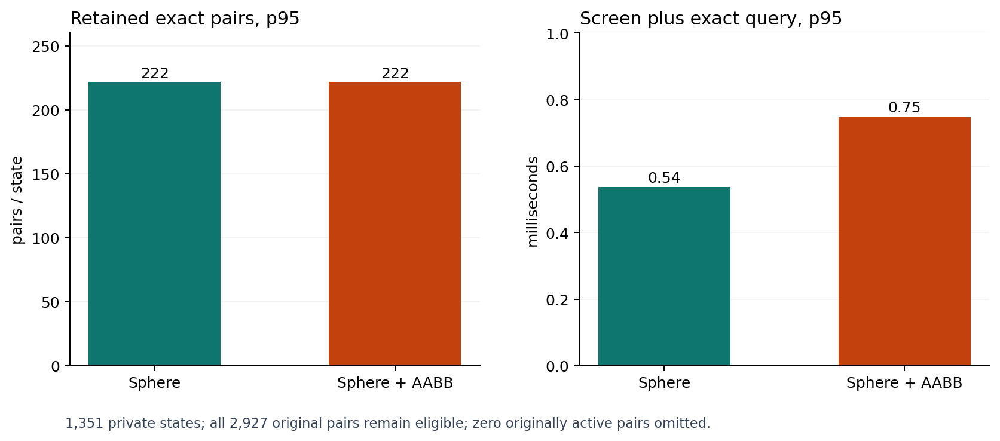

# B.2 MuJoCo 碰撞对 AABB 筛选试验

在场景 01 的 1351 个保存状态逐一重算原 2927 对精确距离，检查包围球筛选与包围球＋AABB 筛选是否漏掉原激活对。AABB 对 MuJoCo 原始几何只作额外保守下界；所有保留对继续使用原 `mj_geomDistance`。

| 方案 | 精确调用对数 p95 | 筛选＋精确查询 p95 | 漏掉原激活对 |
| --- | ---: | ---: | ---: |
| 包围球 | 222 | 0.537 ms | 0 |
| 包围球＋AABB | 222 | 0.747 ms | 0 |

AABB 只略微减少保留对数，但增加计算时间；当前私有控制路径不采用该变体。此处只测筛选与 MuJoCo 精确对查询，不是完整周期或连续时间安全证明。

- `audit summary SHA-256`: `2fb31ad4d273651f4d47e5ef208cbb8c067dc2aa938f3ea84ecd544e4bcb3410`
- `audit rows SHA-256`: `e1f013adb0ff164bf2390c79648612822a4e60b1a2737a7325b7e84ea390f8db`
