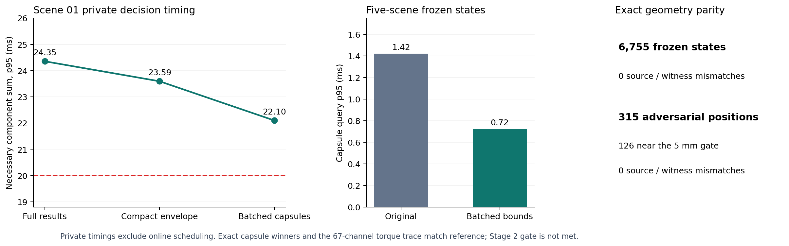

# B.2 胶囊筛选与周期性能进展

该私有试验沿用 A.1 的 50 Hz 任务周期，即每个周期 20 ms；这来自 `task_period_s=0.02` 的执行配置，不是 CBF 定理给出的时间。现有指标是必要计算项的计时合计，不包含完整生产在线调度。

| 检查 | 结果 |
| --- | ---: |
| 五场景冻结状态 | 6755 |
| 冻结状态来源不一致 | 0 |
| 胶囊查询原实现 p95 | 1.420 ms |
| 胶囊查询批量筛选 p95 | 0.725 ms |
| 对抗目标位置 | 315 |
| 5 mm 附近位置 | 126 |
| 对抗位置来源不一致 | 0 |
| 场景 01 私有周期 | 1350 |
| 参考必要计算和 p95 | 23.592 ms |
| 试验必要计算和 p95 / p99 / 最大 | 22.097 / 23.931 / 78.339 ms |
| 超 20 ms 的试验周期 | 683 |

原 61 条胶囊、精确线段—OBB 胜出查询、安全半径与 67 路力矩保持一致。当前必要计算和 p95 仍超过 20 ms，B.2 第二阶段总门禁为 `GATE_NOT_MET`；不能据此切换生产在线 PCC 模式，也不构成连续时间安全或硬实时证明。

## 输入 SHA-256

- `frozen`: `dc84b870d7f8f0baf50c3b724c2bf0ebf0bf181890ba54f387d79ed35a31c03b`
- `adversarial`: `f6a76aa4c4a60d36abcc10187c3ab398fccc07c901e2ba300d64381db00bf7ee`
- `private`: `f41e22d22b6592dad62f26c8d106ff5df4526a824d4b6848f20b8db9026b7b69`
- `visual`: `0c99fc6c538b9c4bf8f709e51fe03c771ac26a9101ad1c7ac026a5deacbd5929`
- `image`: `9e7c379594c2bbf72a740aed4f9c39eb5b9be531373af4579c546b4c9fb38c4b`
