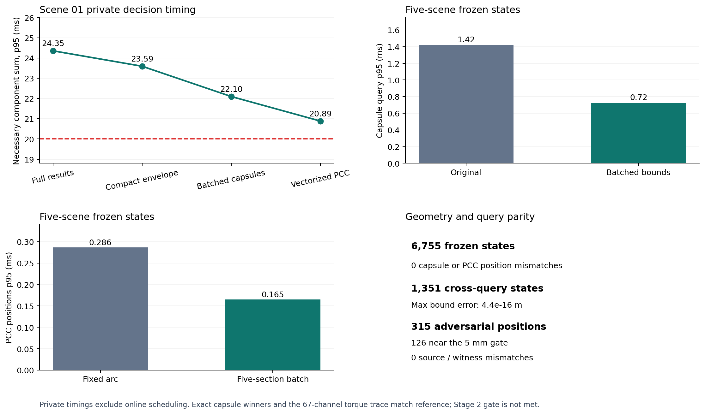

# B.2 几何批量计算与周期性能进展

该私有试验沿用 A.1 的 50 Hz 任务周期，即每个周期 20 ms；这来自 `task_period_s=0.02` 的执行配置，不是 CBF 定理给出的时间。现有指标是必要计算项的计时合计，不包含完整生产在线调度。

| 检查 | 结果 |
| --- | ---: |
| 五场景冻结状态 | 6755 |
| 冻结状态来源不一致 | 0 |
| 胶囊查询原实现 p95 | 1.420 ms |
| 胶囊查询批量筛选 p95 | 0.725 ms |
| PCC 位置原实现 p95 | 0.286 ms |
| PCC 位置批量计算 p95 | 0.165 ms |
| 对抗目标位置 | 315 |
| 5 mm 附近位置 | 126 |
| 对抗位置来源不一致 | 0 |
| 场景 01 私有周期 | 1350 |
| 参考必要计算和 p95 | 23.592 ms |
| 试验必要计算和 p95 / p99 / 最大 | 22.097 / 23.931 / 78.339 ms |
| 超 20 ms 的试验周期 | 683 |
| 叠加五段批量计算后的必要计算和 p95 / p99 / 最大 | 20.886 / 24.506 / 75.665 ms |
| 叠加后超 20 ms 周期 | 165 |

两种私有区间查询实现于 1351 个场景 01 状态上得到相同决策分区和状态；距离界最大差为 4.441e-16 m。这仅是两种实现的有限状态对照，不能视为生产缓存认证。

原 61 条胶囊、精确线段—OBB 胜出查询、安全半径与 67 路力矩保持一致。当前必要计算和 p95 仍超过 20 ms，B.2 第二阶段总门禁为 `GATE_NOT_MET`；不能据此切换生产在线 PCC 模式，也不构成连续时间安全或硬实时证明。

## 未采用的性能试验

| 试验 | 观察 | 决定 |
| --- | --- | --- |
| 同状态区间决策缓存 | 0 次命中 / 1350 次查询 | 当前实现跨两种查询类，单类缓存无效；不计入提速 |
| 胶囊包络先规约平方距离 | p95 0.347 → 0.346 ms | 提速不足；不接入 |

## 输入 SHA-256

- `frozen`: `dc84b870d7f8f0baf50c3b724c2bf0ebf0bf181890ba54f387d79ed35a31c03b`
- `adversarial`: `f6a76aa4c4a60d36abcc10187c3ab398fccc07c901e2ba300d64381db00bf7ee`
- `private`: `f41e22d22b6592dad62f26c8d106ff5df4526a824d4b6848f20b8db9026b7b69`
- `vectorized`: `140b589a7d086aecd728222502ad937dd45741f52a86c28751e3b3321be4070a`
- `positions`: `704e721ea87f338963e01ab95cc0d81bc4d09274582b9f2598f8e5d61f09c416`
- `cache_failed`: `ceb5abb276f95ca9e57798b796a9b106c4f6a47cde7192119a8556341fe9ec83`
- `squared`: `9b374bce19e7aff72a90072d0fddab5598133c92379e5b0ffbe1200d7eca905d`
- `cross_impl`: `d355d2b824350dd578fa92858795acfd7c5b06ad9474a8ab9c01e7151f24e0e1`
- `visual`: `f5bf920915ed57b1b63f06fd8822ec53f16916bb37f4b56370ba569358adf714`
- `image`: `49b3d687744a3e36989a61ba4ec70da1646fb707831ff37055a135b4008ab886`
