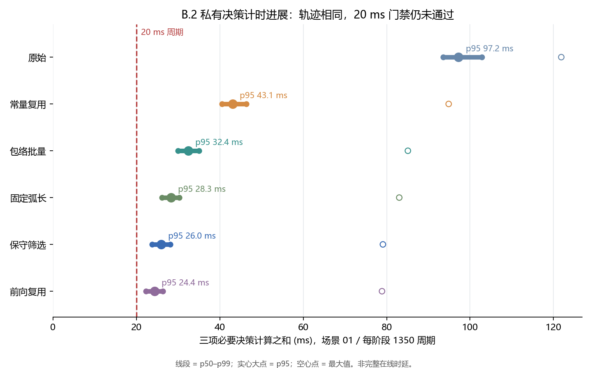

# B.2 六阶段私有决策计时进展

六阶段在场景 01 各运行 1350 个周期，原生力矩 trace SHA-256 相同。计时只包括预检＋QP、十步候选分支和下一起点重算；它们的逐周期和仍不是完整在线全链时延。

| 私有变体 | p50 ms | p95 ms | p99 ms | 最大 ms | 超 20 ms | 最长连续超期 |
| --- | ---: | ---: | ---: | ---: | ---: | ---: |
| 原始 | 93.557 | 97.223 | 102.809 | 121.849 | 1350 | 1350 |
| 常量复用 | 40.564 | 43.093 | 46.396 | 94.864 | 1350 | 1350 |
| 包络批量 | 30.036 | 32.418 | 34.993 | 85.089 | 1350 | 1350 |
| 固定弧长 | 26.176 | 28.310 | 30.250 | 83.020 | 1350 | 1350 |
| 保守筛选 | 23.767 | 25.973 | 28.162 | 79.102 | 1350 | 1350 |
| 前向复用 | 22.333 | 24.354 | 26.333 | 78.885 | 1349 | 1114 |

固定弧长变体在 13,501 个保存的 2 ms 状态上逐个核对了每状态 61 个实际链胶囊的完整结果，零不一致。保守筛选变体的全部下一起点记录也与全对重算逐值相同。

五场景私有闭环诊断通过，但阶段二在线门禁仍为 `GATE_NOT_MET`。没有执行正式性能重复协议、完整在线全链时延或新区间模式的原 26/11 验收；生产在线控制器未切换。

本报告由保存的逐周期行自动生成，摘要绑定源码、输入和图像 SHA-256。
