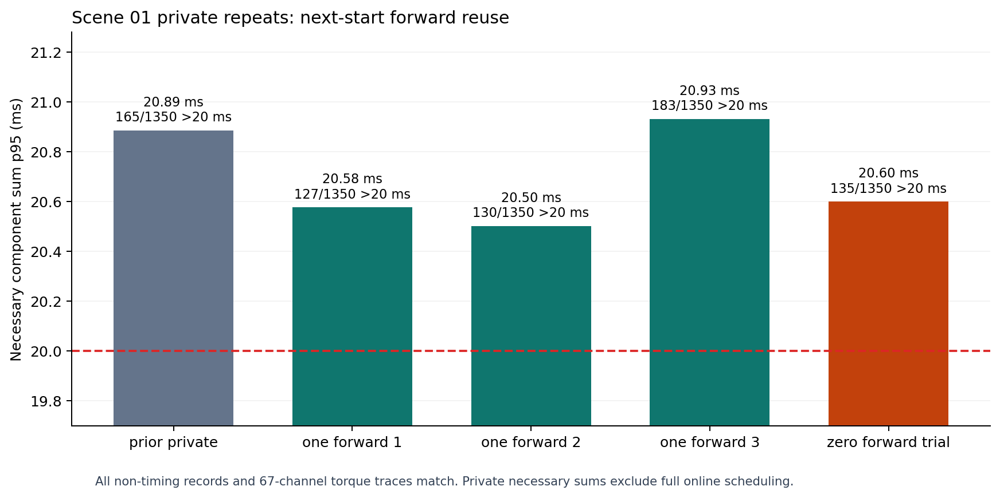

# B.2 下一起点状态更新复用的重复计时

私有场景 01；各轮均为完整 1350 个 50 Hz 任务周期。去掉下一起点构造器内部第二次 `mj_forward`，独立重放构造器对任意输入状态仍自行调用一次。

| 试验 | 必要计算和 p50 / p95 / p99 / 最大 ms | 超 20 ms 周期 |
| --- | ---: | ---: |
| prior private | 18.740 / 20.886 / 24.506 / 75.665 | 165 / 1350 |
| one forward 1 | 18.582 / 20.577 / 22.701 / 75.258 | 127 / 1350 |
| one forward 2 | 18.529 / 20.502 / 22.582 / 73.815 | 130 / 1350 |
| one forward 3 | 18.788 / 20.932 / 23.805 / 75.478 | 183 / 1350 |
| zero forward trial | 18.518 / 20.601 / 22.692 / 75.255 | 135 / 1350 |

三轮保留变体的 p95 范围为 20.502～20.932 ms。零次状态更新变体依赖候选分支已更新 MuJoCo 状态，本轮计时没有显示稳定额外收益，故未采用。

全部非计时记录与原生 67 路力矩轨迹逐值一致。这只是必要计算项合计，不包含完整在线调度；所有轮次 p95 仍超过 20 ms；B.2 第二阶段完整在线性能门禁仍未通过。

## SHA-256

- `prior private summary`: `140b589a7d086aecd728222502ad937dd45741f52a86c28751e3b3321be4070a`
- `prior private records`: `f8c2c81ef31939497743f9568cee688489c0b6fa936ebd7953dd5998759c395a`
- `prior private trace`: `46382a0e3421ee2b1a5b6149d73dc69c0e67de52c9dc58cd448821e309657f90`
- `one forward 1 summary`: `10aabd162b9260b63a91579605e805c6f71f6c1f7538db2c80a70f32f8aea236`
- `one forward 1 records`: `1b1f5c37d3b170e8c43e751b123bc3f651fbf20b8b0fe47c189f72874e3db771`
- `one forward 1 trace`: `46382a0e3421ee2b1a5b6149d73dc69c0e67de52c9dc58cd448821e309657f90`
- `one forward 2 summary`: `3fa4d47f86e34c12eb76322fba749fefdf91b7733190a4f6c8176dbcf222f69e`
- `one forward 2 records`: `7d3cbaa08f2e4009f030491d89c3fa0e4c7e81dc6a116f812811b3f8fa1f995d`
- `one forward 2 trace`: `46382a0e3421ee2b1a5b6149d73dc69c0e67de52c9dc58cd448821e309657f90`
- `one forward 3 summary`: `29c4bac1e64cc531b1651978d9867dca7ff00e448e71d0321967469211e3a2d2`
- `one forward 3 records`: `4cd6ec09b3ced96d48c4dda4a5f8671d07888415b1fbfa815c02188885394c57`
- `one forward 3 trace`: `46382a0e3421ee2b1a5b6149d73dc69c0e67de52c9dc58cd448821e309657f90`
- `zero forward trial summary`: `63cb9cb1c5ab6e250f164fe32c89104199d6e5ed9b0c58d2f60b4a476506e2f8`
- `zero forward trial records`: `ca7e65415ecc3e4276c351482cf65e84de0564cc3607f37b97ea80ab3864e726`
- `zero forward trial trace`: `46382a0e3421ee2b1a5b6149d73dc69c0e67de52c9dc58cd448821e309657f90`
- `image`: `691af66d20b63be3bdf39a93805e4eaa1c491726abf5ae12b6206263bbaef977`
