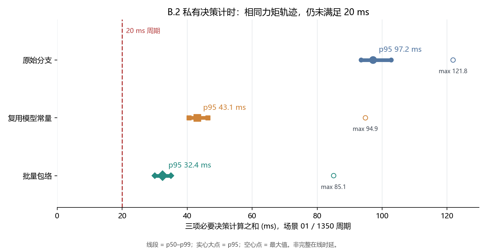

# B.2 完整决策必要计算的私有计时

场景 01 的 1350 个周期，三次变体的力矩 trace SHA-256 相同。计时包括预检＋QP、十步 MuJoCo 候选分支及下一起点重算；不包括诊断用独立行核对，也不等于生产在线全链时延。

| 变体 | p50 ms | p95 ms | p99 ms | 最大 ms | 超 20 ms 周期 | 最长连续超期 |
| --- | ---: | ---: | ---: | ---: | ---: | ---: |
| 原始分支 | 93.557 | 97.223 | 102.809 | 121.849 | 1350 | 1350 |
| 复用模型常量 | 40.564 | 43.093 | 46.396 | 94.864 | 1350 | 1350 |
| 批量包络 | 30.036 | 32.418 | 34.993 | 85.089 | 1350 | 1350 |

五场景私有力矩诊断已通过，但阶段二在线门禁仍为 `GATE_NOT_MET`。本次只是场景 01 的一次配对计时，未完成预声明重复轮次、完整在线全链计时或原 26/11 正式重放。不接入生产控制器，不声称连续时间安全证明。

全部数字由保存的逐周期计时行生成；摘要记录了源码、输入和图像的 SHA-256。
