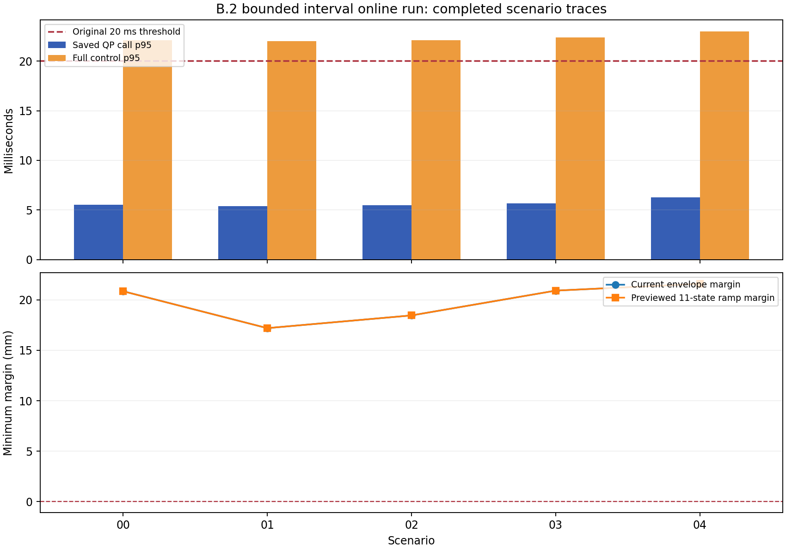

# B.2 新模式在线轨迹进展

本快照只读取已经完整写出的场景 trace。橙色柱包含预检、QP、十步力矩预演和下一起点重算；不构成硬实时保证。

| 场景 | 规划周期 | 力矩步 | QP p95 ms | 完整控制 p95 ms | 最小斜坡包络 mm |
| --- | ---: | ---: | ---: | ---: | ---: |
| v6_lite_scenario_00 | 1350 | 13500 | 5.534 | 22.122 | 20.855 |
| v6_lite_scenario_01 | 1350 | 13500 | 5.391 | 22.000 | 17.200 |
| v6_lite_scenario_02 | 1350 | 13500 | 5.497 | 22.086 | 18.460 |
| v6_lite_scenario_03 | 1350 | 13500 | 5.687 | 22.369 | 20.918 |
| v6_lite_scenario_04 | 1350 | 13500 | 6.262 | 22.987 | 21.594 |

原 20 ms 门槛与完整 26 项重放验收尚需另行判定。
